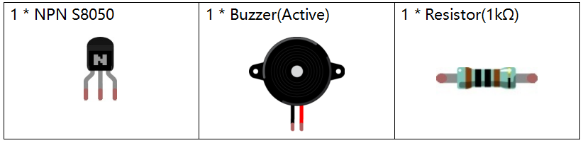
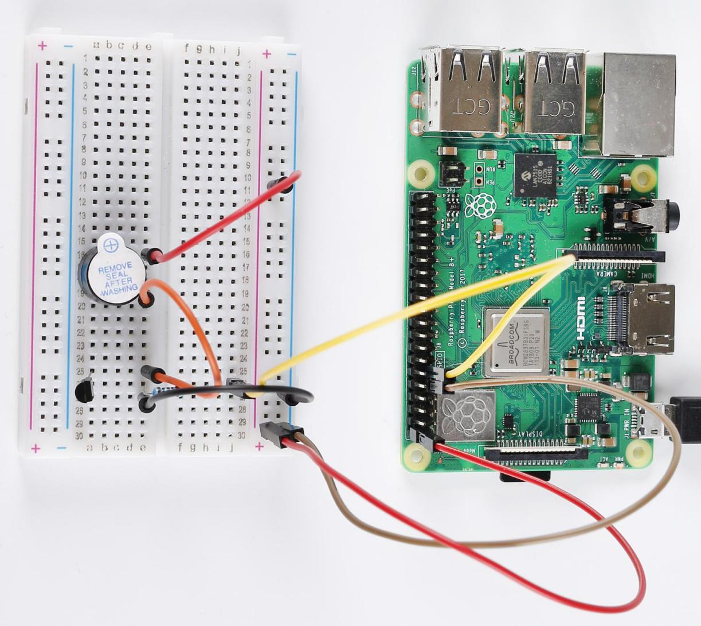

Lesson 10 Active Buzzer
==================================================

**Introduction**
----------------------

A buzzer is a great tool in your experiments whenever you want to make
sounds.

**Newly Added Components**
-----------------------------

**Principle**
------------------

As a type of electronic buzzer with an integrated structure, buzzers,
which are supplied by DC power, are widely used in computers, printers,
photocopiers, alarms, electronic toys, automotive electronic devices,
telephones, timers and other electronic products or voice devices.
Buzzers can be categorized as active and passive ones (see the following
picture). Turn the buzzer so that its pins are facing up, and the
buzzers with a green circuit board is a passive buzzer, while the one
enclosed with a black tape is an active one.

The difference between an active buzzer and a passive buzzer:

.. image:: media_pi/image139.png
    :width: 400
    :align: center

An active buzzer has a built-in oscillating source, so it will make
sounds when electrified. But a passive buzzer does not have such source,
so it will not tweet if DC signals are used; instead, you need to use
square waves whose frequency is between 2K and 5K to drive it. The
active buzzer is often more expensive than the passive one because of
multiple built-in oscillating circuits.

In this experiment, we use an active buzzer.

**Schematic Diagram**
--------------------------

When **Pin11** is input into high voltage, the transistor will be
switched on, and the collector will output low level. When there is a
level difference between the two pins of the buzzer, the buzzer is
ringing. When **Pin11** inputs low power level, the transistor is cut
off and the collector is at high level, here, both ends of the buzzer
are at high level, the buzzer will be silent.

.. image:: media_pi/image224.png
    :width: 800
    :align: center

**Build the Circuit**
------------------------

.. image:: media_pi/image141.png
    :width: 800
    :align: center

**For C Language Users**
---------------------------

**Command**
^^^^^^^^^^^^

1. Go to the folder of the code.

.. raw:: html

    <run></run>

.. code-block::

    cd /home/pi/electronic-kit/for-raspberry-pi/c/Lesson_10_ActiveBuzzer

2. Compile the code.

.. raw:: html

    <run></run>

.. code-block::

    gcc 10_ActiveBuzzer.c -lwiringPi

3. Run the executable file.

.. raw:: html

    <run></run>

.. code-block::

    sudo ./a.out

Now, you may hear the buzzer beep.

.. note::

    If it does not work after running, or there is an error prompt: \"wiringPi.h: No such file or directory\", please refer to :ref:`C code is not working?`.

**Code**
^^^^^^^^^^^

.. code-block:: C

    #include <wiringPi.h>  
    #include <stdio.h>  
      
    #define BeepPin 0  
      
    int main(void){  
        if(wiringPiSetup() == -1){ //when initialize wiring failed, print message to screen  
            printf("setup wiringPi failed !");  
            return 1;   
        }  
          
        pinMode(BeepPin, OUTPUT);     
      
        while(1){  
            //beep on  
            digitalWrite(BeepPin, HIGH);  
            delay(100);  
            //beep off  
            digitalWrite(BeepPin, LOW);  
            delay(100);  
        }  
        return 0;  
    }  

**Code Explanation**
^^^^^^^^^^^^^^^^^^^^^

.. code-block:: C

 12.    pinMode(BeepPin, OUTPUT); 

Set the pin connected to the buzzer to **OUTPUT** mode.

.. code-block:: C

    16.        digitalWrite(BeepPin, HIGH);

When BeepPin is at high level, the base pin(b pin) of the 
connected transistor inputs high level and the collector pin(c pin) 
output low level. That is, when the cathode of the buzzer is at low 
level and the anode of the buzzer is connected to a 5V high 
level, the buzzer sounds.

.. code-block:: C

    19.        digitalWrite(BeepPin, LOW);

The **BeepPin** is connected to the transistor and then to the 
cathode of the buzzer. When BeepPin is low level, the base pin 
(b pin) of the connected transistor inputs low level, then the 
collector pin(c pin) outputs high level; that is, when the level 
at both ends of the connected buzzer is high, the buzzer is silent.

**For Python Language Users**
-------------------------------

**Command**
^^^^^^^^^^^^^

**1.** Go to the folder of the code.

.. raw:: html

    <run></run>

.. code-block::

    cd /home/pi/electronic-kit/for-raspberry-pi/python

**2.** Run the code.

.. raw:: html

    <run></run>

.. code-block::

    sudo python3 10_ActiveBuzzer.py

Now, you should hear the buzzer beep.

**Code**
^^^^^^^^^^^^

.. note::
    You can **Modify/Reset/Copy/Run/Stop** the code below. But before that, you need to go to  source code path like ``electronic-kit/for-raspberry-pi/python``. After modifying the code, you can run it directly to see the effect.

.. raw:: html

    <run></run>

.. code-block:: python

    import RPi.GPIO as GPIO  
    import time  
      
    BeepPin = 17  
      
    def setup():  
        GPIO.setmode(GPIO.BCM)  
        GPIO.setup(BeepPin, GPIO.OUT, initial=GPIO.LOW)  
      
    def main():  
        while True:  
            # Buzzer on (Beep)  
            GPIO.output(BeepPin, GPIO.HIGH)  
            time.sleep(0.1)  
            # Buzzer off  
            GPIO.output(BeepPin, GPIO.LOW)  
            time.sleep(0.1)  
      
    def destroy():  
        # Turn off buzzer  
        GPIO.output(BeepPin, GPIO.LOW)  
        # Release resource  
        GPIO.cleanup()      
      
    # If run this script directly, do:  
    if __name__ == '__main__':  
        setup()  
        try:  
            main()  
        # When 'Ctrl+C' is pressed, the child program   
        # destroy() will be  executed.  
        except KeyboardInterrupt:  
            destroy()  

**Code Explanation**
^^^^^^^^^^^^^^^^^^^^^^

.. code-block::

    1.    GPIO.setup(BeepPin, GPIO.OUT, initial=GPIO.LOW) 

Initialize the pin connected to the buzzer to output 
mode and set it to the default low level.

.. code-block::

    1.         GPIO.output(BeepPin, GPIO.HIGH) 

The **BeepPin** is connected to the transistor and then to the cathode 
of the buzzer. When BeepPin is at high level, the base pin(b pin) 
of the connected transistor inputs high level, then the collector 
pin(c pin) outputs low level; that is, when the cathode of the 
buzzer is at low level and the anode of the buzzer is connected 
to a 5V high level, the buzzer sounds.

.. code-block::

    1.         GPIO.output(BeepPin, GPIO.LOW) 

When **BeepPin** is at low level, the base pin(b pin) of the connected 
transistor inputs low level, then the collector pin(c pin) outputs high 
level; that is, when the level at both ends of the connected buzzer 
is high, the buzzer is silent.

**Phenomenon Picture**
----------------------------

