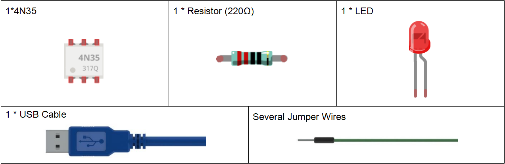

**Lesson 11 4N35**
=======================

**Introduction**
--------------------

The 4N35 is an optocoupler that consists of a gallium arsenide infrared
LED and a silicon NPN phototransistor. When the input signal is applied
to the LED in the input terminal, the LED lights up. After receiving the
light signal, the light receiver then converts it into electrical signal
and outputs the signal directly or after amplifying it into a standard
digital level. Thus, the transition and transmission of
electricity-light-electricity is completed. Since light is the media of
the transmission, meaning the input terminal and the output one are
isolated electrically, this process is also be known as electrical
isolation.

**Components**
---------------

.. image:: media_arduino/image171.png
    :width: 800
    :align: center

**Experimental Principle**
-----------------------------

**4N35**
^^^^^^^^^^^^^

.. image:: media_arduino/image115.jpeg
    :width: 400
    :align: center

The 4N35 is an optocoupler for general purpose application. It consists
of gallium arsenide infrared LED and a silicon NPN phototransistor.

What an optocoupler does is to break the connection between signal
source and signal receiver, so as to stop electrical interference. In
other words, it is used to prevent interference from external electrical
signals. 4N35 can be used in AV conversion audio circuits. Broadly it is
widely used in electrical isolation for a general optocoupler.

.. image:: media_arduino/image116.png
    :width: 800
    :align: center

See the internal structure of the 4N35 above. Pin 1 and 2 are connected
to an infrared LED. When the LED is electrified, it'll emit infrared
rays. To protect the LED from burning, usually a resistor (about 1K) is
connected to pin 1. Then the NPN phototransistor is power on when
receiving the rays. This can be done to control the load connected to
the phototransistor. Even when the load short circuit occurs, it won't
affect the control board, thus realizing good electrical isolation.

The schematic diagram:

.. image:: media_arduino/image117.png
    :width: 800
    :align: center

**Principle:**
^^^^^^^^^^^^^^^

In this experiment, use an LED as the load connected to the NPN
phototransistor. Connect pin 2 of the 4N35 to pin 7 of the control
board, and pin 1 to a 1K current limiting resistor and then to 5V.
Connect pin 4 to GND of the Uno, and pin 5 to the cathode of the LED.
Then hook the anode of the LED to 5V after connecting with a 220 Ohm
resistor. When in program, a LOW level is given to pin 7, the infrared
LED will emit infrared rays. Then the phototransistor receives infrared
rays and gets electrified, and the LED cathode is LOW, thus

turning on the LED. Also you can control the LED by circuits only –
connect pin 2 to ground and it will brighten.

**Experimental Procedures**
------------------------------

**Step 1:** Build the circuit (pay attention to the direction of the
chip by the concave on it)

.. image:: media_arduino/image118.png
    :width: 600
    :align: center

**Step 2**: Open the code file.

**Step 3:** Select correct Board and Port.

**Step 4:** Upload the sketch to the SunFounder Uno board.

You will see the LED blinks.

.. image:: media_arduino/image119.jpeg
    :width: 800
    :align: center

**Exploration**
----------------

4N35 is usually used for driving relay as well as motor circuits. As
there is no direct connection between the input and output, even if a
short circuit at the output end occurs, the control board will not be
burnt. Have a try!

**Code**
----------------------

.. raw:: html

    <iframe src=https://create.arduino.cc/editor/sunfounder01/a06b9d24-c4cc-4240-ae57-4a670964c765/preview?embed style="height:510px;width:100%;margin:10px 0" frameborder=0></iframe>

.. code-block:: arduino

    void loop()

    {

        digitalWrite(OptoPin, LOW); //set the OptoPin as LOW level,then the led
        connected on the output of 4n35 will be light

        delay(500); //delay 500ms

        digitalWrite(OptoPin, HIGH); //turn off the led

        delay(500); //delay 500ms

    }

The code in this experiment is very easy to understand. Set pin 7 as Low
level and the LED will light up; set it as High, and the LED goes out.

