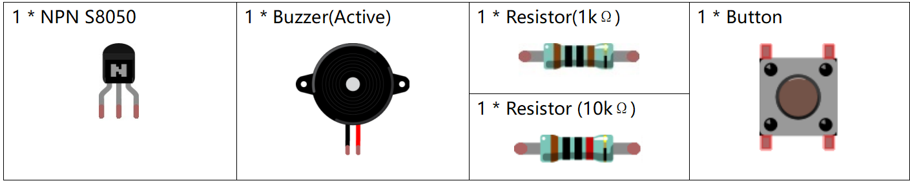
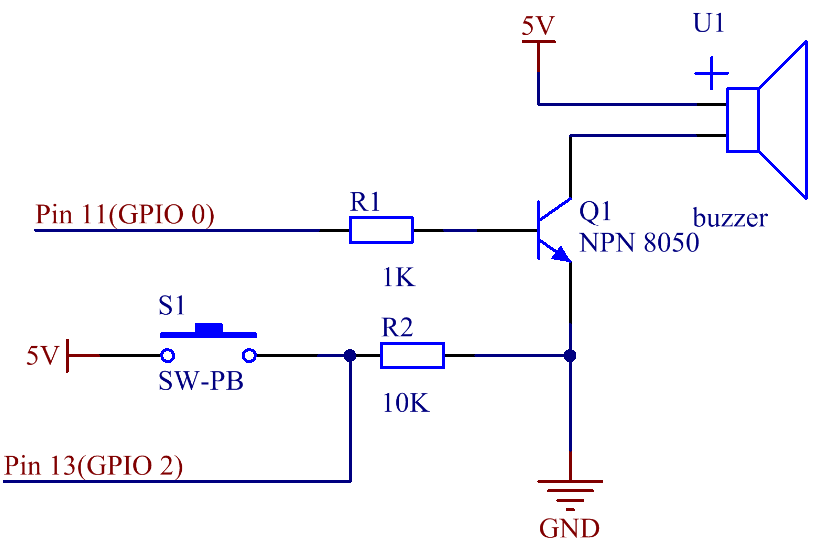
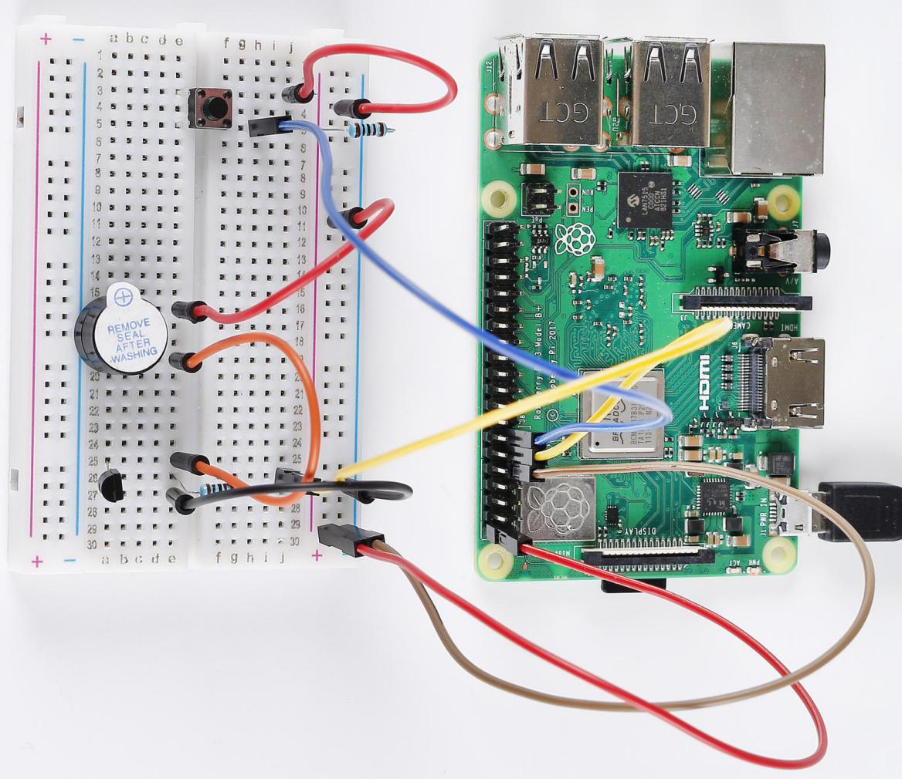

Lesson 11 Doorbell
======================

**Introduction**
--------------------

In this lesson, we will learn how to drive an active buzzer to build a
simple doorbell.

**Newly Added Components**
----------------------------------

**Schematic Diagram**
----------------------------

When the button is pressed, **Pin13** is connected to the **5V** power
supply and reads out high level; therefore, the program responds to make
**Pin11** output the high level so as to energize the transistor, and
the collector will output low level that means the buzzer rings. When
pin11 outputs at low level the buzzer will be silent.

.. image:: media_pi/image226.png
    :width: 800
    :align: center

**Build the Circuit**
---------------------------

.. note::
     Long pins of buzzer is the Anode and the short pin is Cathode.

.. image:: media_pi/image144.png
    :width: 800
    :align: center

**For C Language Users**
----------------------------

**Command**
^^^^^^^^^^^^^

**1.** Go to the folder of the code.

.. raw:: html

    <run></run>

.. code-block::

    cd /home/pi/electronic-kit/for-raspberry-pi/c/Lesson_11_DoorBell

**2.** Compile the code.

.. raw:: html

    <run></run>

.. code-block::

    gcc 11_DoorBell.c -lwiringPi

**3.** Run the executable file.

.. raw:: html

    <run></run>

.. code-block::

    sudo ./a.out

When the button is pressed, the buzzer makes a 
sound to simulate a doorbell.

.. note::

    If it does not work after running, please refer to :ref:`C code is not working?`

**Code**
^^^^^^^^^^^^^^^

.. code-block:: c

    #include <wiringPi.h>  
    #include <stdio.h>  
      
    #define BeepPin 0  
    #define ButtonPin   2  
      
    int main(void){  
        if(wiringPiSetup() == -1){ //when initialize wiring failed, print message to screen  
            printf("setup wiringPi failed !");  
            return 1;   
        }  
          
        pinMode(BeepPin, OUTPUT);     
        pinMode(ButtonPin, INPUT);  
        pullUpDnControl(ButtonPin, PUD_DOWN);  
      
        while(1){  
            // Indicate that button has pressed down  
            if(digitalRead(ButtonPin) == 1){  
                delay(10);  
                if(digitalRead(ButtonPin) == 1){  
                //beep on  
                printf("Buzzer on\n");  
                digitalWrite(BeepPin, HIGH);  
                delay(100);  
                }  
            }  
            else{  
                printf("Buzzer off\n");  
                //beep off  
                digitalWrite(BeepPin, LOW);  
                delay(100);  
            }         
        }  
        return 0;  
    }   

**Code Explanation**
^^^^^^^^^^^^^^^^^^^^^^^

.. code-block:: c

    20.            delay(10); 

Software removes button jitter. When the signal that the 
button is pressed is detected, a delay of 10ms is used to 
eliminate the possibility of false judgment. If both **if** conditions 
are met, confirm that the button is pressed, and then execute the program in if.

.. code-block:: c

    21.            if(digitalRead(ButtonPin) == 1){  
    22.            //beep on  
    23.            printf("Buzzer on\n");  
    24.            digitalWrite(BeepPin, HIGH);  
    25.            delay(100);  
    26.            }  

If the button is recognized to be pressed, the **BeepPin** is 
at high level. The base pin(b pin) of the connected 
transistor inputs high level, while the collector pin(c pin) 
outputs low level. That is, the cathode of buzzer is at low 
level, and the anode is connected with a high level 5V. Then the 
buzzer rings. 

.. code-block:: c

    28.        else{  
    29.            printf("Buzzer off\n");  
    30.            //beep off  
    31.            digitalWrite(BeepPin, LOW);  
    32.            delay(100);  
    33.        }   

Otherwise, **BeepPin** is at low level, and the base pin(b pin) 
of the connected transistor inputs low level, then the collector 
pin(c pin) outputs high level; that is, the level at both ends 
of the buzzer is high, and the buzzer does not ring.

**For Python Language Users**
----------------------------------

**Command**
^^^^^^^^^^^

**1.** Go to the folder of the code.

.. raw:: html

    <run></run>

.. code-block::

    cd /home/pi/electronic-kit/for-raspberry-pi/python

**2.** Run the code.

.. raw:: html

    <run></run>

.. code-block::

    sudo python3 11_DoorBell.py

When the button is pressed, the buzzer makes a sound to simulate a
doorbell.

**Code**
^^^^^^^^^^

.. note::
    You can **Modify/Reset/Copy/Run/Stop** the code below. But before that, you need to go to  source code path like ``electronic-kit/for-raspberry-pi/python``. After modifying the code, you can run it directly to see the effect.

.. raw:: html

    <run></run>

.. code-block:: python

    import RPi.GPIO as GPIO  
    import time  
      
    BeepPin = 17  
    BtnPin = 27  
      
    def setup():  
        GPIO.setmode(GPIO.BCM)  
        GPIO.setup(BtnPin, GPIO.IN)  
        GPIO.setup(BeepPin, GPIO.OUT, initial=GPIO.LOW)  
          
    def main():  
        while True:  
            if GPIO.input(BtnPin) == 0:  
                #Buzzer off  
                print ('Buzzer Off')  
                GPIO.output(BeepPin, GPIO.LOW)  
                time.sleep(0.1)  
            if GPIO.input(BtnPin) == 1:  
                #Buzzer on  
                print ('Buzzer On')  
                GPIO.output(BeepPin, GPIO.HIGH)  
                time.sleep(0.1)  
      
    def destroy():  
        # Turn off buzzer  
        GPIO.output(BeepPin, GPIO.LOW)  
        # Release resource  
        GPIO.cleanup()      
      
    # If run this script directly, do:  
    if __name__ == '__main__':  
        setup()  
        try:  
            main()  
        # When 'Ctrl+C' is pressed, the child program   
        # destroy() will be  executed.  
        except KeyboardInterrupt:  
            destroy()  

**Code Explanation**
^^^^^^^^^^^^^^^^^^^^^

.. code-block::

    14.        if GPIO.input(BtnPin) == 0:  
    15.            #Buzzer off   
    16.            print ('Buzzer Off')  
    17.            GPIO.output(BeepPin, GPIO.LOW)  
    18.            time.sleep(0.1)  

If it is judged that the button is not pressed, BeepPin is 
at low level, and the base pin(b pin) of the connected transistor 
inputs low level, then the collector pin(c pin) outputs high level; 
that is, when the level at both ends of the connected buzzer is high, 
the buzzer does not ring.

.. code-block::

    19.        if GPIO.input(BtnPin) == 1:  
    20.            #Buzzer off  
    21.            print ('Buzzer On')  
    22.            GPIO.output(BeepPin, GPIO.HIGH)  
    23.             time.sleep(0.1)

If the button is recognized to be pressed, the BeepPin is at high level. 
The base pin(b pin) of the connected transistor inputs high level, while the 
collector pin(c pin) outputs low level. That is, the cathode of buzzer is at 
low level, and the anode is connected with a high level 5V. Then the buzzer rings. 

**Phenomenon Picture**
-------------------------------

