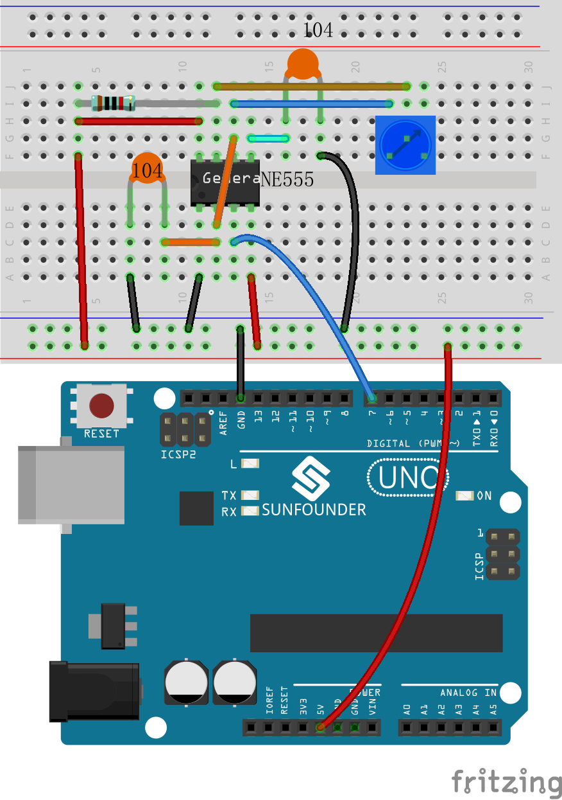
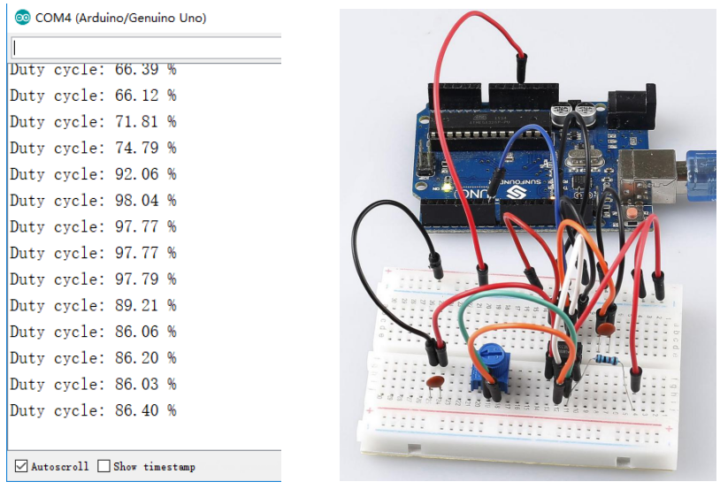

Lesson 11 NE555 Timer
============================

**Introduction**
-----------------

The NE555 Timer, a mixed circuit composed of analog and digital
circuits, integrates analog and logical functions into an independent
IC, thus tremendously expanding the applications of analog integrated
circuits. It is widely used in various timers, pulse generators, and
oscillators. In this experiment, the SunFounder Uno board is used to
test the frequencies of square waves generated by the 555 oscillating
circuit and show them on Serial Monitor.

**Components**
------------------

.. image:: media_arduino/image171.png
    :width: 800
    :align: center

.. image:: media_arduino/image220.png
    :width: 800
    :align: center

**Experimental Principle**
----------------------------

**555 IC**

The 555 IC was originally used as a timer, hence the name 555 time base
circuit. It is now widely used in various electronic products because of
its reliability, convenience, and low price. The 555 is a complex hybrid
circuit with dozens of components such as a divider, comparator, basic
R-S trigger, discharge tube, and buffer.

Its pins and their functions:

.. image:: media_arduino/image121.png
    :width: 800
    :align: center

As shown in the picture, the pins are set dual in-line with the 8-pin
package.

-  Pin 1 (**GND**): the ground

-  Pin 2 (**TRIGGER** ): when the voltage at the pin reduces to 1/3 of the VCC (or the threshold defined by the control board), the output terminal sends out a High level

-  Pin 3 (**OUTPUT**): outputs High or Low, two states 0 and 1 decided by the input electrical level; maximum output current approx. 200mA at High

-  Pin 4 (**RESET**): when a Low level is received at the pin, the timer will be reset and the output will return to Low level; usually connected to positive pole or neglected

-  Pin 5 (**CONTROL VOLTAGE**): to control the threshold voltage of the chip (if it skips connection, by default, the threshold voltage is 1/3 VCC and 2/3 VCC)

-  Pin 6 (**THRESHOLD)**: when the voltage at the pin increases to 2/3 VCC (or the threshold defined by the control board), the output terminal sends out a High level

-  Pin 7 (**DISCHARGE)**: output synchronized with Pin 3, with the same logical level; but this pin does not output current, so pin 3 is the real High (or Low) when pin 7 is the virtual High (or Low); connected to the open collector (OC) inside to discharge the capacitor

-  Pin 8 (**VCC**): positive terminal for the NE555 timer IC, ranging +4.5V to +16V

-  The NE555 timer works under the monostable, astable and bistable modes. In this experiment, apply it under the astable mode, which means it works as an oscillator, as shown below:

.. image:: media_arduino/image122.jpeg
    :width: 800
    :align: center

Connect a resistor R1 between the VCC and the discharging pin DS,
another resistor between pin DS and the trigger pin TR which is
connected to the threshold pin TH and then to the capacitor C1. Connect
the RET (pin 4) to VCC, CV (pin 5) to another capacitor C2 and then to
the ground.

Working process:

The oscillator starts to shake once the circuit is power on. Upon the
energizing, since the voltage at C1 cannot change abruptly, which means
pin 2 is Low level initially, set the timer to 1, so pin 3 is High
level. The capacitor C1 charges via R1 and R2, in a time span:

Tc=0.693(R1+R2)

When the voltage at C1 reaches the threshold 2/3Vcc, the timer is reset
and pin 3 is Low level. Then C1 discharges via R2 till 2/3Vcc, in a time
span:

Td=0.693(R2)

Then the capacitor is recharged and the output voltage flips again:

Duty cycle D=Tc/(Tc+Td) x 100%

Since a potentiometer is used for resistor, we can output square wave
signals with different duty cycles by adjusting its resistance. But R1
is a 10K resistor and R2 is 0k-10k, so the range of the ideal duty cycle
is 66.7%-100%. If you want another else, you need to change the
resistance of R1 and R2.

Dmin=(0.693(10K+0K))/(0.693(10K+0K)+0.693x0k) x100%=100%

Dmax=(0.693(10K+10K))/(0.693(10K+10K)+0.693x10k) x100%=66.7%

**Experimental Procedures**
------------------------------

**Step 1:** Build the circuit.

**Step 2**: Open the code file.

**Step 3:** Select correct Board and Port.

**Step 4:** Upload the sketch to the SunFounder Uno board.   

After uploading, open the Serial Monitor and you will see the following
window.

**Code**
--------------------

.. raw:: html

    <iframe src=https://create.arduino.cc/editor/sunfounder01/4c252e5a-ffbc-497e-875b-66561523d401/preview?embed style="height:510px;width:100%;margin:10px 0" frameborder=0></iframe>

**Code Analysis** **11-1** **Calculate the duty cycle**
^^^^^^^^^^^^^^^^^^^^^^^^^^^^^^^^^^^^^^^^^^^^^^^^^^^^^^^^^^

.. code-block:: arduino

    void loop()

    {

        duration1 = pulseIn(ne555, HIGH);  // Reads a pulse on ne555

        duration2 = pulseIn(ne555, LOW);   // Reads a pulse on ne555

        dc = float (duration1) / (duration1 + duration2) * 100;

        Serial.print("Duty cycle: ");

        Serial.print(dc);  // print the length of the pulse on the serial monitor

        Serial.print(" %");

        Serial.println();  // print an blank on serial monitor

        delay(500);        // wait for 500 microseconds

    }

Read a pulse waits for the ne555(pin 7) from HIGH to LOW firstly, then
read a pulse waits for pin 7 from LOW to HIGH. So the range of the ideal duty cycle dc is float (duration1) /
(duration1 + duration2) \* 100; You can rotate the potentiometer and read the duty cycle from the serial monitor.

**pulseIn()**
----------------------------------
[Advanced I/O]

**Description**

Reads a pulse (either HIGH or LOW) on a pin. For example,
if value is HIGH, pulseIn() waits for the pin to go from LOW to HIGH,
starts timing, then waits for the pin to go LOW and stops timing.
Returns the length of the pulse in microseconds or gives up and returns
0 if no complete pulse was received within the timeout.

The timing of this function has been determined empirically and will
probably show errors in longer pulses. Works on pulses from 10
microseconds to 3 minutes in length.

**Syntax**

pulseIn(pin, value)

pulseIn(pin, value, timeout)

**Parameters**

pin: the number of the pin on which you want to read the pulse. (int)

value: type of pulse to read:
either `HIGH <https://www.arduino.cc/reference/en/language/variables/constants/constants/>`__ or `LOW <https://www.arduino.cc/reference/en/language/variables/constants/constants/>`__.
(int)

timeout (optional): the number of microseconds to wait for the pulse to
start; default is one second. (unsigned long)

**Returns**

the length of the pulse (in microseconds) or 0 if no pulse started
before the timeout. (unsigned long)
