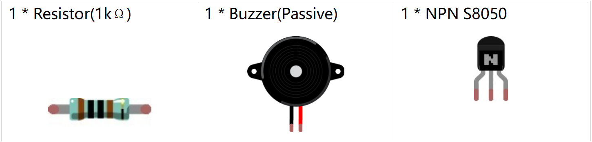
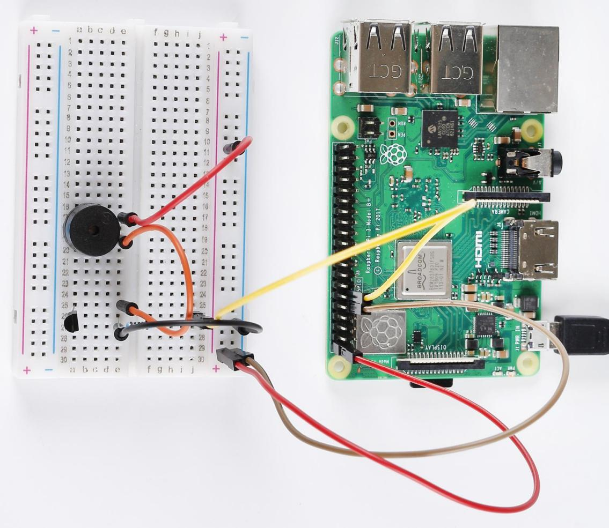

**Lesson 12 Passive Buzzer**
============================

**Introduction**
---------------------

In this lesson, we will learn how to make a passive buzzer to play
music.

**Newly Added Components**
------------------------------

**Schematic Diagram**
--------------------------

The base pin(b pin) of the transistor is connected to pin11, the
collector pin(c pin) to the cathode pin of the buzzer, and the emitter
pin(e pin) to GND. The anode of the buzzer is connected to 5 v power
supply. When pin11 inputs high voltage, the transistor will be switched
on, and the collector will output low level. When there is a level
difference between the two pins of the buzzer, the buzzer rings. When
pin11 inputs low power level, the transistor is cut off, and the
collector is at high level, and both ends of the buzzer are at high
level, so the buzzer is silent.

.. image:: media_pi/image228.png
    :width: 800
    :align: center

.. image:: media_pi/image256.png
    :width: 800
    :align: center

**Build the Circuit**
-------------------------

.. image:: media_pi/image147.png
    :width: 800
    :align: center

**For C Language Users**
-------------------------

**Command**
^^^^^^^^^^^^^^^^^^^

**1.** Go to the folder of the code.

.. code-block::

    cd /home/pi/electronic-kit/for-raspberry-pi/c/Lesson_12_PassiveBuzzer

**2.** Compile the code.

.. code-block::

    gcc 12_PassiveBuzzer.c -lwiringPi

**3.** Run the executable file.

.. code-block::

    sudo ./a.out

Now, the buzzer automatically plays music on a loop.

**Code**
^^^^^^^^^

.. code-block::

    1.#include <wiringPi.h>  
    2.#include <softTone.h>  
    3.#include <stdio.h>  
    4.  
    5.#define BuzPin    0  
    6.  
    7.#define  CM1  262  
    8.#define  CM2  294  
    9.#define  CM3  330  
    10.#define  CM4  350  
    11.#define  CM5  393  
    12.#define  CM6  441  
    13.#define  CM7  495  
    14.  
    15.#define  CH1  525  
    16.#define  CH2  589  
    17.#define  CH3  661  
    18.#define  CH4  700  
    19.#define  CH5  786  
    20.#define  CH6  882  
    21.#define  CH7  990  
    22.  
    23.int song[] = {CH5,CH2,CM6,CH2,CH3,CH6,0,CH3,CH5,CH3,CM6,CH2,0};   
    24.int beat[] = {1,1,1,1,1,1,2,1,1,1,1,1,3};  
    25.  
    26.int main(void)  
    27.{  
    28.    int i, j;  
    29.  
    30.    if(wiringPiSetup() == -1){ //when initialize wiring failed,print message to screen  
    31.        printf("setup wiringPi failed !");  
    32.        return 1;   
    33.    }  
    34.  
    35.    if(softToneCreate(BuzPin) == -1){  
    36.        printf("setup softTone failed !");  
    37.        return 1;   
    38.    }  
    39.  
    40.    while(1){  
    41.        printf("music is being played...\n");         
    42.        for(int i=0;i<sizeof(song)/4;i++){  
    43.            softToneWrite(BuzPin, song[i]);   
    44.            delay(beat[i] * 250);  
    45.        }     
    46.    }  
    47.    return 0;  
    48.}  

**Code Explanation**
^^^^^^^^^^^^^^^^^^^^^

.. code-block::

    2.#include <softTone.h> 

WiringPi includes a software-driven sound handler capable 
of outputting a simple tone/square wave signal on any of 
the Raspberry Pi’s GPIO pins. To maintain a low CPU usage, 
the minimum pulse width is 100μS. That gives a maximum frequency 
of 1/0.0002 = 5000Hz. Within these limitations, simple tones on a 
high impedance speaker or piezo sounder is possible.

.. code-block::

    3.#define  CM1  262  
    4.#define  CM2  294  
    5.#define  CM3  330  
    6.#define  CM4  350  
    7.#define  CM5  393  
    8.#define  CM6  441  
    9.#define  CM7  495  

These frequencies of each note are as shown. CM refers to 
middle note, CH high note, 1-7 correspond to the notes C, D, E, F, G, A, B.

.. code-block::

    23.int song[] = {CH5,CH2,CM6,CH2,CH3,CH6,0,CH3,CH5,CH3,CM6,CH2,0};    
    24.int beat[] = {1,1,1,1,1,1,2,1,1,1,1,1,3};  

Define a section of music and the corresponding beat. 
The number in beat[] refers to the beat of each note in the 
song(0.5s for each beat).

.. code-block::

 35.    if(softToneCreate(BuzPin) == -1){  

softToneCreate( ) creates a software controlled tone pin. 
You can use any GPIO pin and the pin numbering will be that 
of the wiringPiSetup() function you used. The return value is 0 
for success. This is used to determine whether it is successful 
for the software to control tone pin; if it fails, it will not execute the program.

.. code-block::

    42.        for(int i=0;i<sizeof(song)/4;i++){  
    43.            softToneWrite(BuzPin, song[i]);   
    44.            delay(beat[i] * 250);  
    45.     }

Employ a for statement to play song_1.
In the judgment condition, i<sizeof(song_1)/4，"devide by 4" is used because the array 
song_1[] is an array of the data type of integer, and each element takes up four bytes. 
The number of elements in song (the number of musical notes) is gotten by deviding sizeof(song) by 4.
To enable each note to play for beat * 500ms, the function delay(beat_1[i] * 500) is called.
The prototype of softToneWrite(BuzPin, song_1[i])：
void softToneWrite (int pin, int freq); 
This updates the tone frequency value on the given pin. The tone does not stop 
playing until you set the frequency to 0.

**For Python Language Users**
-----------------------------

**Command**
^^^^^^^^^^^^

**1.** Go to the folder of the code.

.. code-block::

    cd /home/pi/electronic-kit/for-raspberry-pi/python

**2.** Run the code.

.. code-block::

    sudo python3 12_PassiveBuzzer.py

Now, the buzzer automatically plays music on a loop.

**Code**
--------------

.. code-block::

    1.import RPi.GPIO as GPIO  
    2.import time  
    3.  
    4.Buzzer = 17  
    5.  
    6.CL = [0, 131, 147, 165, 175, 196, 211, 248]        # Frequency of Low C notes  
    7.CM = [0, 262, 294, 330, 350, 393, 441, 495]        # Frequency of Middle C notes  
    8.CH = [1, 525, 589, 661, 700, 786, 882, 990]        # Frequency of High C notes  
    9.  
    10.song = [    CH[5], CH[2], CM[6], CH[2], CH[3], CH[6],CH[0], CH[3], # Notes of song  
    11.            CH[5], CH[3], CM[6], CH[2],CH[0]]  
    12.  
    13.beat = [    1,1,1,1,1,1,2,1,1,1,1,1,3    ]  
    14.  
    15.def setup():  
    16.    GPIO.setmode(GPIO.BCM)          
    17.    GPIO.setup(Buzzer, GPIO.OUT)      
    18.    global Buzz                           
    19.          
    20.                          
    21.  
    22.def loop():  
    23.    while True:  
    24.        print ('\n    Playing song...')  
    25.        for i in range(1, len(song)):          
    26.            if  song[i] == 1 :  
    27.                time.sleep(beat[i] *0.25)  
    28.            else:    
    29.                Buzz = GPIO.PWM(Buzzer, song[i])     
    30.                Buzz.start(50)  
    31.                time.sleep(beat[i] * 0.25)         
    32.                Buzz.stop()  
    33.        time.sleep(1)                        # Wait a second for next song.  
    34.          
    35.def destory():  
    36.    Buzz.stop()                      
    37.    GPIO.output(Buzzer, LOW)          
    38.    GPIO.cleanup()                  
    39.  
    40.if __name__ == '__main__':        # Program start from here  
    41.    setup()  
    42.    try:  
    43.        loop()  
    44.    except KeyboardInterrupt:      # When 'Ctrl+C' is pressed, the child program destroy() will be  executed.  
            destory()

**Code Explanation**
^^^^^^^^^^^^^^^^^^^^

.. code-block::

    6.CL = [0, 131, 147, 165, 175, 196, 211, 248]
    7.CM = [0, 262, 294, 330, 350, 393, 441, 495]
    8. CH = [1, 525, 589, 661, 700, 786, 882, 990]

These are the frequencies of each note. The first 0 is to 
skip CL[0] so that the number CL[1]-CL[7] corresponds to the 
CDEFGAB of the note.

.. code-block::

    10.int song[] = {CH5,CH2,CM6,CH2,CH3,CH6,0,CH3,CH5,CH3,CM6,CH2,0};    
    13.int beat[] = {1,1,1,1,1,1,2,1,1,1,1,1,3};  

Define a section of music and the corresponding beats. 
The number in beat[] refers to the beat of each note 
in the song(0.5s for each beat).

.. code-block::

    29.    Buzz = GPIO.PWM(Buzzer, song[i])     
    30.     Buzz.start(50) 

Define pin Buzzer as PWM pin, then set its frequency to 786(song[0]) 
and Buzz.start(50) is used to run PWM. What’s more, 
set the duty cycle to 50%.

.. code-block::

    22. def loop():  
    23.    while True:  
    24.        print ('\n    Playing song...')  
    25.        for i in range(1, len(song)):          
    26.            if  song[i] == 1 :  
    27.                time.sleep(beat[i] *0.25)  
    28.            else:    
    29.                Buzz = GPIO.PWM(Buzzer, song[i])     
    30.                Buzz.start(50)  
    31.                time.sleep(beat[i] * 0.25)         
    32.                Buzz.stop() 
    33.   time.sleep(1)               

Play music in the while loop. As i increases gradually, the buzzer 
plays following the note in song[].

**Phenomenon Picture**
--------------------------

