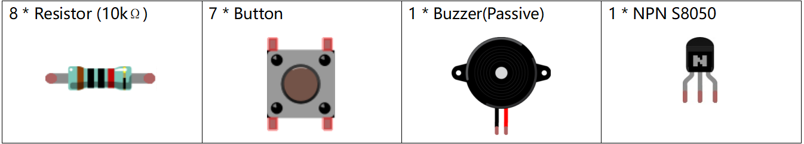
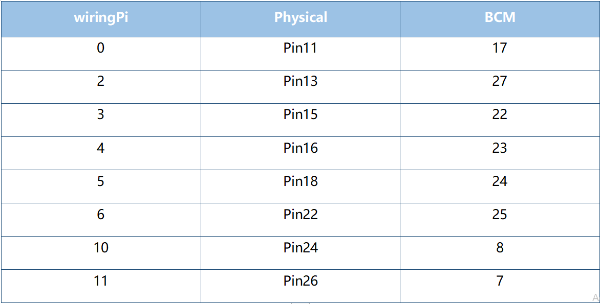
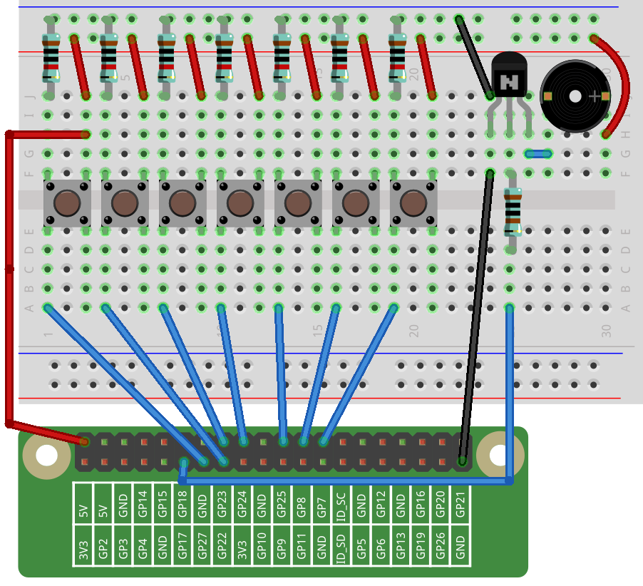
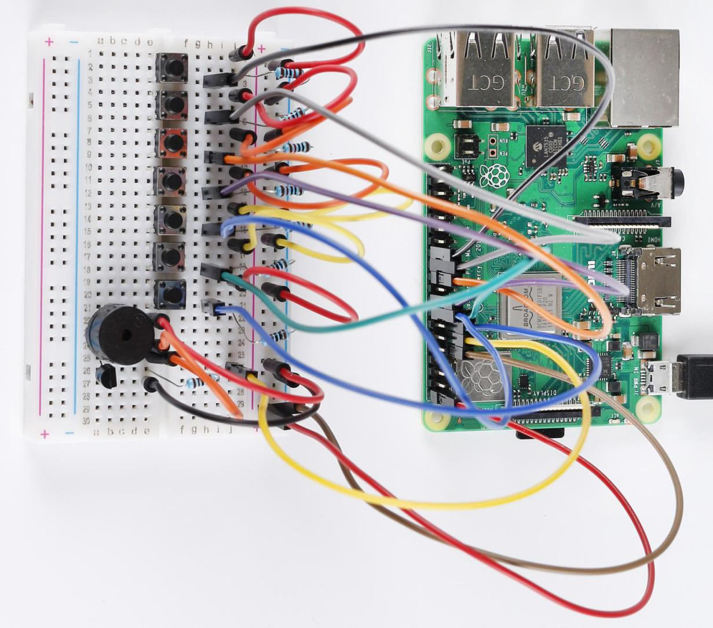

Lesson 13 Button Piano
============================

**Introduction**
-----------------

In our past lesson, we learned how to use PWM waves to drive a passive
buzzer to ring. In this lesson, we make a simple keyboard by applying a
passive buzzer. Let's get started!

**Newly Added Components**
---------------------------

**Schematic Diagram**
---------------------------

.. image:: media_pi/image257.png
    :width: 800
    :align: center

**Build the Circuit**
-------------------------

.. image:: media_pi/image231.png
    :width: 400
    :align: center

**For C Language Users**
----------------------------

**Command**
^^^^^^^^^^^^^^^^

**1.** Go to the folder of the code.

.. raw:: html

    <run></run>

.. code-block::

    cd /home/pi/electronic-kit/for-raspberry-pi/c/Lesson_13_Button_Piano

**2.** Compile the code.

.. raw:: html

    <run></run>

.. code-block::

    gcc 13_ButtonPiano.c -lwiringPi

**3.** Run the executable file.

.. raw:: html

    <run></run>

.. code-block::

    sudo ./a.out

Now press the seven buttons, and the buzzer will emit the notes: DO, RE,
MI, FA, SO, LA, TI. You can play a song with these seven buttons.

.. note::

    If it does not work after running, or there is an error prompt: \"wiringPi.h: No such file or directory\", please refer to :ref:`C code is not working?`.

**Code**
^^^^^^^^^^^

.. code-block:: C

    #include <wiringPi.h>  
    #include <softTone.h>  
    #include <stdio.h>  
      
    #define BuzPin    0  
      
    const int Tone[] = {262,294,330,350,393,441,495};//define DO, RE, MI, FA, SO, LA, TI  
    int beat[] = {1,1,1,1,1,1,1};  
    const int Btn[] = {2,3,4,5,6,10,11};//define 7 buttons  
      
    int main(void)  
    {  
        int i, j;  
      
        if(wiringPiSetup() == -1){ //when initialize wiring failed,print message to screen  
            printf("setup wiringPi failed !");  
            return 1;   
        }  
      
        if(softToneCreate(BuzPin) == -1){  
            printf("setup softTone failed !");  
            return 1;   
        }  
      
        //set the buttons mode  
        for(int j=0;j<7;j++)  
        {  
            pinMode(Btn[j], INPUT);  
        }  
              
        while(1){  
            //printf("Please press button to play the piano\n");  
            // Indicate that button has pressed down      
            for(i=0;i<7;i++)  
            {  
                if(digitalRead(Btn[i])==1)  
                {  
                    delay(10);//Prevent the button' s vibration  
                    if(digitalRead(Btn[i])==1)  
                    {  
                        softToneWrite(BuzPin, Tone[i]);   
                        delay(beat[i]*250);  
                        printf("1");  
                    }  
                }  
                else  
                    softToneWrite(BuzPin, 0);  
                if(i==7)  
                    i=0;  
            }             
        }  
        return 0;  
    }   

**Code Explanation**
^^^^^^^^^^^^^^^^^^^^^^^^^

.. code-block:: C

    7.  const int Tone[] = {262,294,330,350,393,441,495}; 
    8.  int beat[] = {1,1,1,1,1,1,1};  

In the array **Tone[]**, define the frequencies of DO, RE, MI, FA, SO, LA, TI 
and the number in **beat[]** refers to the beat of each note in this song(0.5s for each beat).

.. code-block:: C

    26.    for(int j=0;j<7;j++)  
    27.    {  
    28.        pinMode(Btn[j], INPUT);  
    29.    }  

Set the mode of all buttons to input mode in the for loop.

.. code-block:: C

    34.        for(i=0;i<7;i++)  
    35.        {  
    36.            if(digitalRead(Btn[i])==1)  
    37.            {  
    38.                delay(10);//Prevent the button' s vibration  
    39.                if(digitalRead(Btn[i])==1)  
    40.                {  
    41.                    softToneWrite(BuzPin, Tone[i]);   
    42.                    delay(beat[i]*250);  
    43.                    printf("1");  
    44.                }  
    45.            }  

Use a **for** loop to check all the buttons. When one button in array **Btn[i]** 
is detected to be pressed, the buzzer will respond to the corresponding note in array **Tone[i]**.

.. code-block:: C

    46.            else  
    47.                softToneWrite(BuzPin, 0);  
    48.            if(i==7)  
    49.                i=0;  
    50.        }

If no button is pressed, turn off the buzzer.

**For Python Language Users**
-------------------------------

**Command**
^^^^^^^^^^^^^

**1.** Go to the folder of the code.

.. raw:: html

    <run></run>

.. code-block::

    cd /home/pi/electronic-kit/for-raspberry-pi/python

**2.** Run the code.

.. raw:: html

    <run></run>

.. code-block::

    sudo python3 13_ButtonPiano.py

Now press the seven buttons, and the buzzer will emit the notes: DO, RE,
MI, FA, SO, LA, TI. You can play a song with these seven buttons.

**Code**
^^^^^^^^^^^

.. note::
    You can **Modify/Reset/Copy/Run/Stop** the code below. But before that, you need to go to  source code path like ``electronic-kit/for-raspberry-pi/python``. After modifying the code, you can run it directly to see the effect.

.. raw:: html

    <run></run>

.. code-block:: python

    import RPi.GPIO as GPIO  
    import time  
      
    Buzzer = 17  
    BtnPin = [18,27,22,23,24,25,8,7]  
      
    CL = [0, 131, 147, 165, 175, 196, 211, 248]        # Frequency of Low C notes  
    CM = [0, 262, 294, 330, 350, 393, 441, 495]        # Frequency of Middle C notes  
    CH = [1, 525, 589, 661, 700, 786, 882, 990]        # Frequency of High C notes  
      
    song = [     0,CM[1],CM[2],CM[3],CM[4],CM[5],CM[6],CM[7]    ]  
    beat = [    1,1, 1, 1, 1, 1, 1,  1]  
      
    def setup():  
        GPIO.setmode(GPIO.BCM)          
        for i in range(1, len(BtnPin)):  
            GPIO.setup(BtnPin[i],GPIO.IN)  
        GPIO.setup(Buzzer, GPIO.OUT)      
      
    def loop():  
        global Buzz    
        while True:  
            #print ('\n    Please playing piano...')  
            for i in range(1, len(BtnPin)):          
                if GPIO.input(BtnPin[i]) == 1:  
                    Buzz = GPIO.PWM(Buzzer, song[i])      
                    Buzz.start(50)  
                    time.sleep(beat[i] * 0.25)          
                    Buzz.stop()      
                         
    def destory():  
        Buzz.stop()                      
        GPIO.output(Buzzer, 0)          
        GPIO.cleanup()                  
      
    if __name__ == '__main__':        # Program start from here  
        setup()  
        try:  
            loop()  
        except KeyboardInterrupt:      # When 'Ctrl+C' is pressed, the child program destroy() will be  executed.  
            destory()  

**Code Explanation**
^^^^^^^^^^^^^^^^^^^^^^^

.. code-block::

    7.CL = [0, 131, 147, 165, 175, 196, 211, 248]        # Frequency of Low C notes  
    8.CM = [0, 262, 294, 330, 350, 393, 441, 495]        # Frequency of Middle C notes  
    9.CH = [1, 525, 589, 661, 700, 786, 882, 990]        # Frequency of High C notes  

These are the frequencies of each note. The first 0 is to skip **CL[0]** so that the 
number **CL[1]-CL[7]** corresponds to the CDEFGAB of the note.

.. code-block::

    10.song = [     0,CM[1],CM[2],CM[3],CM[4],CM[5],CM[6],CM[7]    ]  
    11.beat = [    1,1, 1, 1, 1, 1, 1,  1]  

Define a section of music and the corresponding beats. The number in beat[] 
refers to the beat of each note in the song(0.5s for each beat).

.. code-block::

    16.   for i in range(1, len(BtnPin)):  
    17.        GPIO.setup(BtnPin[i],GPIO.IN)  

Set the mode of all buttons to input mode in the for loop.

.. code-block::

    24.        for i in range(1, len(BtnPin)):       
    25.            if GPIO.input(BtnPin[i]) == 1:  
    26.                Buzz = GPIO.PWM(Buzzer, song[i])      
    27.                Buzz.start(50)  
    28.                time.sleep(beat[i] * 0.25)       
    29.                Buzz.stop()  

Use a for loop to check all the buttons. When one button in array **button[i]**
is detected to be pressed, the buzzer will respond to 
the corresponding note in array **song[i]**.

**Phenomenon Picture**
-------------------------

