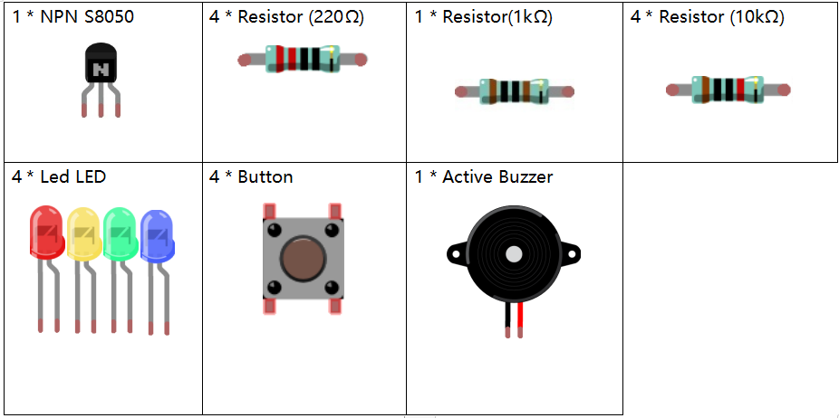

**Lesson 14 Quiz Buzzer System**
======================================

**Introduction**
---------------------

In quiz shows, especially entertainment activities (e.g. competitive
answering activities), organizers often apply a quiz buzzer system in
order to accurately, fairly and visually determine the seat number of a
responder. In this lesson, we will use some buttons, buzzers, and LEDs
to make a quiz buzzer system.

**Newly Added Components**
------------------------------

**Schematic Diagram**
-----------------------

Button 2, 3 and 4 are answer buttons, and button 1 is the reset button.
If button 2 is pressed first, the buzzer will beep, the corresponding
LED will light up and all the other LEDs will go out. If you want to
start another round, press button 1 to reset.

.. image:: media_pi/image233.png
    :width: 800
    :align: center

.. image:: media_pi/image258.png
    :width: 800
    :align: center

**Build the Circuit**
-----------------------------

.. image:: media_pi/image156.png
    :align: center

**For C Language Users**
----------------------------

**Command**
^^^^^^^^^^^^

**1.** Go to the folder of the code.

.. code-block::

    cd /home/pi/electronic-kit/for-raspberry-pi/c/Lesson_14_AnswerMachine

**2.** Compile the code.

.. code-block::

    gcc 14_AnswerMachine.c -lwiringPi

**3.** Run the executable file.

.. code-block::

    sudo ./a.out

Now, first press button 4 to get started. If you press button 1 first,
you will see the corresponding LED light up and the buzzer will beep.
Then press button 4 again to reset before you press other buttons.

**Code**
---------

.. code-block::

    1.#include <wiringPi.h>  
    2.#include <stdio.h>  
    3.  
    4.#define BeepPin 0  
    5.#define ResetBtnPin 1  
    6.const int BtnPin[] = {2,3,4};  
    7.const int LedPin[] = {21,22,23,24};  
    8.  
    9.void Alarm()  
    10.{  
    11.    for(int i=0;i<50;i++){  
    12.    digitalWrite(BeepPin,HIGH); //the buzzer sound  
    13.    delay(2); //delay 2ms  
    14.    digitalWrite(BeepPin,LOW);  //without sound  
    15.    delay(2);         
    16.  }  
    17.}  
    18.  
    19.int main(void){  
    20.    if(wiringPiSetup() == -1){ //when initialize wiring failed, print message to screen  
    21.        printf("setup wiringPi failed !");  
    22.        return 1;   
    23.    }  
    24.      
    25.     pinMode(BeepPin, OUTPUT);     
    26.    for(int j=1;j<4;j++)  
    27.    {  
    28.        pinMode(LedPin[j], OUTPUT);  
    29.        digitalWrite(LedPin[j],LOW);  
    30.    }  
    31.    pinMode(LedPin[0], OUTPUT);  
    32.    digitalWrite(LedPin[0],HIGH);  
    33.    for(int k;k<3;k++)  
    34.    {  
    35.        pinMode(BtnPin[k], INPUT);  
    36.    }  
    37.  
    38.    int flag = 1;  
    39.      
    40.    while(1){  
    41.        // if reset button is pressed  
    42.        if(digitalRead(ResetBtnPin) == 1)  
    43.        {  
    44.                flag = 1;                
    45.                digitalWrite(LedPin[0], HIGH);//Reset Led turns on  
    46.                digitalWrite(LedPin[1],LOW);  
    47.                digitalWrite(LedPin[2],LOW);  
    48.                digitalWrite(LedPin[3],LOW);             
    49.        }  
    50.        if(flag==1)  
    51.        {         
    52.            //If the button1 press the first  
    53.            if(digitalRead(BtnPin[0]) == 1)  
    54.            {  
    55.                    flag = 0;  
    56.                    digitalWrite(LedPin[0],LOW);  
    57.                    Alarm();  //buzzer sound  
    58.                    digitalWrite(LedPin[1],HIGH);//turn the LED1 on only  
    59.                    digitalWrite(LedPin[2],LOW);  
    60.                    digitalWrite(LedPin[3],LOW);  
    61.                    while(digitalRead(ResetBtnPin));            
    62.            }  
    63.             if(digitalRead(BtnPin[1]) == 1)  
    64.            {          
    65.                    flag = 0;  
    66.                    digitalWrite(LedPin[0],LOW);  
    67.                    Alarm();  //buzzer sound  
    68.                    digitalWrite(LedPin[1],LOW);  
    69.                    digitalWrite(LedPin[2],HIGH);//turn the LED2 on only  
    70.                    digitalWrite(LedPin[3],LOW);  
    71.                    while(digitalRead(ResetBtnPin));               
    72.            }  
    73.             if(digitalRead(BtnPin[2]) == 1)  
    74.            {                                
    75.                    flag = 0;  
    76.                    digitalWrite(LedPin[0],LOW);  
    77.                    Alarm();  //buzzer sound  
    78.                    digitalWrite(LedPin[1],LOW);  
    79.                    digitalWrite(LedPin[2],LOW);  
    80.                    digitalWrite(LedPin[3],HIGH);//turn the LED3 on only  
    81.                    while(digitalRead(ResetBtnPin));                  
    82.            }            
    83.        }         
    84.    }  
    85.    return 0;  
    86.}  

**Code Explanation**
^^^^^^^^^^^^^^^^^^^^^^^^

.. code-block::

    9.void Alarm()  
    10.{  
    11.    for(int i=0;i<50;i++){  
    12.    digitalWrite(BeepPin,HIGH); //the buzzer sound  
    13.    delay(2);   
    14.    digitalWrite(BeepPin,LOW);  //without sound  
    15.    delay(2);       
    16.  }  
    17.}  

Define a function to control the buzzer. The buzzer rings when this 
function is called in the main function.

.. code-block::

    38.    int flag = 1; 

Define a flag to judge whether the answer device is in the state of answering. 
When flag = 0, it indicates that someone is currently scrambling, and 
others cannot continue to answer first; when flag = 1, it means that the 
reset button has been pressed, and a new round of answer rush can be conducted.

.. code-block::

    42.        if(digitalRead(ResetBtnPin) == 1)  
    43.        {  
    44.                flag = 1;                  
    45.                digitalWrite(LedPin[0], HIGH);//Reset Led turns on  
    46.                digitalWrite(LedPin[1],LOW);  
    47.                digitalWrite(LedPin[2],LOW);  
    48.                digitalWrite(LedPin[3],LOW);           
    49.        }  

If the reset button is detected to have been pressed, it means that the answer 
begins. Now set flag to 1 and let the referee LED light up, the rest of the LED lights out.

.. code-block::

    53.            if(digitalRead(BtnPin[0]) == 1)  
    54.            {  
    55.                    flag = 0;  
    56.                    digitalWrite(LedPin[0],LOW);  
    57.                    Alarm();  //buzzer sound  
    58.                    digitalWrite(LedPin[1],HIGH);//turn the LED1 on only  
    59.                    digitalWrite(LedPin[2],LOW);  
    60.                    digitalWrite(LedPin[3],LOW);  
    61.                    while(digitalRead(ResetBtnPin));           
    62.            }  

In the process of quick answering, if the first button is recognized to 
have been pressed, the flag is set to 0, and then no other buttons are 
detected. At this time, the buzzer alarms, indicating that someone has 
successfully responsed, and the corresponding LED lights up. The 
identification codes of the remaining buttons are explained as above. 

.. code-block::

    61.                    while(digitalRead(ResetBtnPin)); 

Having executed the instruction of successful quick answer, 
it enters the loop to judge whether the button reset is pressed. Here, 
if the button reset is pressed, then the next round of quickfire 
answering begins.   

**For Python Language Users**
------------------------------

**Command**
^^^^^^^^^^^^^^

**1.** Go to the folder of the code.

.. code-block::

    cd /home/pi/electronic-kit/for-raspberry-pi/python

**2.** Run the code.

.. code-block::

    sudo python3 14_AnswerMachine.py

Now, first press button 4 to get started. If you press button 1 first,
you will see the corresponding LED light up and the buzzer will beep.
Then press button 4 again to reset before you press other buttons.

**Code**
^^^^^^^

.. code-block::

    1.import RPi.GPIO as GPIO  
    2.import time  
    3.  
    4.BeepPin = 17  
    5.ResetBtnPin = 18  
    6.BtnPin =(27,22,23)  
    7.LedPin =(5,6,13,19)  
    8.  
    9.def setup():  
    10.    GPIO.setmode(GPIO.BCM)  
    11.    GPIO.setup(BeepPin, GPIO.OUT, initial=GPIO.LOW)  
    12.    GPIO.setup(ResetBtnPin, GPIO.IN)  
    13.    GPIO.setup(LedPin[0], GPIO.OUT, initial=GPIO.HIGH)  
    14.    for i in range(1,4):  
    15.        GPIO.setup(LedPin[i], GPIO.OUT, initial=GPIO.LOW)  
    16.    for i in range(0,3):  
    17.        GPIO.setup(BtnPin[i], GPIO.IN)  
    18.  
    19.def Alarm():  
    20.    for i in range(0,50):  
    21.        GPIO.output(BeepPin,GPIO.HIGH)  
    22.        time.sleep(0.003)  
    23.        GPIO.output(BeepPin,GPIO.LOW)  
    24.        time.sleep(0.003)  
    25.  
    26.def loop():  
    27.    flag = 1  
    28.    while True:  
    29.        if GPIO.input(ResetBtnPin) == 1:  
    30.            flag = 1  
    31.            GPIO.output(LedPin[0],GPIO.HIGH)  
    32.            GPIO.output(LedPin[1],GPIO.LOW)  
    33.            GPIO.output(LedPin[2],GPIO.LOW)  
    34.            GPIO.output(LedPin[3],GPIO.LOW)  
    35.        if flag == 1:  
    36.            if GPIO.input(BtnPin[0]) == 1:  
    37.                flag = 0  
    38.                GPIO.output(LedPin[0],GPIO.LOW)  
    39.                Alarm()  
    40.                GPIO.output(LedPin[1],GPIO.HIGH)  
    41.                GPIO.output(LedPin[2],GPIO.LOW)  
    42.                GPIO.output(LedPin[3],GPIO.LOW)  
    43.            elif GPIO.input(BtnPin[1]) == 1:  
    44.                flag = 0  
    45.                GPIO.output(LedPin[0],GPIO.LOW)  
    46.                Alarm()  
    47.                GPIO.output(LedPin[1],GPIO.LOW)  
    48.                GPIO.output(LedPin[2],GPIO.HIGH)  
    49.                GPIO.output(LedPin[3],GPIO.LOW)  
    50.            elif GPIO.input(BtnPin[2]) == 1:  
    51.                flag = 0  
    52.                GPIO.output(LedPin[0],GPIO.LOW)  
    53.                Alarm()  
    54.                GPIO.output(LedPin[1],GPIO.LOW)  
    55.                GPIO.output(LedPin[2],GPIO.LOW)  
    56.                GPIO.output(LedPin[3],GPIO.HIGH)  
    57.  
    58.def destroy():  
    59.    # Turn off buzzer  
    60.    GPIO.output(BeepPin, GPIO.LOW)  
    61.    GPIO.output(LedPin[0],GPIO.LOW)  
    62.    GPIO.output(LedPin[1],GPIO.LOW)  
    63.    GPIO.output(LedPin[2],GPIO.LOW)  
    64.    GPIO.output(LedPin[3],GPIO.HIGH)  
    65.    # Release resource  
    66.    GPIO.cleanup()      
    67.  
    68.# If run this script directly, do:  
    69.if __name__ == '__main__':  
    70.    setup()  
    71.    try:  
    72.        loop()  
    73.    # When 'Ctrl+C' is pressed, the child program   
    74.    # destroy() will be  executed.  
    75.    except KeyboardInterrupt:  
    76.        destroy()  

**Code Explanation**
^^^^^^^^^^^^^^^^^^^^^^^^^

.. code-block::

    19.def Alarm():  
    20.    for i in range(0,50):  
    21.        GPIO.output(BeepPin,GPIO.HIGH)  
    22.        time.sleep(0.003)  
    23.        GPIO.output(BeepPin,GPIO.LOW)  
    24.        time.sleep(0.003)  

Define a function to control the buzzer. The buzzer rings 
when this function is called in the function main.

.. code-block::

    27.    flag = 1 

Define a flag bit to judge whether the responder is in the 
state of answering. When flag = 0, it indicates that someone is 
currently scrambling, and others cannot continue to answer first; 
when flag = 1, it means that the reset button has been pressed, 
and a new round of answer rush can be conducted.

.. code-block::

    29.        if GPIO.input(ResetBtnPin) == 1:  
    30.            flag = 1  
    31.            GPIO.output(LedPin[0],GPIO.HIGH)  
    32.            GPIO.output(LedPin[1],GPIO.LOW)  
    33.            GPIO.output(LedPin[2],GPIO.LOW)  
    34.            GPIO.output(LedPin[3],GPIO.LOW)  

If the recognition that reset button has been pressed is done, it means 
that answer begins. Now, set flag to 1, and let the referee LED light up, 
other LEDs light out.

.. code-block::

    36.            if GPIO.input(BtnPin[0]) == 1:  
    37.                flag = 0  
    38.                GPIO.output(LedPin[0],GPIO.LOW)  
    39.                Alarm()  
    40.                GPIO.output(LedPin[1],GPIO.HIGH)  
    41.                GPIO.output(LedPin[2],GPIO.LOW)  
    42.                GPIO.output(LedPin[3],GPIO.LOW)  

In the process of quick answering, if the first button is recognized 
to have been pressed, the flag is set to 0, and then no other buttons 
are detected. At this time, the buzzer alarms, indicating that there is 
a successful response, and the corresponding LED lights up. The 
identification codes of the remaining buttons are explained as above. 

**Phenomenon Picture**
----------------------------

.. image:: media_pi/image157.jpeg
    :width: 800
    :align: center

