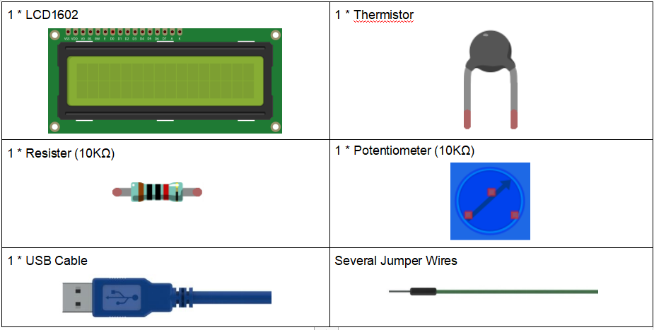
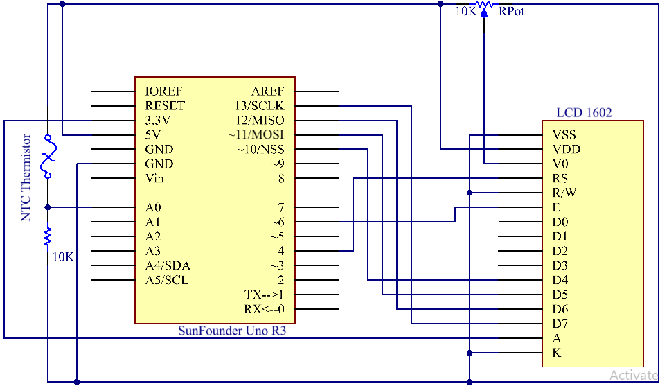
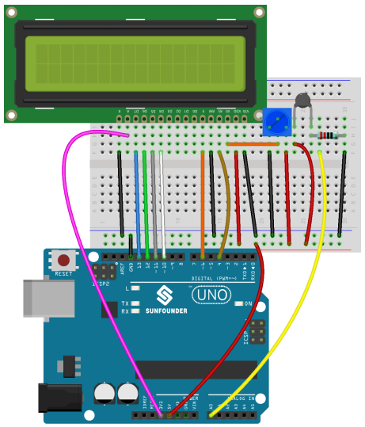

.. note::

    Hello, welcome to the SunFounder Raspberry Pi & Arduino & ESP32 Enthusiasts Community on Facebook! Dive deeper into Raspberry Pi, Arduino, and ESP32 with fellow enthusiasts.

    **Why Join?**

    - **Expert Support**: Solve post-sale issues and technical challenges with help from our community and team.
    - **Learn & Share**: Exchange tips and tutorials to enhance your skills.
    - **Exclusive Previews**: Get early access to new product announcements and sneak peeks.
    - **Special Discounts**: Enjoy exclusive discounts on our newest products.
    - **Festive Promotions and Giveaways**: Take part in giveaways and holiday promotions.

    👉 Ready to explore and create with us? Click [|link_sf_facebook|] and join today!

Lesson 14 Thermistor
==========================

**Introduction**
------------------------

We've learnt many devices so far. To make more things, you need to have
a good command of more knowledge. Today we're going to meet a
thermistor. It is similar to photoresistor in being able to change their
resistance based on the outer change. Different from photoresistor,
resistance of thermistor varies significantly with temperature in the
outer environment.

**Components**
------------------

.. image:: media_arduino/image171.png
    :width: 800
    :align: center

**Experimental Principle**
-----------------------------

Thermistor is a sensitive element, it has two types: Negative
Temperature Coefficient (NTC) and Positive Temperature Coefficient
(PTC), also NTC and PTC. Its resistance varies significantly with
temperature. The resistance of PTC thermistor increases with higher
temperature when that of NTC, decreases. In this experiment we use an
NTC one.

The schematic diagram:

The principle is that the resistance of the NTC thermistor changes with
the temperature difference in the outer environment. It detects the
real-time temperature of the environment. When the temperature gets
higher, the resistance of the thermistor decreases and the voltage of
pin A0 increases accordingly. The voltage data then is converted to
digital quantities by the A/D adapter. The temperature in Celsius and
Fahrenheit then is output via programming and then displayed on LCD1602.

In this experiment a thermistor and a 10k pull-up resistor are used.
Each thermistor has a normal resistance. Here it is 10k ohm, which is
measured under 25 degree Celsius.

Here is the relation between the resistance and temperature change:

R\ :sub:`T` =R\ :sub:`N` exp\ :sup:`B(1/TK – 1/TN)`   

**R\ T:** resistance of the NTC thermistor when the temperature is
T\ :sub:`K`. 

**R\ N:** resistance of the NTC thermistor under the rated temperature
which is T\ :sub:`N`. 

**T\ K** is a Kelvin temperature and the unit is K.   

**T\ N** is a rated Kelvin temperature; the unit is K, also.

And, beta, here is the material constant of NTC thermistor, also called
heat sensitivity index.  

exp is short for exponential, an exponential with the base number e,
which is a natural number and equals 2.7 approximately.    

Note that this relation is an empirical formula. It is accurate only
when the temperature and resistance are within the effective range.

Since T\ :sub:`K` =T+273, T is Celsius temperature, the relation between
resistance and temperature change can be transformed into this:

R =R\ :sub:`o` exp\ :sup:`B[1/(T+273) – 1/(To+273)]`

B, short for beta, is a constant. Here it is 4090. R\ :sub:`o` is 10k
ohms and T\ :sub:`o` is 25 degrees Celsius. The data can be found in the
datasheet of thermistor. Again, the above relation can be transformed
into one to evaluate temperature:

T= B/[ ln(R/ 10) + (B/ 298) ] – 273 (So ln here means natural logarithm,
a logarithm to the base e)

If we use a resistor with fixed resistance as 10k ohms, we can calculate
the voltage of the analog input pin A0 with this formula:

V =10k x 5/(R+10K)

So, this relation can be formed:

R = (5 x 10k /V) - 10k

The voltage of A0 is transformed via A/D adaptor into a digital number
a.

a=V x (1024/5)

V=a/205

Then replace V in the relation *R* = (5 x *10k /V)* - 10k with the
expression, and we can get this: R=1025 x 10k/a-10k.

Finally replace R in the formula here T= B/[ ln(R/ 10) + (B/ 298) ] –
273, which is formed just now. Then we at last get the relation for
temperature as this:

T =B/[ ln{[ 1025 X 10/a) - 10]/10} 十(B/298)] – 273

**Experimental Procedures**
-----------------------------

**Step 1:** Build the circuit

**Step 2:** Open the code file.

**Step 3:** Select the **Board** and **Port.**

**Step 4:** Upload the sketch to the board.

Now, you can see the current temperature displayed both in
Celsius and Fahrenheit degrees on the LCD1602.

.. image:: media_arduino/image138.jpeg
    :width: 800
    :align: center

**Code**
-----------------------

.. raw:: html

    <iframe src=https://create.arduino.cc/editor/sunfounder01/1b522b1f-eee7-4b55-9e29-e9e16b6bdcb5/preview?embed style="height:510px;width:100%;margin:10px 0" frameborder=0></iframe>

**Code Analysis** **14-1** **Set the variables**
^^^^^^^^^^^^^^^^^^^^^^^^^^^^^^^^^^^^^^^^^^^^^^^^^^^^^^

.. code-block:: arduino

    #define analogPin A0   // the thermistor attach to

    #define beta 3950      // the beta of the thermistor

    #define resistance 10  // the value of the pull-up resistor

Define the beta coefficient as 3950, which is described in the datasheet
of thermistor.

**Code Analysis** **14-2** **Get the temperature**
^^^^^^^^^^^^^^^^^^^^^^^^^^^^^^^^^^^^^^^^^^^^^^^^^^^^^^^^

.. code-block:: arduino

    long a = analogRead(analogPin); 
    // Read the resistance value of the thermistor to a via the signal from the analog pin. 
    // Here use a long type to make the value of a to be a long integer. 

    float tempC = beta / (log((1025.0 * 10 / a - 10) / 10) + beta / 298.0) - 273.0; 
    // The formula here is to calculate the temperature in Celsius, which we deduced previously. 
    
    float tempF = 1.8 * tempC + 32.0;  
    // define the temperature in Fahrenheit. As we know Fahrenheit equals to 1.8 * Celsius + 32. 

**Code Analysis** **14-3** **Display the temperature on LCD1602**
^^^^^^^^^^^^^^^^^^^^^^^^^^^^^^^^^^^^^^^^^^^^^^^^^^^^^^^^^^^^^^^^^^^^^^^^

.. code-block:: arduino

    lcd.setCursor(0, 0);   // set the cursor to column 0, line 0

    lcd.print("Temp: ");   // Print a message of "Temp: "to the LCD.

    lcd.print(tempC);      // Print the tempC value on display.

    lcd.print(char(223));  // print the unit" ° "

    lcd.print("C");

    // (note: line 1 is the second row, since counting begins with 0):

    lcd.setCursor(0, 1);   // set the cursor to column 0, line 1

    lcd.print("Fahr: ");

    lcd.print(tempF);    // Print a Fahrenheit temperature to the LCD.

    lcd.print(" F");       // Print the unit of the Fahrenheit temperature to the LCD.

    delay(200);           // wait for 100 milliseconds

