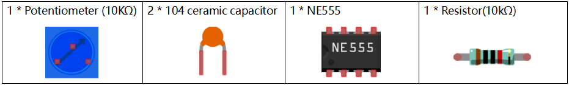
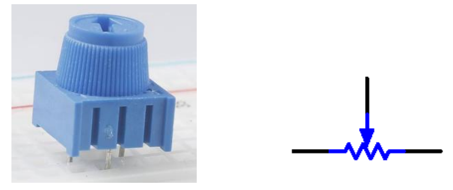

Lesson 15 NE555 Timer
==============================

**Introduction**
----------------------

The NE555 Timer, a mixed circuit composed of analog and digital
circuits, integrates analog and logical functions into an independent
IC, thus tremendously expanding the applications of analog integrated
circuits. It is widely used in various timers, pulse generators, and
oscillators. In this experiment, the Raspberry Pi is used to test the
frequencies of square waves generated by the 555 oscillating circuit and
show them on terminal windows.

**Newly Added Components**
---------------------------

**Principle**
--------------

**Potentiometer**

Potentiometer is also a resistance component with
3 terminals and its resistance value can be adjusted according to some
regular variation. Potentiometer usually consists of resistor and
movable brush. When the brush is moving along the resistor, there is a
certain resistance or voltage output depending on the displacement.

The functions of the potentiometer in the circuit are as follows:

1.Serving as a voltage divider
Potentiometer is a continuously adjustable resistor. 
When you adjust the shaft or sliding handle of the 
potentiometer, the movable contact will slide on the resistor. 
At this point, a voltage can be output depending on the voltage 
applied onto the potentiometer and the angle the movable arm has 
rotated to or the distance it moves. 

2.Serving as a rheostat
When the potentiometer 
is used as a rheostat, connect the middle pin and one 
of the other 2 pins in the circuit. Thus you can get a 
smoothly and continuously changed resistance value cused 
by moving contact. 

3.Serving as a current controller
When the potentiometer acts as a current controller, 
the sliding contact terminal must be connected as 
one of the output terminals.

**555 IC**

The 555 IC was originally used as a timer, 
hence the name 555 time base circuit. It is 
now widely used in various electronic products because 
of its reliability, convenience, and low price. The 
555 is a complex hybrid circuit with dozens of components such 
as a divider, comparator, basic R-S trigger, discharge 
tube, and buffer.

**Pins and functions:**

.. image:: media_pi/image162.png
    :width: 800
    :align: center

As shown in the picture, the pins are set dual 
in-line with the 8-pin package.

* Pin 1 (**GND**): the ground

* Pin 2 (**TRIGGER**): when the voltage at the pin reduces to 1/3 of the VCC (or the threshold defined by the control board), the output terminal sends out a High level

* Pin 3 (**OUTPUT**): outputs High or Low, two states 0 and 1 decided by the input electrical level; maximum output current approx. 200mA at High

* Pin 4 (**RESET**): when a Low level is received at the pin, the timer will be reset and the output will return to Low level; usually connected to positive pole or neglected

* Pin 5 (**CONTROL VOLTAGE**): to control the threshold voltage of the chip (if it skips connection, by default, the threshold voltage is 1/3 VCC and 2/3 VCC)

* Pin 6 (**THRESHOLD**): when the voltage at the pin increases to 2/3 VCC (or the threshold defined by the control board), the output terminal sends out a High level.

* Pin 7 (**DISCHARGE**): output synchronized with Pin 3, with the same logical level; but this pin does not output current, so pin 3 is the real High (or Low) when pin 7 is the virtual High (or Low); connected to the open  collector (OC) inside to discharge the capacitor.

* Pin 8 (**VCC**): positive terminal for the NE555 timer IC, ranging +4.5V to +16V

The NE555 timer works under the monostable, astable and bistable modes. In this experiment, apply it under the astable mode, which means it works as an oscillator, as shown below:

**Cap**

.. image:: media_pi/image163.jpeg
    :width: 400
    :align: center

A ceramic capacitor is a capacitor that is made of ceramic material 
and works as a dielectric. It is coated with a metal film on the surface 
of the ceramic and sintered at a high temperature. The ceramic capacitor is 
commonly used in high-stability oscillator circuits as loops, bypass capacitors, 
and pad capacitors. It is a non-polar capacitor, so this capacitor does not need 
to distinguish between positive and negative during installation.

In the circuit of this lesson, the main function of the ceramic 
capacitor, high-frequency filtering is to remove some clutter 
that may occur in the working process of the NE555 chip, so that 
the waveform is more stable.

**Schematic Diagram**
-----------------------

Build the circuit according to the following schematic diagram.

.. image:: media_pi/image237.png
    :width: 800
    :align: center

**Working Process:**

The oscillator starts to shake once the circuit is power on. During
energizing, since the voltage at C1 cannot change abruptly, which means
pin 2 is Low level initially, set the timer to 1, so pin 3 is High
level. The capacitor C1 charges via R1 and R2 in a time span:

When the voltage at C1 reaches the threshold 2/3Vcc, the timer is reset
and pin 3 is Low level. Then C1 discharges via R2 till 2/3Vcc in a time
span:

Then the capacitor is recharged and the output voltage flips again:

**Build the Circuit**
---------------------

.. image:: media_pi/image238.png
    :width: 800
    :align: center

**For C Language Users**
-------------------------------

**Command**
^^^^^^^^^^^

**1.** Go to the folder of the code.

.. raw:: html

    <run></run>

.. code-block::

    cd /home/pi/electronic-kit/for-raspberry-pi/c/Lesson_15_NE555_Timer

**2.** Compile the code.

.. raw:: html

    <run></run>

.. code-block::

    gcc 15_NE555_Timer.c -lwiringPi

**3.** Run the executable file.

.. raw:: html

    <run></run>

.. code-block::

    sudo ./a.out

When the code is running, you will see the number of pulses on the
display screen and the level of pin3 in NE555 at this time.

.. note::

    If it does not work after running, or there is an error prompt: \"wiringPi.h: No such file or directory\", please refer to :ref:`C code is not working?`.

**Code**
^^^^^^^^^^^^

.. code-block:: c

    #include <stdio.h>  
    #include <string.h>  
    #include <errno.h>  
    #include <stdlib.h>  
    #include <wiringPi.h>  
      
    #define  OutPin  1  
      
    static volatile int globalCounter = 0 ;  
      
    void exInt0_ISR(void)  //GPIO 1 interrupt service routine   
    {  
        ++globalCounter;  
    }  
      
    int main (void)  
    {
        if(wiringPiSetup() < 0){  
            fprintf(stderr, "Unable to setup wiringPi:%s\n",strerror(errno));  
            return 1;  
        }  
          
        delay(2000);    
        pinMode(OutPin,INPUT);  
        pullUpDnControl(OutPin,PUD_UP);  
        wiringPiISR(OutPin, INT_EDGE_FALLING, &exInt0_ISR);  
        
        while(1){
            printf("Current pluse number is : %d, %d\n", globalCounter,digitalRead(OutPin));  
            delay(100);  
        }  
        return 0;  
    }  

**Code Explanation**
^^^^^^^^^^^^^^^^^^^^^^

.. code-block:: c

    9.static volatile int globalCounter = 0 ;  

Define a variable to record the number of pulses, 
and initialize the number of pulses to 0.

.. code-block:: c

    11.void exInt0_ISR(void)     
    12.{  
    13.    ++globalCounter;  
    14.} 
 
Set an external interrupt function and **globalCounter** will 
automatically +1 when an interrupt occurs.

.. code-block:: c

    24. pinMode(OutPin,INPUT);
    25. pullUpDnControl(OutPin,PUD_UP);   

Set the out pin of NE555 to **INPUT** mode, 
then let the pin be in pull-up state (1).

.. code-block:: c

    26.  wiringPiISR(OutPin, INT_EDGE_FALLING, &exInt0_ISR);  
    
Set an interrupt in **OutPin**, when the value of **OutPin** changes from 1 to 0. 
Then call the exInt0_ISR() function to let the variable **globalCounter** add 1.

.. code-block:: c

    29.    printf("Current pluse number is : %d, %d\n", globalCounter,digitalRead(OutPin));  

Print out the number of pulses, **globalCounter** and the value of **OutPin** at this time.

**For Python Language Users**
-------------------------------

**Command**
^^^^^^^^^^^^^^^^

**1.** Go to the folder of the code.

.. raw:: html

    <run></run>

.. code-block::

    cd /home/pi/electronic-kit/for-raspberry-pi/python

**2.** Run the code.

.. raw:: html

    <run></run>

.. code-block::

    sudo python3 15_NE555.py

When the code is running, you can see the number of pulses on the
display.

**Code**
^^^^^^^^^^^^^

.. note::
    You can **Modify/Reset/Copy/Run/Stop** the code below. But before that, you need to go to  source code path like ``electronic-kit/for-raspberry-pi/python``. After modifying the code, you can run it directly to see the effect.

.. raw:: html

    <run></run>

.. code-block:: python

    import RPi.GPIO as GPIO  
    import time  
      
    SigPin = 18      
      
    g_count = 0  
      
    def count(ev=None):  
        global g_count  
        g_count += 1  
      
    def setup():  
        GPIO.setmode(GPIO.BCM)        
        GPIO.setup(SigPin, GPIO.IN, pull_up_down=GPIO.PUD_UP)      
        GPIO.add_event_detect(SigPin, GPIO.RISING, callback=count) # wait for rasing  
      
    def main(): 
        while True:  
            print ('g_count = %d' % g_count)  
            time.sleep(0.01)  
      
    def destroy():  
        GPIO.cleanup()    # Release resource  
      
    if __name__ == '__main__':     # Program start from here  
        setup()  
        try:  
            main()  
        except KeyboardInterrupt:  # When 'Ctrl+C' is pressed, the child program destroy() will be  executed.  
            destroy()  

**Code Explanation**
^^^^^^^^^^^^^^^^^^^^^

.. code-block::

    6. g_count = 0  

Define a variable to record the 
number of pulses, and initialize the number of pulses to **0**.

.. code-block::

    7.def count(ev=None):  
    8.global g_count  
    9.g_count += 1

This function will change the value of the global variable **g_count**. 

.. code-block::

    14.      GPIO.setup(SigPin, GPIO.IN, pull_up_down=GPIO.PUD_UP)      

Set the **SigPin** to input mode and pull up to high level(3.3V).

.. code-block::

    15.  GPIO.add_event_detect(SigPin, GPIO.RISING, callback=count)   

Set an interrupt in **SigPin**, when the value of **SigPin** changes from 
0 to 1. Then call the **count()** function to let the variable **g_count** add 1.

.. code-block::

    18.    while True:  
    19.        print ('g_count = %d' % g_count)  
    20.        time.sleep(0.01)  

Print out the value of the number of pulse g_count at an interval of 0.01s.

**Phenomenon Picture**
----------------------------

.. image:: media_pi/image166.jpeg
    :width: 800
    :align: center

