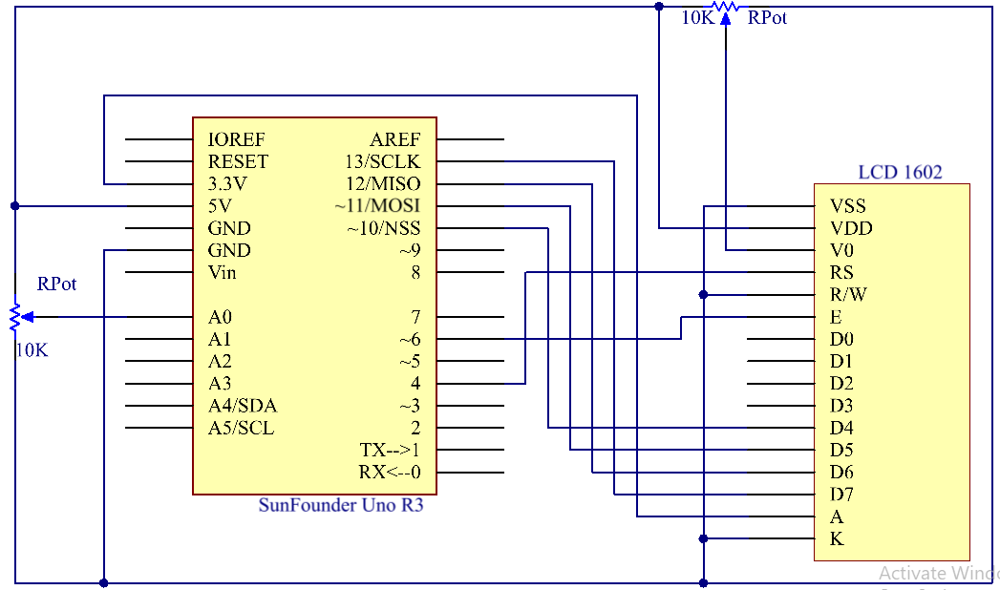
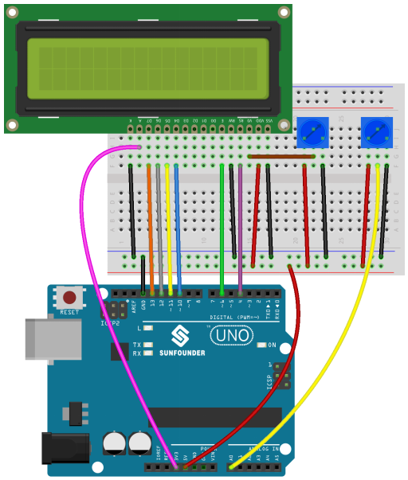
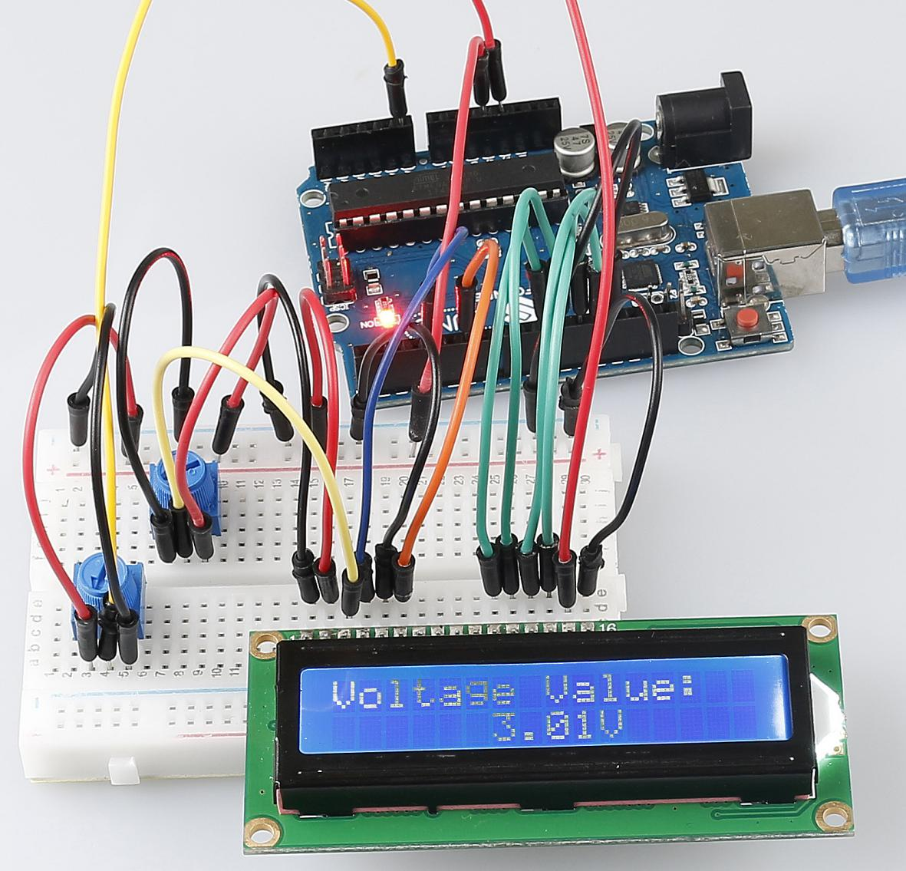

Lesson 15 Voltmeter
========================

**Introduction**
--------------------

In this lesson, we will use two potentiometers and an LCD1602 to make a
DIY voltmeter.

**Components**
-------------------

.. image:: media_arduino/image196.png
    :width: 800
    :align: center

.. image:: media_arduino/image197.png
    :width: 800
    :align: center

**Experimental Principle**
--------------------------------

Here one potentiometer is used to adjust the contrast of the LCD1602 and
the other to divide voltage. When you adjust the potentiometer connected
to pin A0 of the SunFounder Uno board, the resistance of the
potentiometer will change and the voltage at pin A0 will change
accordingly. This voltage change is converted into digital values by A/D
converter on the SunFounder Uno board. We can see this change on the
serial monitor. Then convert the digital values into voltage with the
following formula: the voltage equals the digital value divides by 1024
and then multiplies by 5.0. Finally, display the voltage on the LCD1602.

The schematic diagram:

**Experimental Procedures**
--------------------------------

**Step 1**: Build the circuit

**Step 2**: Open the code file

**Step 3**: Select the correct **Board** and **Port**

**Step 4:** Upload the sketch to the SunFounder Uno board

Now, adjust the potentiometer connected to pin A0, and you will see the
voltage displayed on the LCD1602 varies accordingly.

**Code**
------------------------

.. raw:: html

    <iframe src=https://create.arduino.cc/editor/sunfounder01/3de830b2-cb83-42fd-81d0-8067548c5741/preview?embed style="height:510px;width:100%;margin:10px 0" frameborder=0></iframe>

**Code Analysis** **15-1** **Define the pins of LCD1602 andpotentiometer**
^^^^^^^^^^^^^^^^^^^^^^^^^^^^^^^^^^^^^^^^^^^^^^^^^^^^^^^^^^^^^^^^^^^^^^^^^^^^^^^^^^^

.. code-block:: arduino

    #include <LiquidCrystal.h>

    /****************************************************/

    float analogIn = 0;                      // store the analog value of A0

    LiquidCrystal lcd(4, 6, 10, 11, 12, 13); // lcd(RS,E,D4,D5,D6.D7)

    float vol = 0;                           // store the voltage

Call the LiquidCrystal library and define the pins of LCD1602 connect to
4,6 and 10 to 13 of Uno board.

Assign the value of A0 to analogIn.

**Code Analysis** **15-2** **Initialize the LCD1602 and serial monitor**
^^^^^^^^^^^^^^^^^^^^^^^^^^^^^^^^^^^^^^^^^^^^^^^^^^^^^^^^^^^^^^^^^^^^^^^^^^^^^^^^

.. code-block:: arduino

    void setup()

    {

        Serial.begin(9600);          // Initialize the serial monitor

        lcd.begin(16, 2);            // set the position of the characters on the LCD as Line 2, Column 16

        lcd.print("Voltage Value:"); // print "Voltage Value:"

    }

Initialize the baud rate of serial monitor to 9600bps and set the
position of the characters on the LCD as Line 2, Column 16. Print
“Voltage Value: ” on the LCD1602.

**Code Analysis** **15-3** **Read the analog of A0 and convert to voltage**
^^^^^^^^^^^^^^^^^^^^^^^^^^^^^^^^^^^^^^^^^^^^^^^^^^^^^^^^^^^^^^^^^^^^^^^^^^^^^^^^^^^^^^^^^

.. code-block:: arduino

    void loop()

    {

        analogIn = analogRead(A0); // Read the value of the potentiometer to val

        vol = analogIn/1024*5.0;     // Convert the data to the corresponding voltage value in a math way

        Serial.print(vol);           // Print the number of val on the serial monitor

        Serial.println("V");       // print the unit as V, short for voltage on the serial monitor

        lcd.setCursor(6,1);      // Place the cursor at Line 1, Column 6. From here the characters are to be displayed

        lcd.print(vol);             // Print the number of val on the LCD

        lcd.print("V");            // Then print the unit as V, short for voltage on the LCD

        delay(200);                // Wait for 200ms

    }

The analog value of A0 is: Analog value=5/VA0 \* 1024, so VA0= Analog
value/1024 \* 5, if you connect the potentiometer to 3.3v, then modify
5V to 3.3V.

Print the voltage to serial monitor or the LCD1602.
