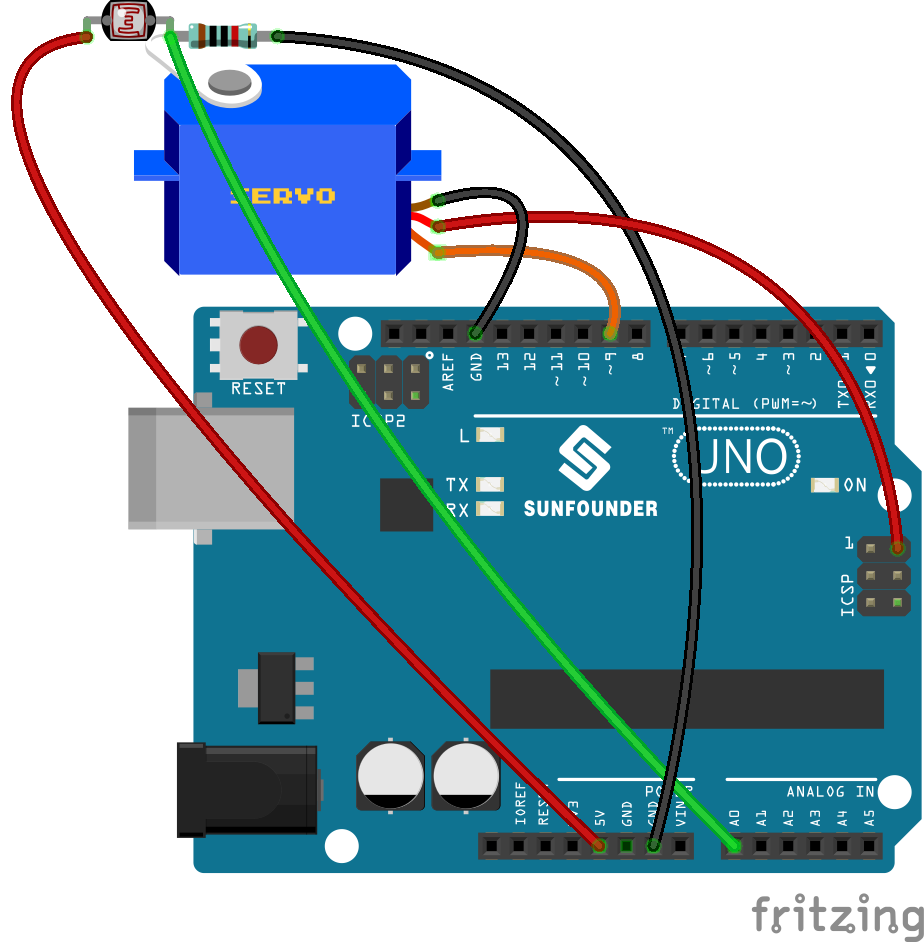
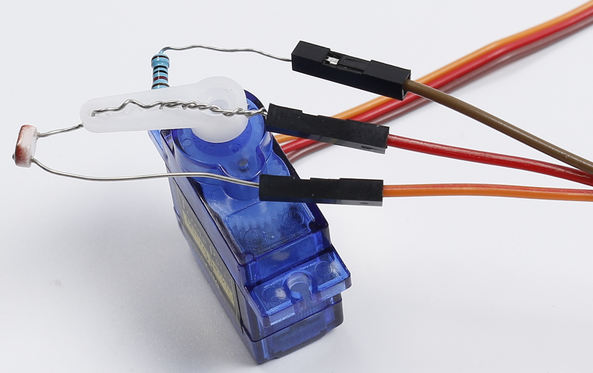

.. note::

    Hello, welcome to the SunFounder Raspberry Pi & Arduino & ESP32 Enthusiasts Community on Facebook! Dive deeper into Raspberry Pi, Arduino, and ESP32 with fellow enthusiasts.

    **Why Join?**

    - **Expert Support**: Solve post-sale issues and technical challenges with help from our community and team.
    - **Learn & Share**: Exchange tips and tutorials to enhance your skills.
    - **Exclusive Previews**: Get early access to new product announcements and sneak peeks.
    - **Special Discounts**: Enjoy exclusive discounts on our newest products.
    - **Festive Promotions and Giveaways**: Take part in giveaways and holiday promotions.

    👉 Ready to explore and create with us? Click [|link_sf_facebook|] and join today!

Lesson 16 Automatically Tracking Light Source
===================================================

**Introduction**
----------------------

In this lesson, we will make some interesting creations – use a servo
motor, a photoresistor and a pull-down resistor to assemble an
automatically tracking light source system.

**Components**
------------------

.. image:: media_arduino/image198.png
    :width: 800
    :align: center

**Experimental Principle**
------------------------------

The rocker arm of the servo and the bundled photoresistor sway together
to scan and "look" for light source within 180 degrees and record the
location of light source when finding one. Then they stop swaying just
at the direction of the light source.

**The schematic diagram:**
-----------------------------

.. image:: media_arduino/image142.png
    :width: 800
    :align: center

**Experimental Procedures**
------------------------------

**Step 1:** Build the circuit

.. note:: you need to bind one end of the resistor and photoresistor to the rocker arm of the servo (cross the pin through the holes of the arm).

    1) Insert one pin of the photoresistor and 10 resistor through the holes
    on the rocker arm. Pay attention here to tightly winding them because
    you need to make sure they are connected in the circuit.

    .. image:: media_arduino/image144.png
        :width: 400
        :align: center

    2) Plug in the rock arm to the servo and use 3 jumper wires to hook up
    the 3 pins.

    pay attention to plug the pin tightly in case of disentanglement.

    .. image:: media_arduino/image224.png
        :width: 800
        :align: center

    

    3) Hook up the middle pin to pin A0 of the Uno board, another pin of the
    10k resistor to GND, photoresistor to 5V.

    .. image:: media_arduino/image146.png
        :width: 400
        :align: center

    4) Connect the brown wire of servo to GND and red to 5v. Since the 5v
    usually used is occupied already, you need to connect the other 5v as
    the following picture shows.

    .. image:: media_arduino/image147.png
        :width: 400
        :align: center

    5) Next connect the orange wire to pin 9 of the SunFounder Uno board. OK
    now the circuit is completed! Connect the Uno board to your computer
    with a USB cable.

**Step 2**: Open the code file

**Step 3**: Select the correct **Board** and **Port**

**Step 4:** Upload the sketch to the SunFounder Uno board

Now, shine a flashlight onto the photoresistor. Then you will see the
rocker arm of the servo and the photoresistor rotate and finally stop at
the direction of light source.

**Code**
-----------------------

.. raw:: html

    <iframe src=https://create.arduino.cc/editor/sunfounder01/281d8f9c-413e-44b1-853e-4cfb274c4697/preview?embed style="height:510px;width:100%;margin:10px 0" frameborder=0></iframe>

**Code Analysis** **16-1** **Initialize and define variables**
^^^^^^^^^^^^^^^^^^^^^^^^^^^^^^^^^^^^^^^^^^^^^^^^^^^^^^^^^^^^^^^^^^^

.. code-block:: arduino

    #include <Servo.h>

    const int photocellPin = A0; //The photoresistor is connected to A0

    /************************************************/

    Servo myservo;//create servo object to control a servo

    int outputValue = 0; //Save the value read from A0

    int angle[] = {0, 10, 20, 30, 40, 50, 60, 70, 80, 90, 100, 110, 120, 130, 140, 150, 160, 170, 180}; 
    //Define the angle of servo

    int maxVal = 0; //Record the maximum number

    int maxPos = 0; //Record the angle of the servo when the read the maximum number of photoresistor.

Define an integer array angle[], which contains 19 elements from 0 to
18, representing 0 to 180 which indicates the degree of servo rotation.
For example, angle[0] means 0 degree, angle[1] is 10 degrees, and so
forth.

**Code Analysis** **16-2** **Servo rock arm stop at the direction of light source**
^^^^^^^^^^^^^^^^^^^^^^^^^^^^^^^^^^^^^^^^^^^^^^^^^^^^^^^^^^^^^^^^^^^^^^^^^^^^^^^^^^^^^^^

.. code-block:: arduino

    void loop()

    {

        for(int i = 0; i < 19; i ++)

        {

            myservo.write(angle[i]); 
            //write the angle from the angle[i] array to servo. 
            //When i=0, angle[0]=0, i=1, angle[1]=10, and so on.

            outputValue = analogRead(photocellPin); //read the value of A0

            Serial.println(outputValue); //print it

            if(outputValue > maxVal) 
            //if the current value of A0 is greater than previous

            {

                maxVal = outputValue; // write down the value

                maxPos =i; // write down the angle

            } 
            
            delay(200); // delay 200ms 
            
        }

        myservo.write(angle[ maxPos]); 
        // write the angle to servo which A0 has greatest value

        delay(1000); //delay 1s

    }

Set the servo to rotate from 0 to 180, and the angle is defined in the
angle [] array. Since the photoresistor is wound with the servo rock
arm, the resistance of the photoresistor changes with different light
intensities each time the servo is rotated, so the analog value of A0 is
changed at the same time.

By comparing the value of A0 with the previously recorded maximum value,
record the maximum A0 value and current angle of the servo. Finally let
the servo turn to this angle.