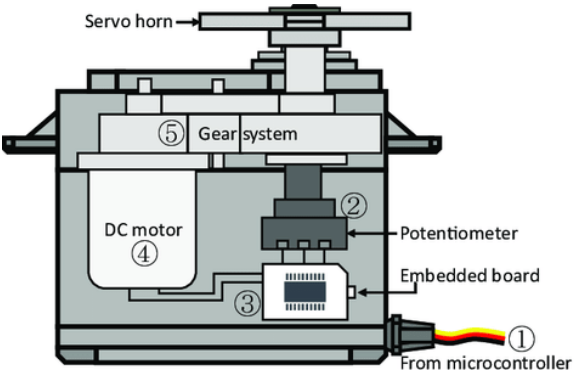
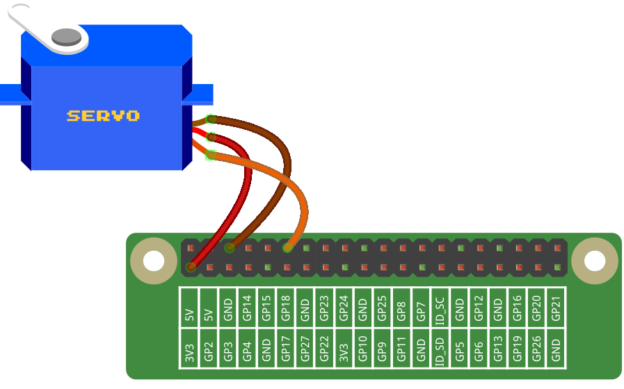
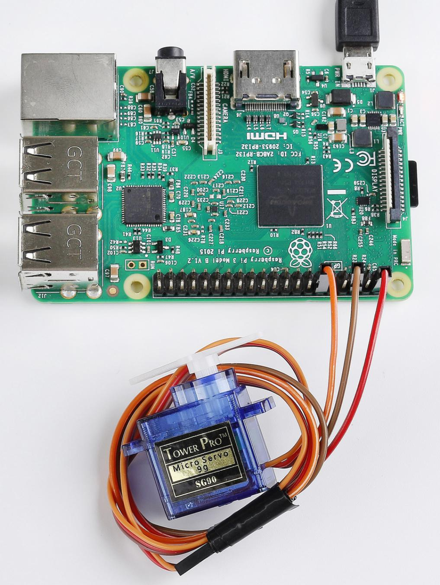

Lesson 16 Servo
===================

**Introduction**
-----------------

Servo is a type of geared motor that can only rotate 180 degrees. It is
controlled by sending electrical pulses from your board. These pulses
tell the servo what position it should move to.

A servo has three wires: the brown wire is GND, the red one is VCC, and
the orange one is signal line.

**Newly Added Components**
---------------------------

.. image:: media_pi/image266.png
    :align: center

**Principle**
-------------------

**Servo**

A servo is generally composed of the following parts: case, shaft, gear
system, potentiometer, DC motor, and embedded board.

.. image:: media_pi/image168.png
    :align: center

It works like this: The microcontroller sends out PWM signals to the
servo, and then the embedded board in the servo receives the signals
through the signal pin and controls the motor inside to turn. As a
result, the motor drives the gear system and then motivates the shaft
after deceleration. The shaft and potentiometer of the servo are
connected together. When the shaft rotates, it drives the potentiometer,
so the potentiometer outputs a voltage signal to the embedded board.
Then the board determines the direction and speed of rotation based on
the current position, so it can stop exactly at the right position as
defined and hold there.

The angle is determined by the duration of a pulse that is applied to
the control wire. This is called Pulse width Modulation. The servo
expects to see a pulse every 20 ms. The length of the pulse will
determine how far the motor turns. For example, a 1.5ms pulse will make
the motor turn to the 90 degree position (neutral position).

When a pulse is sent to a servo that is less than 1.5 ms, the servo
rotates to a position and holds its output shaft some number of degrees
counterclockwise from the neutral point. When the pulse is wider than
1.5 ms the opposite occurs. The minimal width and the maximum width of
pulse that will command the servo to turn to a valid position are
functions of each servo. Generally the minimum pulse will be about 0.5
ms wide and the maximum pulse will be 2.5 ms wide.

.. image:: media_pi/image170.jpeg
    :width: 800
    :align: center

**Schematic Diagram**
----------------------------

.. image:: media_pi/image240.png
    :width: 800
    :align: center

**Build the Circuit**
-------------------------

Note: Connect the brown to GND, Red to VCC, Orange to pin12 of the
control board.

**For C Language Users**
-------------------------

**Command**
^^^^^^^^^^^

**1.** Go to the folder of the code.

.. raw:: html

    <run></run>

.. code-block::

    cd /home/pi/electronic-kit/for-raspberry-pi/c/Lesson_16_Servo

**2.** Compile the code.

.. raw:: html

    <run></run>

.. code-block::

    gcc 16_Servo.c -lwiringPi

**3.** Run the executable file.

.. raw:: html

    <run></run>

.. code-block::

    sudo ./a.out

After the program is executed, the servo will rotate from 0 degrees to
180 degrees, and then from 180 degrees to 0 degrees, circularly.

.. note::

    If it does not work after running, or there is an error prompt: \"wiringPi.h: No such file or directory\", please refer to :ref:`C code is not working?`.

**Code**
^^^^^^^^^^^

.. code-block:: c

    #include <wiringPi.h>  
    #include <softPwm.h>  
    #include <stdio.h>  
      
    #define ServoPin    1         
    long Map(long value,long fromLow,long fromHigh,long toLow,long toHigh){  
        return (toHigh-toLow)*(value-fromLow) / (fromHigh-fromLow) + toLow;  
    }  
    void setAngle(int pin, int angle){    //Specif a certain rotation angle (0-180) for the servo  
        if(angle < 0)  
            angle = 0;  
        if(angle > 180)  
            angle = 180;  
        softPwmWrite(pin,map(angle,0,180,5,25));     
    }   
      
    int main(void)  
    {  
        int i;  
          
        if(wiringPiSetup() == -1){ //when initialize wiring faiservo,print message to screen  
            printf("setup wiringPi failed !");  
            return 1;   
        }  
        softPwmCreate(servoPin,  0, 200);       //initialize PMW pin of servo  
        while(1){  
            for(i=0;i<181;i++){    
                setAngle(ServoPin,i);  
                delay(1);  
            }  
            delay(500);  
            for(i=181;i>-1;i--){    
                setAngle(ServoPin,i);  
                delay(1);  
            }  
            delay(500);  
        }  
        return 0;  
    }  

**Code Explanation**
^^^^^^^^^^^^^^^^^^^^^^^^^^

.. code-block:: c

    6.long Map(long value,long fromLow,long fromHigh,long toLow,long toHigh){  
    7.    return (toHigh-toLow)*(value-fromLow) / (fromHigh-fromLow) + toLow;  
    8.}  

Create a **map()** function to map value in the following code.

.. code-block:: c

    9.void setAngle(int pin, int angle){    //Specif a certain rotation angle (0-180) for the servo  
    10.    if(angle < 0)  
    11.        angle = 0;  
    12.    if(angle > 180)  
    13.        angle = 180;  
    14.    softPwmWrite(pin,map(angle,0,180,5,25));     
    15.}   

Define a function to limit the angle of the servo to 0 to 
180 in order to set the angle of servo.

.. code-block:: c

    softPwmWrite(pin,map(angle,0,180,5,25));  

This function can change the duty cycle of the PWM pin. 

To make the servo rotate to 0 ~ 180 °, the pulse width should change 
within the range of 0.5ms ~ 2.5ms when the period is 20ms; in the function, 
**softPwmCreate()**, we have set that the period is 200x100us=20ms, thus we 
need to map 0 ~ 180 to 5x100us ~ 25x100us.

.. code-block:: c

    25.    softPwmCreate(ServoPin,  0, 200);

The function is to use softwares to create a PWM pin, **servoPin**, 
then the initial pulse widths of them are set to **0**, and the period of PWM is **200** x100us.

.. code-block:: c

    27.        for(i=0;i<181;i++){    
    28.            setAngle(ServoPin,i);  
    29.            delay(1);  
    30.        }  

In a **for** loop, we want servo to rotate from 0 degrees to 180 degrees.

.. code-block:: c

    32.        for(i=181;i>-1;i--){    
    33.            setAngle(ServoPin,i);  
    34.            delay(1);  
    35.        }  

In a **for** loop, we want servo to rotate from 180 degrees to 0 degrees.

**For Python Language Users**
--------------------------------------

**Command**
^^^^^^^^^^^^

**1.** Go to the folder of the code.

.. raw:: html

    <run></run>

.. code-block::

    cd /home/pi/electronic-kit/for-raspberry-pi/python

**2.** Run the code.

.. raw:: html

    <run></run>

.. code-block::

    sudo python3 16_Servo.py

After the program is executed, the servo will rotate from 0 degrees to
180 degrees, and then from 180 degrees to 0 degrees, circularly.

**Code** 
^^^^^^^^^^^^^

.. note::
    You can **Modify/Reset/Copy/Run/Stop** the code below. But before that, you need to go to  source code path like ``electronic-kit/for-raspberry-pi/python``. After modifying the code, you can run it directly to see the effect.

.. raw:: html

    <run></run>

.. code-block:: python

    import RPi.GPIO as GPIO  
    import time  
      
    SERVO_MIN_PULSE = 500  
    SERVO_MAX_PULSE = 2500  
      
    ServoPin = 18  
      
    def map(value, inMin, inMax, outMin, outMax):  
        return (outMax - outMin) * (value - inMin) / (inMax - inMin) + outMin  
      
    def setup():  
        global p  
        GPIO.setmode(GPIO.BCM)       # Numbers GPIOs by BCM  
        GPIO.setup(ServoPin, GPIO.OUT)   # Set ServoPin's mode is output  
        GPIO.output(ServoPin, GPIO.LOW)  # Set ServoPin to low  
        p = GPIO.PWM(ServoPin, 50)     # set Frequecy to 50Hz  
        p.start(0)                     # Duty Cycle = 0  
          
    def setAngle(angle):      # make the servo rotate to specific angle (0-180 degrees)   
        angle = max(0, min(180, angle))  
        pulse_width = map(angle, 0, 180, SERVO_MIN_PULSE, SERVO_MAX_PULSE)  
        pwm = map(pulse_width, 0, 20000, 0, 100)  
        p.ChangeDutyCycle(pwm)#map the angle to duty cycle and output it  
          
    def loop():  
        while True:  
            for i in range(0, 181, 5):   #make servo rotate from 0 to 180 deg  
                setAngle(i)     # Write to servo  
                time.sleep(0.002)  
            time.sleep(1)  
            for i in range(180, -1, -5): #make servo rotate from 180 to 0 deg  
                setAngle(i)  
                time.sleep(0.001)  
            time.sleep(1)  
      
    def destroy():  
        p.stop()  
        GPIO.cleanup()  
      
    if __name__ == '__main__':     #Program start from here  
        setup()  
        try:  
            loop()  
        except KeyboardInterrupt:  # When 'Ctrl+C' is pressed, the program destroy() will be executed. 
            destroy()

**Code Explanation**
^^^^^^^^^^^^^^^^^^^^^^^

.. code-block::

    9.def map(value, inMin, inMax, outMin, outMax):  
    10.    return (outMax - outMin) * (value - inMin) / (inMax - inMin) + outMin  

Create a **map()** function to map value in the following code.

.. code-block::

    17.  p = GPIO.PWM(ServoPin, 50)  
    18.  p.start(0)   

Set the **servoPin** to PWM pin, then the frequency to **50** hz, and the period to 20ms.
p.start(0): Run the PWM function，and set the initial value to **0**.

.. code-block::

    20.def setAngle(angle):      # make the servo rotate to specific angle (0-180 degrees)   
    21.    angle = max(0, min(180, angle))  
    22.    pulse_width = map(angle, 0, 180, SERVO_MIN_PULSE, SERVO_MAX_PULSE)  
    23.    pwm = map(pulse_width, 0, 20000, 0, 100)  
    24.    p.ChangeDutyCycle(pwm)#map the angle to duty cycle and output it  

Create a function, **setAngle()** to write angle that ranges 
from 0 to 180 into the servo.

.. code-block::

    24.p.ChangeDutyCycle(pwm)  

This function can change the duty cycle of the PWM. 
To render a range **0 ~ 180°** to the servo, the pulse width of 
the servo is set to **0.5ms-2.5ms**.

In the previous codes, the period of PWM was set to 20ms, 
thus the duty cycle of PWM is (0.5/20)%-(2.5/20)%, and the 
range 0 ~ 180 is mapped to **2.5 ~ 12.5**.

.. code-block::

    28.        for i in range(0, 181, 5):   #make servo rotate from 0 to 180 deg  
    29.            setAngle(i)     # Write to servo  
    30.            time.sleep(0.002)  

In a **for** loop, we want servo to rotate from **0** degrees to **180** degrees.  

.. code-block::

    32.        for i in range(180, -1, -5): #make servo rotate from 180 to 0 deg  
    33.            setAngle(i)  
    34.            time.sleep(0.001)  

In a **for** loop, we want servo to rotate from **180** degrees to **0** degrees.

**Phenomenon Picture**
-----------------------------

