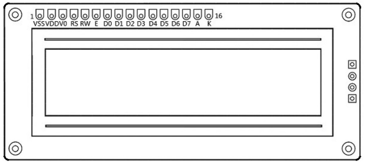
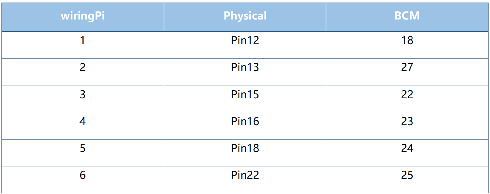
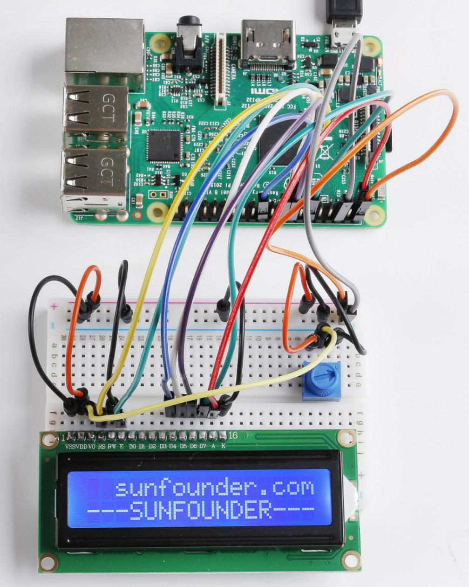

.. note::

    Hello, welcome to the SunFounder Raspberry Pi & Arduino & ESP32 Enthusiasts Community on Facebook! Dive deeper into Raspberry Pi, Arduino, and ESP32 with fellow enthusiasts.

    **Why Join?**

    - **Expert Support**: Solve post-sale issues and technical challenges with help from our community and team.
    - **Learn & Share**: Exchange tips and tutorials to enhance your skills.
    - **Exclusive Previews**: Get early access to new product announcements and sneak peeks.
    - **Special Discounts**: Enjoy exclusive discounts on our newest products.
    - **Festive Promotions and Giveaways**: Take part in giveaways and holiday promotions.

    👉 Ready to explore and create with us? Click [|link_sf_facebook|] and join today!

Lesson 17 LCD1602
============================

**Introduction**
-----------------

In this lesson, we will learn how to use an LCD1602 to display
characters and strings. LCD1602, or 1602 character-type liquid crystal
display, is a kind of dot matrix module to show letters, numbers, and
characters and so on. It's composed of 5x7 or 5x11 dot matrix positions;
each position can display one character. Now let's check more details!

**Newly Added Components**
---------------------------

.. image:: media_pi/image241.png
    :width: 800
    :align: center

**Principle**
------------------

Generally, LCD1602 has parallel ports, that is, it would control several
pins at the same time. LCD1602 can be categorized into eight-port and
four-port connections. If the eight-port connection is used, then all
the digital ports of the Raspberry Pi are almost completely occupied. If
you want to connect more sensors, there will be no ports available.
Therefore, the four-port connection is used here for better
application.

**Pins of LCD1602 and their Functions**
^^^^^^^^^^^^^^^^^^^^^^^^^^^^^^^^^^^^^^^^^

**VSS:** connected to ground.

**VDD:** connected to a +5V power supply.

**VO:** to adjust the contrast.

**RS:** A register select pin that controls where in the LCD’s memory
you are writing data to. You can select either the data register, which
holds what goes on the screen, or an instruction register, which is
where the LCD’s controller looks for instructions on what to do next.

**R/W:** A Read/Write pin to select between reading and writing mode.

**E:** An enabling pin that reads the information when High level (1) is
received. The instructions are run when the signal changes from High
level to Low level.

**D0-D7:** to read and write data.

**A and K:** Pins that control the LCD backlight. Connect K to GND and A
to 3.3v. Open the backlight and you will see clear characters in a
comparatively dark environment.

**Schematic Diagram**
----------------------

Connect **K** to **GND** and **A** to **3.3 V**, and then the backlight
of the LCD1602 will be turned on. Connect **VSS** to **GND** and the
**LCD1602** to the power source. Connect **VO** to the middle pin of the
potentiometer - with it you can adjust the contrast of the screen
display. Connect **RS** to **Pin 13** and **R/W** pin to **GND**.
Connect **E** to **Pin 15** and the characters displayed on the LCD1602
are controlled by **D4-D7**. For programming, it is optimized by calling
function libraries.

.. image:: media_pi/image259.png
    :width: 800
    :align: center

**Build the Circuit**
--------------------------

.. note::
    Make sure the pins are connected correctly. Otherwise, characters
    will not be displayed properly. You may need to adjust the potentiometer
    till the LCD1602 can display clearly.

.. image:: media_pi/image243.png
    :width: 800
    :align: center

**For C Language Users**
---------------------------

**Command**
^^^^^^^^^^^^^

**1.** Go to the folder of the code.

.. raw:: html

    <run></run>

.. code-block::

    cd /home/pi/electronic-kit/for-raspberry-pi/c/Lesson_17_LCD1602

**2.** Compile the code.

.. raw:: html

    <run></run>

.. code-block::

    gcc 17_Lcd1602.c -lwiringPiDev -lwiringPi

.. note::
    In order to use the LCD driver in the wiringPi devLib, you need to use -lwiringPiDev at compile time. 

**3.** Run the executable file.

.. raw:: html

    <run></run>

.. code-block::

    sudo ./a.out

You may see the "SunFounder" and "hello, world" 
appear one by one on the LCD.

.. note::

    If it does not work after running, or there is an error prompt: \"wiringPi.h: No such file or directory\", please refer to :ref:`C code is not working?`.

**Code**
^^^^^^^^^^^

.. code-block:: c

    #include <stdio.h>  
    #include <stdlib.h>  
    #include <wiringPi.h>  
    #include <lcd.h>  
      
    const unsigned char Buf[] = "---SUNFOUNDER---";  
    const unsigned char myBuf[] = "  sunfounder.com";  
      
    int main(void)  
    {  
        int fd;  
        int i;  
          
        if(wiringPiSetup() == -1){  
            exit(1);  
        }  
          
        fd = lcdInit(2,16,4,2,3, 0,0,0,0,6,5,4,1); //see /usr/local/include/lcd.h  
        printf("%d", fd);  
        if (fd == -1){  
            printf("lcdInit 1 failed\n") ;  
            return 1;  
        }  

        delay(1000);  
        lcdClear(fd);  
        lcdPosition(fd, 0, 0);   
        lcdPuts(fd, "Welcome To--->");  
        lcdPosition(fd, 0, 1);  
        lcdPuts(fd, "sunfounder.com");  
        delay(1000);  
        lcdClear(fd);  
      
        while(1){  
            lcdClear(fd);  
            for(i=0; i<16; i++){  
                lcdPosition(fd, i, 0);  
                lcdPutchar(fd, *(myBuf+i));  
                delay(100);  
            }  
            for(i=0;i<sizeof(Buf)-1;i++){  
                lcdPosition(fd, i, 1);  
                lcdPutchar(fd, *(Buf+i));  
                delay(200);  
            }  
            delay(500);  
        }  
        return 0;  
    }  

**Code Explanation**
^^^^^^^^^^^^^^^^^^^^^^^^^^^^^^

.. code-block:: c

    #include <lcd.h>  

This is a library that integrates lcd1602 functional functions, 
in which functions are defined such as lcdClear(), lcdPosition(), 
lcdPuts(), and so on. These functions can be called directly after 
importing into the library.

.. code-block:: c

    18.    fd = lcdInit(2,16,4,2,3, 0,0,0,0,6,5,4,1); //see /usr/local/include/lcd.h  
    19.    printf("%d", fd);  
    20.    if (fd == -1){  
    21.        printf("lcdInit 1 failed\n") ; 
    22.    return 1;       

Initialize the lcd1602. The prototype of lcdInit() is as follows:

int lcdInit (int rows, int cols, int bits, int rs, int strb,
int d0, int d1, int d2, int d3, int d4, int d5, int d6, int d7) ;

This is the main initialisation function and must be called 
before you use any other LCD functions.

**Rows** and **cols** are the rows and columns on the display 
(e.g. 2, 16 or 4,20). **Bits** is the number of bits wide on the interface 
(4 or 8). The **rs** and **strb** represent the pin numbers of the display RS 
pin and Strobe (E) pin. The parameters **d0** through **d7** are the pin 
numbers of the 8 data pins connected from the Pi to the display. 
Only the first 4 are used if you are running the display in 4-bit mode.

The return value is the ‘handle’ to be used for all subsequent calls to 
the lcd library when dealing with that LCD, or -1 to indicate a fault. 
(Usually incorrect parameters)

.. code-block:: c

    26.    lcdClear(fd);  

This function is used to clear the lcd screen. After 
calling this function, all information displayed on the screen will be cleared.

.. code-block:: c

    27. lcdPosition(fd, 0, 0);

Set the position of the cursor at row 0 and col 0 
(in fact it's the first line and first column) for 
subsequent text entry.

The prototype of **lcdpostion** function is as follows:

.. code-block:: c

    lcdPosition (int handle, int x, int y) ;

Set the position of the cursor for subsequent text entry. 
**x** is the column and **0** is the left-most edge. **y** is the line 
and **0** is the top line.

.. code-block:: c

    28.    lcdPuts(fd, "Welcome To--->");  

Display **"Welcome To--->"** at the specified location of LCD1602.

.. code-block:: c

    36.        for(i=0; i<16; i++){  
    37.            lcdPosition(fd, i, 0);  
    38.            lcdPutchar(fd, *(myBuf+i));  
    39.            delay(100);  
    40.        }  

Use the **lcdPosition()** function to place the cursor 
at col i and row 0(the top line ) for subsequent text 
entry. Then the characters in the array **myBuf []** are 
displayed one by one to the LCD1602. 

\*\  is the address of myBuf, the real address of characters stored in memory. After calling lcdPutchar(fd, \*\(myBuf+ I)), the program will find the real address of the character, read the information stored in the address, and display it on the LCD screen.

**For Python Language Users**
---------------------------------

**Command**
^^^^^^^^^^^^

**1.** Go to the folder of the code.

.. raw:: html

    <run></run>

.. code-block::

    cd /home/pi/electronic-kit/for-raspberry-pi/python

**2.** Run the code.

.. raw:: html

    <run></run>

.. code-block::

    sudo python3 17_Lcd1602.py

You may see the "SunFounder" and "hello, world" appear one by one on the
LCD.

**Code**
^^^^^^^^^^^^^

.. note::
    You can **Modify/Reset/Copy/Run/Stop** the code below. But before that, you need to go to  source code path like ``electronic-kit/for-raspberry-pi/python``. After modifying the code, you can run it directly to see the effect.

.. raw:: html

    <run></run>

.. code-block:: python

    #!/usr/bin/env python3

    from time import sleep

    class LCD:
        # commands
        LCD_CLEARDISPLAY 		= 0x01
        LCD_RETURNHOME 		    = 0x02
        LCD_ENTRYMODESET 		= 0x04
        LCD_DISPLAYCONTROL 		= 0x08
        LCD_CURSORSHIFT 		= 0x10
        LCD_FUNCTIONSET 		= 0x20
        LCD_SETCGRAMADDR 		= 0x40
        LCD_SETDDRAMADDR 		= 0x80

        # flags for display entry mode
        LCD_ENTRYRIGHT 		= 0x00
        LCD_ENTRYLEFT 		= 0x02
        LCD_ENTRYSHIFTINCREMENT 	= 0x01
        LCD_ENTRYSHIFTDECREMENT 	= 0x00

        # flags for display on/off control
        LCD_DISPLAYON 		= 0x04
        LCD_DISPLAYOFF 		= 0x00
        LCD_CURSORON 		= 0x02
        LCD_CURSOROFF 		= 0x00
        LCD_BLINKON 		= 0x01
        LCD_BLINKOFF 		= 0x00

        # flags for display/cursor shift
        LCD_DISPLAYMOVE 	= 0x08
        LCD_CURSORMOVE 		= 0x00

        # flags for display/cursor shift
        LCD_DISPLAYMOVE 	= 0x08
        LCD_CURSORMOVE 		= 0x00
        LCD_MOVERIGHT 		= 0x04
        LCD_MOVELEFT 		= 0x00

        # flags for function set
        LCD_8BITMODE 		= 0x10
        LCD_4BITMODE 		= 0x00
        LCD_2LINE 			= 0x08
        LCD_1LINE 			= 0x00
        LCD_5x10DOTS 		= 0x04
        LCD_5x8DOTS 		= 0x00

        def __init__(self, pin_rs=27, pin_e=22, pins_db=[25, 24, 23, 18], GPIO = None):
            # Emulate the old behavior of using RPi.GPIO if we haven't been given
            # an explicit GPIO interface to use
            if not GPIO:
                import RPi.GPIO as GPIO
                self.GPIO = GPIO
                self.pin_rs = pin_rs
                self.pin_e = pin_e
                self.pins_db = pins_db

                self.used_gpio = self.pins_db[:]
                self.used_gpio.append(pin_e)
                self.used_gpio.append(pin_rs)

                self.GPIO.setwarnings(False)
                self.GPIO.setmode(GPIO.BCM)
                self.GPIO.setup(self.pin_e, GPIO.OUT)
                self.GPIO.setup(self.pin_rs, GPIO.OUT)

                for pin in self.pins_db:
                    self.GPIO.setup(pin, GPIO.OUT)

            self.write4bits(0x33) # initialization
            self.write4bits(0x32) # initialization
            self.write4bits(0x28) # 2 line 5x7 matrix
            self.write4bits(0x0C) # turn cursor off 0x0E to enable cursor
            self.write4bits(0x06) # shift cursor right

            self.displaycontrol = self.LCD_DISPLAYON | self.LCD_CURSOROFF | self.LCD_BLINKOFF

            self.displayfunction = self.LCD_4BITMODE | self.LCD_1LINE | self.LCD_5x8DOTS
            self.displayfunction |= self.LCD_2LINE

            """ Initialize to default text direction (for romance languages) """
            self.displaymode =  self.LCD_ENTRYLEFT | self.LCD_ENTRYSHIFTDECREMENT
            self.write4bits(self.LCD_ENTRYMODESET | self.displaymode) #  set the entry mode

            self.clear()

        def begin(self, cols, lines):
            if (lines > 1):
                self.numlines = lines
                self.displayfunction |= self.LCD_2LINE
                self.currline = 0

        def home(self):
            self.write4bits(self.LCD_RETURNHOME) # set cursor position to zero
            self.delayMicroseconds(3000) # this command takes a long time!
        
        def clear(self):
            self.write4bits(self.LCD_CLEARDISPLAY) # command to clear display
            self.delayMicroseconds(3000)	# 3000 microsecond sleep, clearing the display takes a long time

        def setCursor(self, col, row):
            self.row_offsets = [ 0x00, 0x40, 0x14, 0x54 ]

            if ( row > self.numlines ): 
                row = self.numlines - 1 # we count rows starting w/0

            self.write4bits(self.LCD_SETDDRAMADDR | (col + self.row_offsets[row]))

        def noDisplay(self): 
            # Turn the display off (quickly)
            self.displaycontrol &= ~self.LCD_DISPLAYON
            self.write4bits(self.LCD_DISPLAYCONTROL | self.displaycontrol)

        def display(self):
            # Turn the display on (quickly)
            self.displaycontrol |= self.LCD_DISPLAYON
            self.write4bits(self.LCD_DISPLAYCONTROL | self.displaycontrol)

        def noCursor(self):
            # Turns the underline cursor on/off
            self.displaycontrol &= ~self.LCD_CURSORON
            self.write4bits(self.LCD_DISPLAYCONTROL | self.displaycontrol)

        def cursor(self):
            # Cursor On
            self.displaycontrol |= self.LCD_CURSORON
            self.write4bits(self.LCD_DISPLAYCONTROL | self.displaycontrol)

        def noBlink(self):
            # Turn on and off the blinking cursor
            self.displaycontrol &= ~self.LCD_BLINKON
            self.write4bits(self.LCD_DISPLAYCONTROL | self.displaycontrol)

        def noBlink(self):
            # Turn on and off the blinking cursor
            self.displaycontrol &= ~self.LCD_BLINKON
            self.write4bits(self.LCD_DISPLAYCONTROL | self.displaycontrol)

        def DisplayLeft(self):
            # These commands scroll the display without changing the RAM
            self.write4bits(self.LCD_CURSORSHIFT | self.LCD_DISPLAYMOVE | self.LCD_MOVELEFT)

        def scrollDisplayRight(self):
            # These commands scroll the display without changing the RAM
            self.write4bits(self.LCD_CURSORSHIFT | self.LCD_DISPLAYMOVE | self.LCD_MOVERIGHT);

        def leftToRight(self):
            # This is for text that flows Left to Right
            self.displaymode |= self.LCD_ENTRYLEFT
            self.write4bits(self.LCD_ENTRYMODESET | self.displaymode);

        def rightToLeft(self):
            # This is for text that flows Right to Left
            self.displaymode &= ~self.LCD_ENTRYLEFT
            self.write4bits(self.LCD_ENTRYMODESET | self.displaymode)

        def autoscroll(self):
            # This will 'right justify' text from the cursor
            self.displaymode |= self.LCD_ENTRYSHIFTINCREMENT
            self.write4bits(self.LCD_ENTRYMODESET | self.displaymode)

        def noAutoscroll(self): 
            # This will 'left justify' text from the cursor
            self.displaymode &= ~self.LCD_ENTRYSHIFTINCREMENT
            self.write4bits(self.LCD_ENTRYMODESET | self.displaymode)

        def write4bits(self, bits, char_mode=False):
            # Send command to LCD
            self.delayMicroseconds(1000) # 1000 microsecond sleep
            bits=bin(bits)[2:].zfill(8)
            self.GPIO.output(self.pin_rs, char_mode)
            for pin in self.pins_db:
                self.GPIO.output(pin, False)
            for i in range(4):
                if bits[i] == "1":
                    self.GPIO.output(self.pins_db[::-1][i], True)
            self.pulseEnable()
            for pin in self.pins_db:
                self.GPIO.output(pin, False)
            for i in range(4,8):
                if bits[i] == "1":
                    self.GPIO.output(self.pins_db[::-1][i-4], True)
            self.pulseEnable()

        def delayMicroseconds(self, microseconds):
            seconds = microseconds / float(1000000)	# divide microseconds by 1 million for seconds
            sleep(seconds)

        def pulseEnable(self):
            self.GPIO.output(self.pin_e, False)
            self.delayMicroseconds(1)		# 1 microsecond pause - enable pulse must be > 450ns 
            self.GPIO.output(self.pin_e, True)
            self.delayMicroseconds(1)		# 1 microsecond pause - enable pulse must be > 450ns 
            self.GPIO.output(self.pin_e, False)
            self.delayMicroseconds(1)		# commands need > 37us to settle

        def message(self, text):
            # Send string to LCD. Newline wraps to second line
            for char in text:
                if char == '\n':
                    self.write4bits(0xC0) # next line
                else:
                    self.write4bits(ord(char),True)
        
        def destroy(self):
            self.GPIO.cleanup(self.used_gpio)

    def print_msg():
        print ("========================================")
        print ("|                LCD1602               |")
        print ("|    ------------------------------    |")
        print ("|         D4 connect to BCM25          |")
        print ("|         D5 connect to BCM24          |")
        print ("|         D6 connect to BCM23          |")
        print ("|         D7 connect to BCM18          |")
        print ("|         RS connect to BCM27          |")
        print ("|         CE connect to BCM22          |")
        print ("|          RW connect to GND           |")
        print ("|                                      |")
        print ("|           Control LCD1602            |")
        print ("|                                      |")
        print ("|                            SunFounder|")
        print ("========================================\n")
        print ('Program is running...')
        print ('Please press Ctrl+C to end the program...')
        #input ("Press Enter to begin\n")

    def main():
        global lcd
        print_msg()
        lcd = LCD()
        line0 = "  sunfounder.com"
        line1 = "---SUNFOUNDER---"

        lcd.clear()
        lcd.message("Welcome to --->\n  sunfounder.com")
        sleep(3)

        msg = "%s\n%s" % (line0, line1)
        while True:
            lcd.begin(0, 2)
            lcd.clear()
            for i in range(0, len(line0)):
                lcd.setCursor(i, 0)
                lcd.message(line0[i])
                sleep(0.1)
            for i in range(0, len(line1)):
                lcd.setCursor(i, 1)
                lcd.message(line1[i])
                sleep(0.1)
            sleep(1)

    if __name__ == '__main__':
        try:
            main()
        except KeyboardInterrupt:
            lcd.clear()
            lcd.destroy()
        

.. note::
    Because the source code contains so many definitions, we only list
    few code here. Please download the complete code from the address marked
    in the document.

**Code Explanation**
^^^^^^^^^^^^^^^^^^^^^^^^^^

.. code-block::

    1.     line0 = "  sunfounder.com"  
    2.     line1 = "---SUNFOUNDER---"  

Define 2 lines of characters that will be displayed on the LCD 1602.

.. code-block::

    1.     lcd.message("Welcome to --->\n  sunfounder.com")  

On LCD1602, **"Welcome to --->\n  sunfounder.com"** pops up.

.. code-block::

    1.         lcd.begin(0, 2)  

Initializes the LCD screen and specifies the dimensions 
(width and height) of the display. begin() function needs 
to be called before any other LCD library commands. 

.. code-block::

    1.         lcd.clear() 
     
This function is used to clear the lcd screen. After 
calling this function, all information displayed on 
the screen will be cleared.

.. code-block::

    1.             lcd.setCursor(i, 0)  

Set the position of the cursor at col i and row 
0 (the first line) for subsequent text entry.

.. code-block::

    1.             lcd.message(line0[i])  

The characters in the array **line0[]** will be displayed 
at the specified location one by one.

**Phenomenon Picture**
-----------------------

