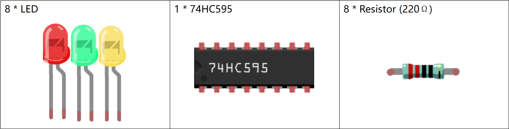
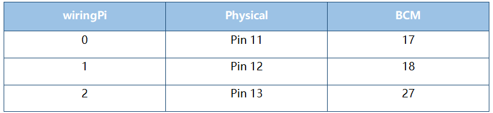
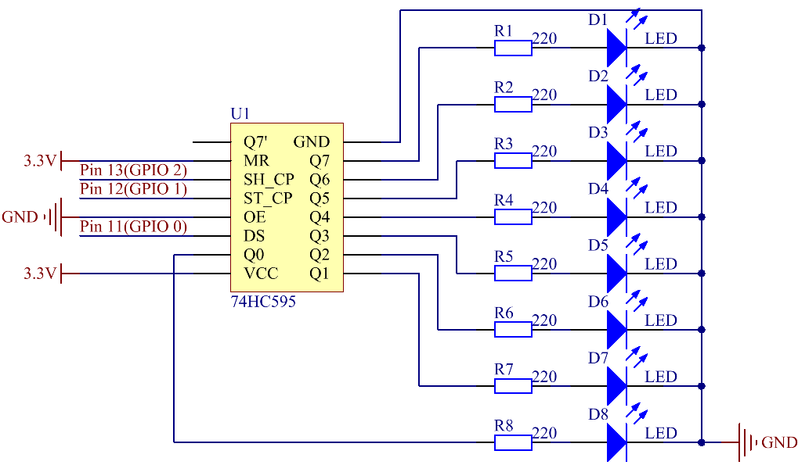
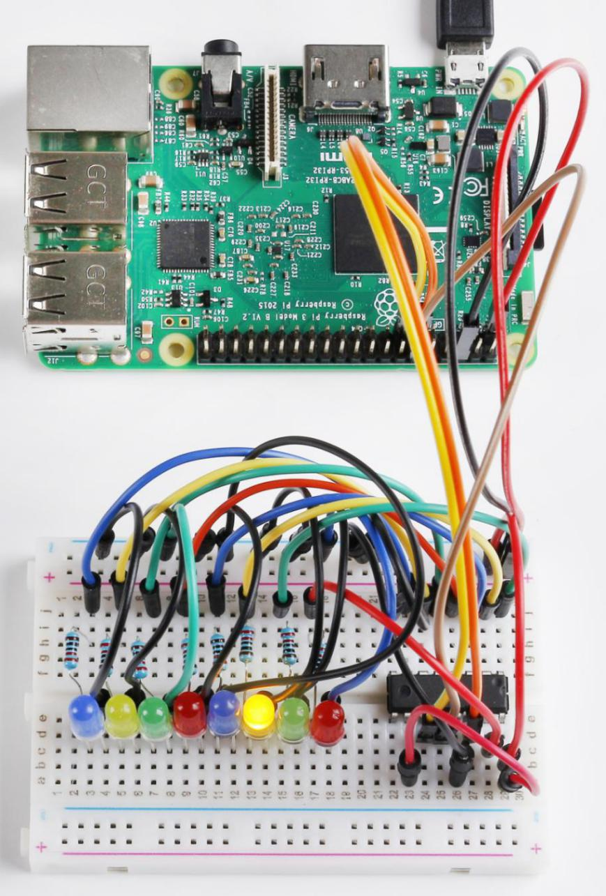

**Lesson 18 Driving LEDs by 74HC595**
=============================================

**Introduction**
--------------------------

In this lesson, we will learn how to use 74HC595 to make eight LEDs
blink regularly. Now let's get started!

**Newly Added Components**
-------------------------------

**Principle**
--------------------

**74HC595**

The 74HC595 consists of an 8−bit shift register and a storage register
with three−state parallel outputs. It converts serial input into
parallel output so you can save IO ports of an MCU.

When MR (pin10) is high level and OE (pin13) is low level, data is input
in the rising edge of SHcp and goes to the memory register through the
rising edge of SHcp. If the two clocks are connected together, the shift
register is always one pulse earlier than the memory register. There is
a serial shift input pin (Ds), a serial output pin (Q) and an
asynchronous reset button (low level) in the memory register. The memory
register outputs a Bus with a parallel 8-bit and in three states. When
OE is enabled (low level), the data in memory register is output to the
bus.

.. image:: media_pi/image181.png
    :width: 800
    :align: center

**Pins of 74HC595 and their Functions:**

**Q0-Q7**: 8-bit parallel data output pins, able to control 8 LEDs or 8
pins of 7-Segment Display directly.

**Q7’**: Series output pin, connected to DS of another 74HC595 to
connect multiple 74HC595s in series.

**MR**: Reset pin, active at low level;

**SHcp**: Time sequence input of shift register. On the rising edge, the
data in shift register moves successively one bit, i.e. data in Q1 moves
to Q2, and so forth. While on the falling edge, the data in shift
register remain unchanged.

**STcp**: Time sequence input of storage register. On the rising edge,
data in the shift register moves into memory register.

**OE**: Output enable pin, active at low level.

**DS**: Serial data input pin.

**VCC**: Positive supply voltage.

**GND**: Ground.

**Schematic Diagram**
-----------------------------

In the experiment **MR** is connected to **3.3V** (HIGH Level) and
**OE** to **GND** (LOW Level). Therefore, the data is input into the
rising edge of **SHcp** and enters the memory register through the
rising edge. In the rising edge of the **SHcp**, the data in the shift
register moves successively one bit in one time, i.e. data in **Q1**
moves to **Q2**, and so forth. In the rising edge of **STcp**, data in
the shift register moves into the memory register. All data will be
moved to the memory register 8 times. Then the data in the memory
register is output to the bus (**Q0-Q7**).

**Build the Circuit**
---------------------------

.. note::
    Recognize the direction of the chip according to the concave on
    it.

.. image:: media_pi/image246.png
    :width: 800
    :align: center

**For C Language Users**
------------------------------------

**Command**
^^^^^^^^^^^^^^^^

**1.** Go to the folder of the code.

.. code-block::

    cd/home/pi/electronic-kit/for-raspberry-pi/c/Lesson_18_Driving_Leds_by_74hc595

**2.** Compile the code.

.. code-block::

    gcc 18_74hc595.c -lwiringPi

**3.** Run the executable file.

.. code-block::

    sudo ./a.out

As the code runs, you can see these eight LEDs are lit up from left to
right, and then all LEDs light up and flash 3 times. After that, these
eight LEDs are lit from right to left, then they all turn on before
flashing 3 times. This loop continues in this way.

**Code**
^^^^^^^^^^^^

.. code-block::

    1.#include <wiringPi.h>  
    2.#include <stdio.h>  
    3.  
    4.#define   SDI   0   //serial data input  
    5.#define   RCLK  1   //memory clock input(STCP)  
    6.#define   SRCLK 2   //shift register clock input(SHCP)  
    7.  
    8.unsigned char LED[8] = {0x01,0x02,0x04,0x08,0x10,0x20,0x40,0x80};  
    9.  
    10.void pulse(int pin){  
    11.    digitalWrite(pin, 0);  
    12.    digitalWrite(pin, 1);  
    13.}  
    14.  
    15.void SIPO(unsigned char byte){  
    16.    int i;    
    17.    for(i=0;i<8;i++){  
    18.        digitalWrite(SDI, ((byte & (0x80 >> i)) > 0));  
    19.        pulse(SRCLK);  
    20.    }  
    21.}  
    22.  
    23.void init(void){  
    24.    pinMode(SDI, OUTPUT);   
    25.    pinMode(RCLK, OUTPUT);   
    26.    pinMode(SRCLK, OUTPUT);   
    27.  
    28.    digitalWrite(SDI, 0);  
    29.    digitalWrite(RCLK, 0);  
    30.    digitalWrite(SRCLK, 0);  
    31.}  
    32.  
    33.int main(void){  
    34.    int i;  
    35.  
    36.    if(wiringPiSetup() == -1){ //when initialize wiring failed, print message to screen  
    37.        printf("setup wiringPi failed !");  
    38.        return 1;   
    39.    }  
    40.  
    41.    init();  
    42.  
    43.    while(1){  
    44.        for(i=0;i<8;i++){  
    45.            SIPO(LED[i]);  
    46.            pulse(RCLK);  
    47.            delay(150);                
    48.        }  
    49.        delay(500);  
    50.  
    51.        for(i=0;i<3;i++){  
    52.            SIPO(0xff);  
    53.            pulse(RCLK);  
    54.            delay(100);  
    55.            SIPO(0x00);  
    56.            pulse(RCLK);  
    57.            delay(100);  
    58.        }  
    59.        delay(500);  
    60.  
    61.        for(i=0;i<8;i++){  
    62.            SIPO(LED[8-i-1]);  
    63.            pulse(RCLK);  
    64.            delay(150);  
    65.        }  
    66.        delay(500);  
    67.  
    68.        for(i=0;i<3;i++){  
    69.            SIPO(0xff);  
    70.            pulse(RCLK);  
    71.            delay(100);  
    72.            SIPO(0x00);  
    73.            pulse(RCLK);  
    74.            delay(100);  
    75.        }  
    76.        delay(500);  
    77.    }  
    78.    return 0;  
    79.}  

**Code Explanation**
^^^^^^^^^^^^^^^^^^^^^^^^

.. code-block::

    10.void pulse(int pin){  
    11.    digitalWrite(pin, 0);  
    12.    digitalWrite(pin, 1);  
    13.}  
    Define an pulse function to generate an pulse.
    15.void SIPO(unsigned char byte){  
    16.    int i;  
    17.    for(i=0;i<8;i++){  
    18.        digitalWrite(SDI, ((byte & (0x80 >> i)) > 0));  
    19.        pulse(SRCLK);  
    20.    }  
    21.}  

The function SIPO is used to assign the byte data to SDI(DS) by bits. 

Among them, the inequality in statement digitalWrite()((byte & (0x80>>i))>0) 
is used to confirm each value written into the register and it realizes 
the function by Shift operator (>>).

For example, if byte=0x01:

When the condition "i=0" is met, 0x80(1000 0000)>>0 becomes 0x80(1000 0000), 
if byte&0x80=0, the inequality is false, and output 0 (false).

If "i=1" is true, 0x80>>1 changes into 0x40(0100 0000); when byte&0x40=0, output 0.

Deduce the rest from this, when and only when "i=8" is met, 0x80>>8 is 0x01(0000 0001), 
byte&0x01=1, and output 1(true).

Pulse(SRCLK) generates a rising edge pulse on input pin of shift register to shift 
the 8 bit data on SDI to shift register successively.

In a word, this for loop produces 8 times to shift the 8 
bits of 0000 0001 to shift register.

.. code-block::

    23.void init(void){  
    24.    pinMode(SDI, OUTPUT);   
    25.    pinMode(RCLK, OUTPUT); 
    26.    pinMode(SRCLK, OUTPUT); 
    27.  
    28.    digitalWrite(SDI, 0);  
    29.    digitalWrite(RCLK, 0);  
    30.    digitalWrite(SRCLK, 0);  
    31.}  

Initialize pins. Set all control pins of 74HC595 to output mode and 
initialize them to low level. At the same time, the LEDs are set to 
output mode, default low level.

.. code-block::

    44.for(i=0;i<8;i++){  
    45.            SIPO(LED[i]);  
    46.            pulse(RCLK);  
    47.            delay(150); 
    48.}

Use the for loop to count 8 times in cycle, 
and write a 1-bit data to the SDI each time. 

When i=0, LED[0]=0x01(0000 0001), through the function SIPO(LED[0]), 
shifts the 8 bits of 0x01 to shift register successively. Pulse(SRCLK) 
generates a rising edge signal on input pin of storage register to shift 
the 0x01 on shift register to storage register at once. Then the data 
in the memory register are output to the bus (Q7-Q0), so you'll see the 
LED on Q0 is lit up. After loops, output all eight elements in the array 
LED[i] to the bus (Q7-Q0), and you'll see eight LEDs turning on from left to right.

.. code-block::

    51.        for(i=0;i<3;i++){  
    52.            SIPO(0xff);  
    53.            pulse(RCLK);  
    54.            delay(100);  
    55.            SIPO(0x00);  
    56.            pulse(RCLK);  
    57.            delay(100);  
    58. }
    
In this part, the for loop is used to three times repeat the program in for() 
statement. SIPO(0xff) means 8 LEDs are lit up, SIPO(0x00) represents 8 LEDs turn 
off. That is, let 8 LEDs turn off 3 times simultaneously.   

.. code-block::
       
    61.        for(i=0;i<8;i++){  
    62.            SIPO(LED[8-i-1]);  
    63.            pulse(RCLK);  
    64.            delay(150);  
    65.        }  

By the same token, this for loop allows 8 LEDs be 
lit up one by one in reverse order. Here, i gradually 
increases from 0, and 8-i-1 gradually decreases. SIPO(LED[8-i-1]) 
can be used to call the data in the LED[] array from back to front 
so that you can get 8 LEDs lit up one by one in reverse order.

.. code-block::

    68.        for(i=0;i<3;i++){  
    69.            SIPO(0xff);  
    70.            pulse(RCLK);  
    71.            delay(100);  
    72.            SIPO(0x00);  
    73.            pulse(RCLK);  
    74.            delay(100);  
    75.        }  

Then, make the eight LEDs turn on or off 3 times simultaneously.

**For Python Language Users**
---------------------------------------

**Command**
^^^^^^^^^^^^

**1.** Go to the folder of the code.

.. code-block::

    cd /home/pi/electronic-kit/for-raspberry-pi/python

**2.** Run the code.

.. code-block::

    sudo python3 18_74HC595.py

As the code runs, you can see these eight LEDs are lit up from left to
right, and then all LEDs light up and flash 3 times. After that, these
eight LEDs are lit from right to left, then they all turn on before
flashing 3 times. This loop continues in this way.

**Code**  
^^^^^^^^^

.. code-block::

    1.import RPi.GPIO as GPIO  
    2.import time  
    3.  
    4.SDI   = 17  
    5.RCLK  = 18  
    6.SRCLK = 27  
    7.  
    8.LED0 = [0x01,0x02,0x04,0x08,0x10,0x20,0x40,0x80]    #original mode  
    9.BLINK = [0xff,0x00,0xff,0x00,0xff,0x00]         #blink  
    10.  
    11.def setup():  
    12.    GPIO.setmode(GPIO.BCM)      
    13.    GPIO.setup(SDI, GPIO.OUT, initial=GPIO.LOW)  
    14.    GPIO.setup(RCLK, GPIO.OUT, initial=GPIO.LOW)  
    15.    GPIO.setup(SRCLK, GPIO.OUT, initial=GPIO.LOW)  
    16.  
    17.# Shift the data to 74HC595  
    18.def hc595_shift(dat):  
    19.    for bit in range(0, 8):   
    20.        GPIO.output(SDI, 0x80 & (dat << bit))  
    21.        GPIO.output(SRCLK, GPIO.HIGH)  
    22.        time.sleep(0.001)  
    23.        GPIO.output(SRCLK, GPIO.LOW)  
    24.    GPIO.output(RCLK, GPIO.HIGH)  
    25.    time.sleep(0.001)  
    26.    GPIO.output(RCLK, GPIO.LOW)  
    27.  
    28.def main():  
    29.    print_message()  
    30.    mode = LED0   
    31.    sleeptime = 0.15          
    32.    blink_sleeptime = 0.15  
    33.      
    34.    while True:  
    35.        # Change LED status from mode  
    36.        for onoff in mode:  
    37.            hc595_shift(onoff)             
    38.            time.sleep(sleeptime)            
    39.          
    40.        for onoff in BLINK:  
    41.            hc595_shift(onoff)  
    42.            time.sleep(blink_sleeptime)  
    43.  
    44.        # Change LED status from mode reverse  
    45.        for onoff in reversed(mode):  
    46.            hc595_shift(onoff)            
    47.            time.sleep(sleeptime)           
    48.  
    49.        for onoff in BLINK:  
    50.            hc595_shift(onoff)             
    51.            time.sleep(blink_sleeptime)  
    52.  
    53.def destroy():  
    54.    GPIO.cleanup()  
    55.  
    56.if __name__ == '__main__':  
    57.    setup()  
    58.    try:  
    59.        main()  
    60.    except KeyboardInterrupt:  
    61.        destroy()   

**Code Explanation**
^^^^^^^^^^^^^^^^^^^^^^^

.. code-block::

    8.LED0 = [0x01,0x02,0x04,0x08,0x10,0x20,0x40,0x80]    #original mode  

Use array to define LED flashing mode, you can also customize 
several hexadecimals to light up 8 LEDs.

.. code-block::

    11.def setup():  
    12.    GPIO.setmode(GPIO.BCM)    # Number GPIOs by its BCM location  
    13.    GPIO.setup(SDI, GPIO.OUT, initial=GPIO.LOW)  
    14.    GPIO.setup(RCLK, GPIO.OUT, initial=GPIO.LOW)  
    15.    GPIO.setup(SRCLK, GPIO.OUT, initial=GPIO.LOW)  

Initialize pins. Set all control pins of 74HC595 to output mode 
and initialize them to low level. At the same time, the LED 
lights are set to output mode, default low level. 

.. code-block::

    18.def hc595_shift(dat):  

Define a function hc595_shift() to output the 8 bits of dat to Q0-Q7. 

.. code-block::

    19. for bit in range(0, 8):   
    20.        GPIO.output(SDI, 0x80 & (dat << bit))  
    21.        GPIO.output(SRCLK, GPIO.HIGH)  
    22.        time.sleep(0.001)  
    23.                  GPIO.output(SRCLK, GPIO.LOW)

Assign the dat to SDI(DS) according to bits. Pin SRCLK will convert from 
low to high, and generate a rising edge pulse, then shift the data in 
pin SDI to shift register. Execute the loop 8 times to shift the 8 bits 
of dat to the shift register in proper order.

.. code-block::

    24.    GPIO.output(RCLK, GPIO.HIGH)  
    25.    time.sleep(0.001)  
    26.    GPIO.output(RCLK, GPIO.LOW)  

Pin RCLK converts from low to high and generate a rising edge, 
then shift data from shift register to storage register. 
Finally the data in the memory register is output to the bus (Q0-Q7).

.. code-block::

    36.        for onoff in mode:  
    37.            hc595_shift(onoff)  
    38.            time.sleep(sleeptime)  

Here we use a onoff variable to control the LED that changes 
within the range of mode, and hc595_shift (onoff) means 
lighting up LED one by one. For example, when mode is the 
first datum in LED0, or 0x01, onoff = mode = 0x01 = 00000001. 
In this course, the LED is lit by high level. To put it another 
way, it is Hc595_shift (onoff) = hc595_shift (00000001) that 
lights up the last LED. Along the same vein, when the value of mode 
is the second datum of LED0 (onoff = 0x02 = 00000010), the second 
last LED turns on.  

.. code-block::

    45.        for onoff in reversed(mode):  
    46.            hc595_shift(onoff) 
    47.        time.sleep(sleeptime)

According to the same principle, a reversed is used here 
to get LEDs lit up in reverse order. 

.. code-block::

    49.        for onoff in BLINK:  
    50.            hc595_shift(onoff)  
    51.            time.sleep(blink_sleeptime)  

In the same way, light up 8 LEDs; exactly, 8 LEDs are turned 
on or off 3 times synchronously in the same pattern as 
that of the LEDs in the BLINK array.

**Phenomenon Picture**
----------------------------

