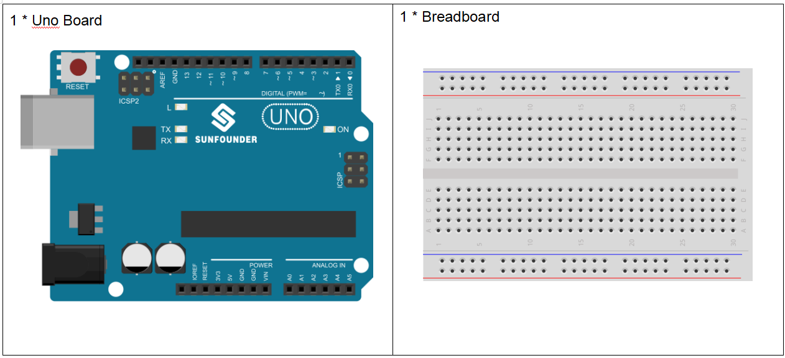

**Lesson 18 Light Alarm**
=================================

**Introduction**
-----------------

This experiment is a very interesting one – a DIY phototransistor. DIY
phototransistors use the glow effect and photoelectric effect of LEDs.
That is, LEDs will generate weak currents when some light is shined on
it. And we use a transistor to amplify the currents generated, so the
SunFounder Uno board can detect them.

**Components**
------------------

.. image:: media_arduino/image199.png
    :width: 800
    :align: center

**Experimental Principle**
-----------------------------

LEDs not only have a glow effect, but also a photoelectric effect. They
will generate weak currents when exposed to light waves.

NPN consists of a layer of P-doped semiconductor (the "base") between
two N-doped layers (see the picture above). A small current entering the
base is amplified to produce a large collector and emitter current. That
is, when there is a positive potential difference measured from the
emitter of a NPN transistor to its base (i.e., when the base is high
relative to the emitter) as well as positive potential difference
measured from the base to the collector, the transistor becomes active.
In this "on" state, current flows between the collector and emitter of
the transistor.

A 10kΩ pull-down resistor is attached to the transistor output stage in
order to avoid analog port suspending to interfere with signals and
cause misjudgment.

When the LED exposed to light waves, the LED generates weak currents,
then the NPN transistor becomes active. Then read the analog value of
A0, when A0>0, then set pin 5(buzzer) to high level.

The schematic diagram:

.. image:: media_arduino/image211.png
    :width: 800
    :align: center

**Experimental Procedures**

**Step 1:** Build the circuit.

**Step 2:** Open the code file

**Step 3:** Select the correct Board and Port

**Step 4:** Upload the sketch to the board

.. image:: media_arduino/image225.png
    :align: center

Now, you can hear the buzzer beep when shining a flashlight on the LED.

Note: You need to do this experiment in a dark environment, or the
lights you give need to be much stronger than ambient light.

.. image:: media_arduino/image151.jpeg
    :width: 800
    :align: center

**Code**
---------------------

.. raw:: html

    <iframe src=https://create.arduino.cc/editor/sunfounder01/35e4882b-ac84-430e-a4f7-622742173520/preview?embed style="height:510px;width:100%;margin:10px 0" frameborder=0></iframe>

**Code Analysis** **18-1** **Whole Code**
^^^^^^^^^^^^^^^^^^^^^^^^^^^^^^^^^^^^^^^^^^^^^^^

.. code-block:: arduino

    void setup()

    {

        Serial.begin(9600); // start serial port at 9600 bps:

    }

    void loop()

    {

        int n=analogRead(A0); //read the value from analog pin AO

        Serial.println(n);

        if(n>0) //If there is a voltage

        {

            pinMode(5,OUTPUT); //set the digital pin 5 as an output

            tone(5,10000); //Generates a square wave of the frequency of 10000 Hz
            (and 50% duty cycle) on pin 5

            pinMode(5,INPUT); //set the pin 5 as an input

        }

    }

**tone()**
----------------

**Description**
^^^^^^^^^^^^^^^^^^

Generates a square wave of the specified frequency (and 50% duty cycle)
on a pin. A duration can be specified, otherwise the wave continues
until a call to
`noTone() <https://www.arduino.cc/reference/en/language/functions/advanced-io/noTone>`__.
The pin can be connected to a piezo buzzer or other speaker to play
tones.

Only one tone can be generated at a time. If a tone is already playing
on a different pin, the call to tone() will have no effect. If the tone
is playing on the same pin, the call will set its frequency.

Use of the tone() function will interfere with PWM output on pins 3 and
11 (on boards other than the Mega).

**Syntax**
^^^^^^^^^^^^^^

tone(pin, frequency)

tone(pin, frequency, duration)

**Parameters**
^^^^^^^^^^^^^^^^^^^

pin: the pin on which to generate the tone

frequency: the frequency of the tone in hertz - unsigned int

duration: the duration of the tone in milliseconds (optional) - unsigned
long

