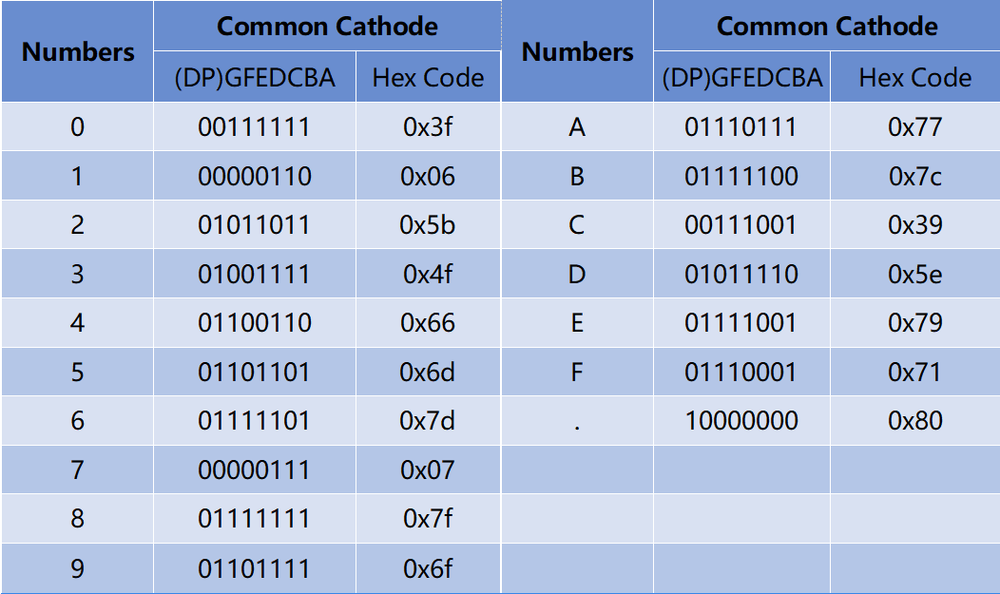
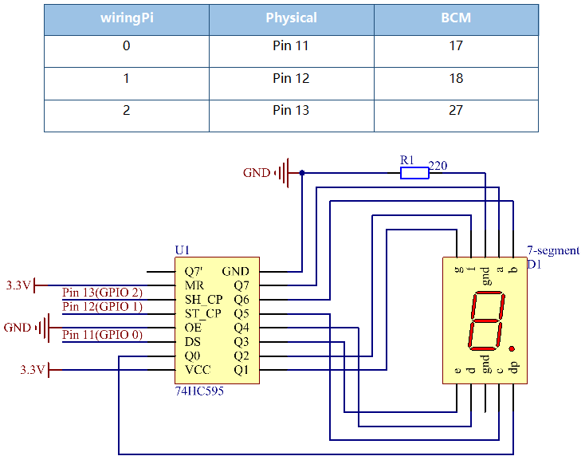
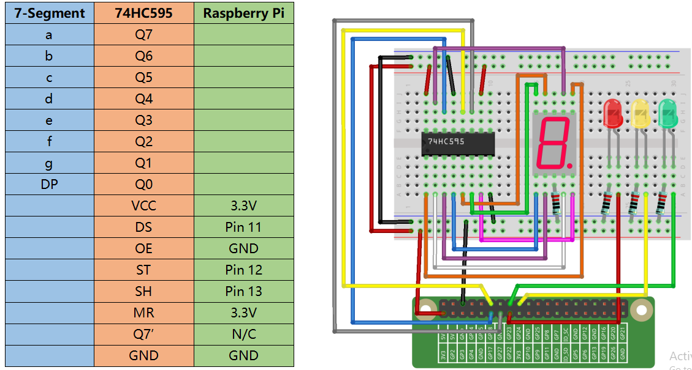

.. note::

    Hello, welcome to the SunFounder Raspberry Pi & Arduino & ESP32 Enthusiasts Community on Facebook! Dive deeper into Raspberry Pi, Arduino, and ESP32 with fellow enthusiasts.

    **Why Join?**

    - **Expert Support**: Solve post-sale issues and technical challenges with help from our community and team.
    - **Learn & Share**: Exchange tips and tutorials to enhance your skills.
    - **Exclusive Previews**: Get early access to new product announcements and sneak peeks.
    - **Special Discounts**: Enjoy exclusive discounts on our newest products.
    - **Festive Promotions and Giveaways**: Take part in giveaways and holiday promotions.

    👉 Ready to explore and create with us? Click [|link_sf_facebook|] and join today!

Lesson 19 7-segment
================================

**Introduction**
-------------------------

Generally, there are two ways to drive a single 7-Segment Display. One
way is to connect its 8 pins directly to eight ports on the Raspberry
Pi. Or you can connect the 74HC595 to three ports of the Raspberry Pi
and then the 7- segment display to the 74HC595. In this experiment, we
will use the latter. By this way, we can save five ports – considering
the board’s limited ports, and this is very important. Now let's get
started!

**Newly Added Components**
-------------------------------

.. image:: media_pi/image247.png
    :width: 800
    :align: center

**Principle**
-----------------

**7-Segment Display**

A 7-Segment Display is an 8-shaped component which packages 7 LEDs. Each
LED is called a segment – when energized, one segment forms part of a
numeral to be displayed.

There are two types of pin connection: Common Cathode (CC) and Common
Anode (CA). As the name suggests, a CC display has all the cathodes of
the 7 LEDs connected when a CA display has all the anodes of the 7
segments connected. In this kit, we use the former.

.. image:: media_pi/image186.jpeg
    :width: 800
    :align: center

Each of the LEDs in the display is given a positional segment with one
of its connection pins led out from the rectangular plastic package.
These LED pins are labeled from "a" through to "g" representing each
individual LED. The other LED pins are connected together forming a
common pin. So by forward biasing the appropriate pins of the LED
segments in a particular order, some segments will brighten and others
stay dim, thus showing the corresponding character on the display.

**Display Codes**

To help you get to know how 7-Segment Displays(Common Cathode) display
Numbers, we have drawn the following table. Numbers are the number 0-F
displayed on the 7-Segment Display; (DP) GFEDCBA refers to the
corresponding LED set to 0 or 1, For example, 00111111 means that DP and
G are set to 0, while others are set to 1. Therefore, the number 0 is
displayed on the 7-Segment Display, while HEX Code corresponds to
hexadecimal number.

**Schematic Diagram**
---------------------

**Build the Circuit**
-------------------------

.. note::
    Recognize the direction of the chip according to the concave on
    it.

**For C Language Users**
---------------------------

**Command**
^^^^^^^^^^^^

**1.** Go to the folder of the code.

.. raw:: html

    <run></run>

.. code-block::

    cd /home/pi/electronic-kit/for-raspberry-pi/c/Lesson_19_7-segment

**2.** Compile the code.

.. raw:: html

    <run></run>

.. code-block::

    gcc 19_7-Segment.c -lwiringPi

**3.** Run the executable file.

.. raw:: html

    <run></run>

.. code-block::

    sudo ./a.out

You may see 0 to 9 and A to F on the 7-Segment Display.

.. note::

    If it does not work after running, or there is an error prompt: \"wiringPi.h: No such file or directory\", please refer to :ref:`C code is not working?`.

**Code**
^^^^^^^^^^^^

.. code-block:: C

    #include <wiringPi.h>  
    #include <stdio.h>  
      
    #define   SDI   0   //serial data input  
    #define   RCLK  1   //memory clock input(STCP)  
    #define   SRCLK 2   //shift register clock input(SHCP)  
      
    unsigned char SegCode[17] = {0x3f,0x06,0x5b,0x4f,0x66,0x6d,0x7d,0x07,0x7f,0x6f,0x77,0x7c,0x39,0x5e,0x79,0x71,0x80};  
      
    void init(void){  
        pinMode(SDI, OUTPUT);   
        pinMode(RCLK, OUTPUT);   
        pinMode(SRCLK, OUTPUT);   
      
        digitalWrite(SDI, 0);  
        digitalWrite(RCLK, 0);  
        digitalWrite(SRCLK, 0);  
    }  
      
    void hc595_shift(unsigned char dat){  
        int i;  
        for(i=0;i<8;i++){  
            digitalWrite(SDI, 0x80 & (dat << i));  
            digitalWrite(SRCLK, 1);  
            delay(1);  
            digitalWrite(SRCLK, 0);  
        }  
      
            digitalWrite(RCLK, 1);  
            delay(1);  
            digitalWrite(RCLK, 0);  
    }  
      
    int main(void){  
        int i;  
      
        if(wiringPiSetup() == -1){ //when initialize wiring failed, print message to screen  
            printf("setup wiringPi failed !");  
            return 1;   
        }  
      
        init();  
      
        while(1){  
            for(i=0;i<17;i++){  
                hc595_shift(SegCode[i]);  
                delay(500);  
            }  
        }  
        return 0;  
    }  

**Code Explanation**
^^^^^^^^^^^^^^^^^^^^^^^^^^

.. code-block:: C

    10.void init(void){  
    11.    pinMode(SDI, OUTPUT);   
    12.    pinMode(RCLK, OUTPUT);   
    13.    pinMode(SRCLK, OUTPUT);   
    14.  
    15.    digitalWrite(SDI, 0);  
    16.    digitalWrite(RCLK, 0);  
    17.    digitalWrite(SRCLK, 0);  
    18.}

Initialize pins. Set all control pins of 74HC595 to output mode 
and initialize them to low level. At the same time, the LEDs 
are set to output mode, default low level. 

.. code-block:: C

    19. void hc595_shift(unsigned char dat) 
     
To assign 8 bit value to 74HC595’s shift register.

.. code-block:: C

    22.    for(i=0;i<8;i++){  
    23.        digitalWrite(SDI, 0x80 & (dat << i));  
    24.        digitalWrite(SRCLK, 1);  
    25.        delay(1);  
    26.        digitalWrite(SRCLK, 0);  
    27.    }  

Assign the **dat** value to SDI(DS) by bits. Then shift them to 
the shift register by bits. Execute the loop 8 times to shift 
the 8 bits of **dat** to the shift register in proper order.

.. code-block:: C

    29.        digitalWrite(RCLK, 1);  
    30.        delay(1);  
    31.        digitalWrite(RCLK, 0);

Pin RCLK converts from low to high and generates a 
rising edge, then shifts data from shift register to 
storage register. Finally the data in the memory register 
are output to the bus (Q0-Q7).

.. code-block:: C

    45.        for(i=0;i<17;i++){  
    46.            hc595_shift(SegCode[i]);  
    47.            delay(500);  
    48.        }  

In the **for** loop, output 16 values from array **Segcode[]** to 7-Segment Display.

**For Python Language Users**
--------------------------------

**Command**
^^^^^^^^^^^^^

**1.** Go to the folder of the code.

.. raw:: html

    <run></run>

.. code-block::

    cd /home/pi/electronic-kit/for-raspberry-pi/python

**2.** Run the code.

.. raw:: html

    <run></run>

.. code-block::

    sudo python3 19_7-Segment.py

You may see 0 to 9 and A to F on the 7-Segment Display.

**Code**
^^^^^^^^^^^^

.. note::
    You can **Modify/Reset/Copy/Run/Stop** the code below. But before that, you need to go to  source code path like ``electronic-kit/for-raspberry-pi/python``. After modifying the code, you can run it directly to see the effect.

.. raw:: html

    <run></run>

.. code-block:: python

    import RPi.GPIO as GPIO  
    import time  
      
    # Set up pins  
    SDI   = 17  
    RCLK  = 18  
    SRCLK = 27  
      
    segCode = [0x3f,0x06,0x5b,0x4f,0x66,0x6d,0x7d,0x07,0x7f,0x6f,0x77,0x7c,0x39,0x5e,0x79,0x71]  
      
    def setup():  
        GPIO.setmode(GPIO.BCM)  
        GPIO.setup(SDI, GPIO.OUT, initial=GPIO.LOW)  
        GPIO.setup(RCLK, GPIO.OUT, initial=GPIO.LOW)  
        GPIO.setup(SRCLK, GPIO.OUT, initial=GPIO.LOW)  
      
    # Shift the data to 74HC595  
    def hc595_shift(dat):  
        for bit in range(0, 8):   
            GPIO.output(SDI, 0x80 & (dat << bit))  
            GPIO.output(SRCLK, GPIO.HIGH)  
            time.sleep(0.001)  
            GPIO.output(SRCLK, GPIO.LOW)  
        GPIO.output(RCLK, GPIO.HIGH)  
        time.sleep(0.001)  
        GPIO.output(RCLK, GPIO.LOW)  
      
    def main():  
        while True:  
            # Shift the code one by one from segCode list  
            for code in segCode:  
                hc595_shift(code)   
                time.sleep(0.5)  
      
    def destroy():  
        GPIO.cleanup()  
      
    if __name__ == '__main__':  
        setup()  
        try:  
            main()  
        except KeyboardInterrupt:  
            destroy()  

**Code Explanation**
^^^^^^^^^^^^^^^^^^^^^^

.. code-block::

    12.def setup():  
    13.    GPIO.setmode(GPIO.BCM)  
    14.    GPIO.setup(SDI, GPIO.OUT, initial=GPIO.LOW)  
    15.    GPIO.setup(RCLK, GPIO.OUT, initial=GPIO.LOW)  
    16.    GPIO.setup(SRCLK, GPIO.OUT, initial=GPIO.LOW)  

Initialize pins. Set all control pins of 74HC595 to output mode 
and initialize them to low level.

.. code-block::

    19.def hc595_shift(dat):  

To assign 8 bit value to 74HC595’s shift register.

.. code-block::

    20.    for bit in range(0, 8):   
    21.        GPIO.output(SDI, 0x80 & (dat << bit))  
    22.        GPIO.output(SRCLK, GPIO.HIGH)  
    23.        time.sleep(0.001)  
    24.        GPIO.output(SRCLK, GPIO.LOW)  

Assign the **dat** value to SDI(DS) by bits. Then shift them to 
the shift register by bits. Execute the loop 8 times to shift 
the 8 bits of **dat** to the shift register in proper order.

.. code-block::

    25.    GPIO.output(RCLK, GPIO.HIGH)  
    26.    time.sleep(0.001)  
    27.    GPIO.output(RCLK, GPIO.LOW)

Pin **RCLK** converts from low to high and generates a 
rising edge, then shifts data from shift register to 
storage register. Finally the data in the memory register 
are output to the bus (Q0-Q7).

.. code-block::

    32.        for code in segCode:  
    33.            hc595_shift(code)   
    34.            time.sleep(0.5)  

In the **for** loop, output 16 values from array **Segcode []** to 7-Segment Display.

**Phenomenon Picture**
-----------------------------

.. image:: media_pi/image189.jpeg
    :width: 600
    :align: center
