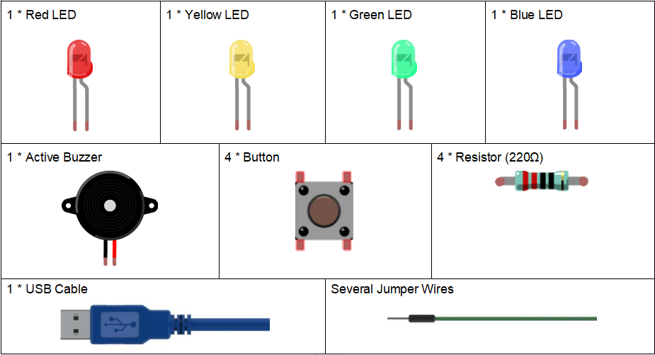

Lesson 19 Answer Machine
============================

**Introduction**
-----------------------

In quiz shows, especially entertainment activities (e.g. competitive
answering activities), organizers often apply a buzzer system in order
to accurately, fairly and visually determine the seat number of a
responder.

Now the system can illustrate the accuracy and equity of the judgment by
data, which improves the entertainment. At the same time, it is more
fair and just. In this lesson, we will use some buttons, buzzers, and
LEDs to make a quiz buzzer system.

**Components**
-----------------
.. image:: media_arduino/image171.png
    :width: 800
    :align: center

**Experimental Principle**
-----------------------------

Button 1, 2 and 3 are answer buttons, and button 4 is the reset button.
If button 1 is pressed first, the buzzer will beep, the corresponding
LED will light up and all the other LEDs will go out. If you want to
start another round, press button 4 to reset.

The schematic diagram:

.. image:: media_arduino/image155.png
    :width: 800
    :align: center

**Experimental Procedures**

**Step 1:**\ Build the circuit

**Step 2:** Open the code file.

**Step 3:** Select the Board and Port.

**Step 4:** Upload the sketch to the board.

.. image:: media_arduino/image226.png
    :align: center

Now, first press button 4 to start. If you press button 1 first, you
will see the corresponding LED light up and the buzzer will beep. Then
press button 4 again to reset before you press other buttons.

.. image:: media_arduino/image157.jpeg
    :width: 800
    :align: center

**Code**
---------------------

The code for this experiment may be a bit long. But the syntax issimple. 
Let's see. **Workflow:** Read the state of button 4, if button 4 is pressed, 
theLED on pin 10 is illuminated while reading the state of the remaining
buttons. If one of the buttons is detected to be pressed, the buzzer
beeps and lights the corresponding LED until button 4 is pressed
again.

.. raw:: html

    <iframe src=https://create.arduino.cc/editor/sunfounder01/64d9c12b-16a7-4f1d-b33e-2cfc3e2349bb/preview?embed style="height:510px;width:100%;margin:10px 0" frameborder=0></iframe>

**Code Analysis** **19-1** **loop() function**
^^^^^^^^^^^^^^^^^^^^^^^^^^^^^^^^^^^^^^^^^^^^^^^^^^^^

.. code-block:: arduino

    b4State = digitalRead(button4); // read the value of button4 to see if it was pressed.

    Serial.println(b4State); // print it value.

    //when button4 pressed

    if(b4State == 0) // if the button4 is pressed, the b4State=0

    {

        if(b4State == 0) /*confirm that the button4 is pressed. One pin of the
        button is connected to pin 9, the other pin is connected to GND, and
        when the button is pressed, pin 9 is pulled low.*/

        {

            flag = 1; // if so,flag is 1

            digitalWrite(LED4, HIGH); // turn the reset LED on

            delay(200); // delay 200ms

        }

    }

    if(1 == flag)

    {

        // read the state of other buttons

        b1State = digitalRead(button1);

        b2State = digitalRead(button2);

        b3State = digitalRead(button3);

        // If the button1 press the first

        if(b1State == 0) // if button1 is pressed

        {

            flag = 0; // flag equals to 0

            digitalWrite(LED4, LOW);

            Alarm(); // buzzer sound

            digitalWrite(LED1,HIGH); // turn the LED1 on only

            digitalWrite(LED2,LOW);

            digitalWrite(LED3,LOW);

            while(digitalRead(button4)); // detect the button4,if pressed,out of the while loop

        }

        ...

Use the same way to detect the button2 and button3, if one of the
buttons is detected to be pressed, the buzzer beeps and lights the
corresponding LED until button 4 is pressed again.

**Code Analysis** **19-2** **Alarm() function**
^^^^^^^^^^^^^^^^^^^^^^^^^^^^^^^^^^^^^^^^^^^^^^^^^^^^

.. code-block:: arduino

    void Alarm()

    {

        for(int i=0;i<100;i++)
        {

            digitalWrite(buzzerPin,HIGH); // the buzzer sound

            delay(2); // delay 2ms

            digitalWrite(buzzerPin,LOW); // without sound

            delay(2); // when delay time changed,the frequency changed

        }

    }

The alarm() function is to set the buzzer to beep. You can change the
frequency and time of the buzzer sound.
