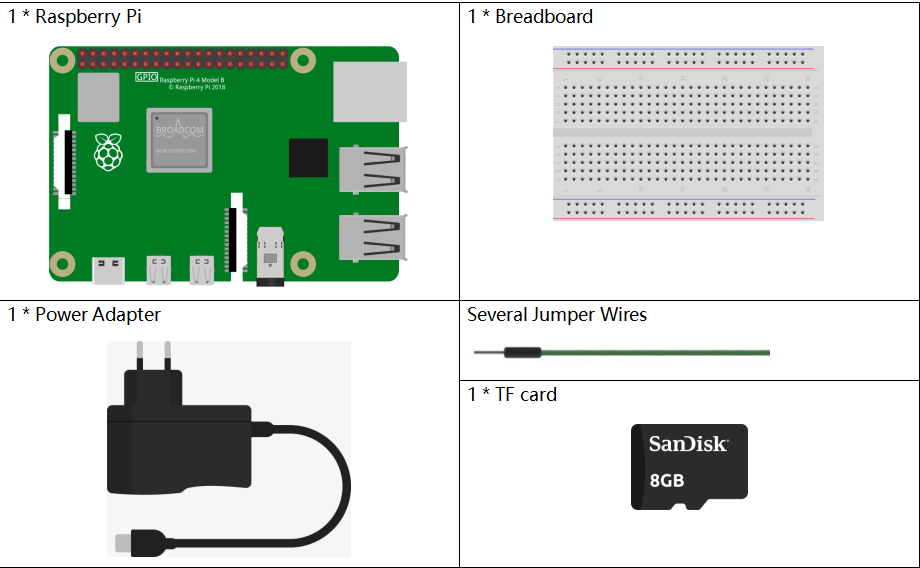
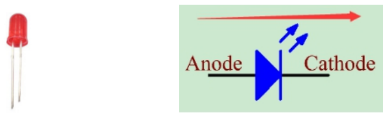
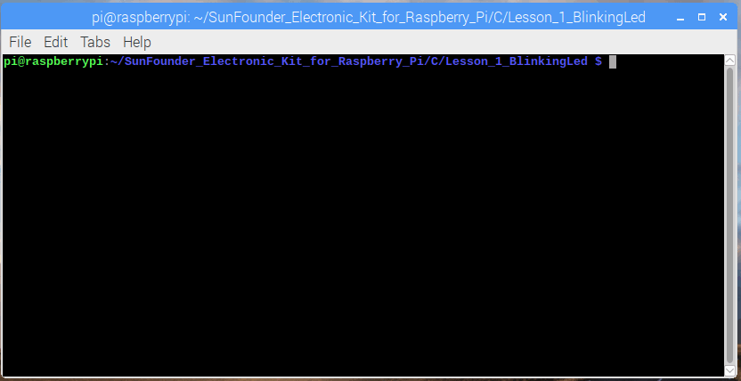
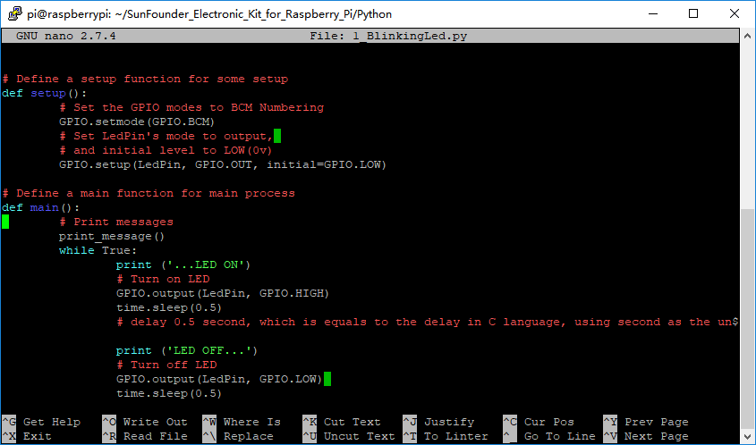

.. note::

    Hello, welcome to the SunFounder Raspberry Pi & Arduino & ESP32 Enthusiasts Community on Facebook! Dive deeper into Raspberry Pi, Arduino, and ESP32 with fellow enthusiasts.

    **Why Join?**

    - **Expert Support**: Solve post-sale issues and technical challenges with help from our community and team.
    - **Learn & Share**: Exchange tips and tutorials to enhance your skills.
    - **Exclusive Previews**: Get early access to new product announcements and sneak peeks.
    - **Special Discounts**: Enjoy exclusive discounts on our newest products.
    - **Festive Promotions and Giveaways**: Take part in giveaways and holiday promotions.

    👉 Ready to explore and create with us? Click [|link_sf_facebook|] and join today!

Lesson 1 Blinking LED
=============================

**Introduction**
---------------------

In this lesson, with Raspberry Pi, we will learn how to make a blinking
LED by programming. By the way, you can get many interesting phenomena
by applying LED. Now get to start and you will enjoy the fun of DIY at
once!

**Newly Added Components**
------------------------------

.. image:: media_pi/image194.png
    :width: 800
    :align: center

**Components**
-----------------

.. note:: This table gives the necessary product components of all lessons.

In the following lessons, if there is no newly added component, the
table will not appear again; instead, the list of newly added components
will present for you.

**Principle**
-----------------

**Breadboard**

A breadboard is a construction base for prototyping of electronics. It
is used to build and test circuits quickly before finishing any circuit
design. And it has many holes into which components mentioned above can
be inserted like ICs and resistors as well as jumper wires. The
breadboard allows you to plug in and remove components easily.

The picture shows the internal structure of a half+ breadboard. Although
these holes on the breadboard appear to be independent of each other,
they are actually connected to each other through metal strips
internally.

.. image:: media_pi/image60.png
    :width: 800
    :align: center

**Resistor**

Resistor is an electronic element that can limit the branch current. A
fixed resistor is a kind of resistor whose resistance cannot be changed,
while that of a potentiometer or a variable resistor can be adjusted.

Fixed resistor is applied in this kit. In the circuit, it is essential
to protect the connected components. The following pictures show a real
object, 220Ω resistor and two generally used circuit symbols of
resistor. Ω is the unit of resistance and the larger units include KΩ,
MΩ, etc. Their relationship can be shown as follows: 1 MΩ=1000 KΩ, 1 KΩ
= 1000 Ω, which means 1 MΩ = 1000,000 Ω = 10^6 Ω.

.. image:: media_pi/image196.png
    :width: 800
    :align: center

Normally, the resistance can be marked directly, in color code, and by
character. The resistors offered in this kit are marked by different
colors. Namely, the bands on the resistor indicate the resistance.

When using a resistor, we need to know its resistance first. Here are
two methods: you can observe the bands on the resistor, or use a
multimeter to measure the resistance. You are recommended to use the
first method as it is more convenient and faster.

As shown in the card, each color stands for a number.

.. image:: media_pi/image65.jpeg
    :width: 800
    :align: center

**LED**

Semiconductor light-emitting diode is a type of component which can turn
electric energy into light energy via PN junctions. In terms of
wavelength, it can be categorized into laser diode, infrared
light-emitting diode and visible light-emitting diode, known as
light-emitting diode (LED).

Diode has unidirectional conductivity, so the current flow will be as
the arrow indicates in figure circuit symbol. You can only provide the
anode with a positive power and the cathode with a negative one. Thus
the LED will light up.

An LED has two pins. The longer one is anode, and the shorter one,
cathode. Pay attention not to connect them inversely. There is fixed
forward voltage drop in the LED, so it cannot be connected with the
circuit directly because the supply voltage can outweigh this drop and
cause the LED to be burnt. The forward voltage of the red, yellow, and
green LED is 1.8 V and that of the white one is 2.6 V. Most LEDs can
withstand a maximum current of 20 mA, so we need to connect a current
limiting resistor in series.

The formula of the resistance value is as follows:

R = (V\ :sub:`supply` – V\ :sub:`D`)/I

R stands for the resistance value of the current limiting resistor,
Vsupply for voltage supply, VD for voltage drop and I for the working
current of the LED.

If we provide 5 Volt for the red LED, the minimum resistance of the
current limiting resistor should be: (5V-1.8V)/20mA = 160Ω. Therefore,
you need a 160Ωor larger resistor to protect the LED. You are
recommended to use the 220Ω resistor offered in the kit.

**Jumper Wires**

Wires that connect two terminals are called jumper wires. There are
various kinds of jumper wires. Here we focus on those used in
breadboard. Especially, they are used to transfer electrical signals
from anywhere on the breadboard to the input/output pins of a
microcontroller.

Jump wires are fitted by inserting their "end connectors" into the slots
provided in the breadboard, beneath whose surface there are a few sets
of parallel plates that connect the slots in groups of rows or columns
depending on the area. The "end connectors" are inserted into the
breadboard, without soldering, in the particular slots that need to be
connected in the specific prototype.

There are three types of jumper wire: Female-to-Female, Male-to-Male,
and Male-to-Female.

.. image:: media_pi/image198.png
    :width: 800
    :align: center

More than one type of them may be used in a project. The color of the
jump wires is different but it doesn’t mean their function is different
accordingly; it's just designed as this way to better identify the
connection between each circuit.

**Schematic Diagram**
-------------------------

In this experiment, connect a 220Ω resistor to the anode (the long pin
of the LED), then the resistor to Pin11 of Raspberry Pi, and connect the
cathode (the short pin) of the LED to GND. **Therefore**, to turn on a
LED, we need to make pin11 high level. We can get this phenomenon by
programming.

Note: Pin11 refers to the 11th pin of the Raspberry Pi from left to
right, and its corresponding wiringPi and BCM pin numbers are shown in
the following table.

In the C language related content, we make GPIO 0 equivalent to 0 in the
wiringPi. Among the Python language related content, BCM 17 is 17 in the
BCM column of the following table. At the same time, they are the same
as the 11th pin on the Raspberry Pi Physical, Pin 11.

.. image:: media_pi/image199.png
    :width: 800
    :align: center

**Build the Circuit**
-------------------------

.. note:: the pin with a curve is the anode of the LED.

.. image:: media_pi/image72.png
    :width: 800
    :align: center

**For C Language Users:**
-----------------------------

**Command**
^^^^^^^^^^^^

**1.** Go to the folder of the code.

**If you use a monitor, you're recommended to take the following
steps.**

Go to **/home/pi/** and find the folder
**electronic-kit/for-raspberry-pi**.

Find **c** in the folder, right-click on it and select **Open in
Terminal**.

.. image:: media_pi/image73.png
    :width: 800
    :align: center

Then a window will pop up as shown below. So now you've entered the path
of the code **1_BlinkingLed.c**

In the following lessons, we will use command to enter the code file
instead of right-clicking. But you can choose the method you prefer.

**If you log into the Raspberry Pi remotely, use “cd” to change
directory:**

.. raw:: html

    <run></run>

.. code-block::

    cd /home/pi/electronic-kit/for-raspberry-pi/c/Lesson_1_BlinkingLed

.. note::
    Change directory to the path of the code via **cd** in this
    experiment.

.. image:: media_pi/image75.png
    :width: 800
    :align: center

In either way, now you are in the folder *Lesson_1_BlinkingLed*. The
subsequent procedures based on these two methods are the same. Let's
move on.

**2.** Compile the code.

.. raw:: html

    <run></run>

.. code-block::

    gcc 1_BlinkingLed.c -o BlinkingLed -lwiringPi

.. note::
    gcc is GNU Compiler Collection. Here, its functions like compiling the C language file *1_BlinkingLed.c* 
    and outputting an executable file. In the command, -o means outputting (the character immediatelyfollowing -o is
    the filename output after compilation, and an executable named **BlinkingLed** 
    will generate here) and -lwiringPi is to load the library wiringPi (l is the abbreviation of library).

.. image:: media_pi/image76.png
    :width: 800
    :align: center

**3.** Run the executable file output in the previous step:

.. raw:: html

    <run></run>

.. code-block::

    sudo ./BlinkingLed

.. note::
    To control the GPIO, you need to run the program by the command, 
    **sudo**\ (superuser do). The command "**./**" indicates the
    current directory. The whole command is to run the **BlinkingLed** in
    the current directory.

.. image:: media_pi/image77.png
    :width: 800
    :align: center

As the code runs, you will see the LED blinking. You can press **Ctrl +
C** to stop running the current code.

.. note::

    If it does not work after running, or there is an error prompt: \"wiringPi.h: No such file or directory\", please refer to :ref:`C code is not working?`.

**4.** If you want to edit the code file *1_BlinkingLed.c*, type the
following command to open *1_BlinkingLed.c* .

.. raw:: html

    <run></run>

.. code-block::

    nano 1_BlinkingLed.c

.. note::
    nano is a text editor tool. The command is used to open the
    code file **1_BlinkingLed.c** by this tool.

**Code**
^^^^^^^^^^^^^^

The program code is shown as follows:

.. code-block:: C

    #include <wiringPi.h>  
    #include <stdio.h>  
    #define LedPin      0  
      
    int main(void)  
    {  
        // When initialize wiring failed, print message to screen  
        if(wiringPiSetup() == -1){  
            printf("setup wiringPi failed !");  
            return 1;   
        }  
          
        pinMode(LedPin, OUTPUT);   
          
        while(1){  
            // LED off  
            digitalWrite(LedPin, LOW);  
            printf("...LED off\n");  
            delay(500);  
            // LED on  
            digitalWrite(LedPin, HIGH);  
            printf("LED on...\n");  
            delay(500);  
        }  
      
        return 0;  
    }    

**Code Explanation**
^^^^^^^^^^^^^^^^^^^^^

.. code-block:: C

    #include <wiringPi.h> 

The hardware drive library is designed for the C language of Raspberry Pi. 
Adding this library is conducive to the 
initialization of hardware,and the output of I/O ports, PWM, etc.

.. code-block:: C

    #include <stdio.h>

Standard I/O library. The printf function used for printing the 
data displayed on the screen is realized by this 
library. There are many other performance functions for you to explore.

.. code-block:: C

    #define LedPin      0  

Assign GPIO 0 to LedPin that represents GPIO 0 in the code later.

.. code-block:: c

    8.      if (wiringPiSetup() == -1){  

    9.          printf("setup wiringPi failed !");  

    10.         return 1;   

This initializes wiringPi library and assumes that the 
calling program is going to be using the wiringPi pin numbering scheme. 
This function needs to be called with root privileges.
When initialize wiring failed, print message to screen.

.. code-block:: c

    13.     pinMode(LedPin, OUTPUT);

This sets the mode of a pin to either INPUT, OUTPUT, PWM_OUTPUT or 
GPIO_CLOCK. Note that only wiringPi pin 1 (BCM_GPIO 18) supports 
hardware PWM output, you can also set other pins to PWM output using the softPWM library. 
Only wiringPi pin 7 (BCM_GPIO 4) supports CLOCK output modes. 
Here we set LedPin as OUTPUT mode to write value to it.

.. code-block:: c

    17.         digitalWrite(LedPin, LOW); 

Writes the value HIGH or LOW (1 or 0) to the given 
pin which must have been previously set as OUTPUT. 
On Raspberry Pi, when the output voltage is less than 0.4V, 
by default, it is low level, LOW, and when the voltage is 
greater than 2.4V, it is high level, HIGH. Since the anode 
of LED is connected to GPIO 0, thus the LED will light up 
if GPIO 0 is set high. On the contrary, set GPIO 0 as low 
level, digitalWrite (LedPin, LOW), LED will go out.

.. code-block:: c

    18.         printf("...LED off\n");

The **printf** function is a standard library function and its 
function prototype is in the header file "stdio.h". The 
general form of the call is: printf("format control string", 
output table columns). The format control string is used to specify 
the output format, which is divided into format string and non-format 
string. The format string starts with “%” followed by format characters 
such as “%d”for decimal integer output. Non-format strings are printed as prototypes. What is used here is a non-format string, 
followed by "\n" that is a newline character, representing 
automatic line wrapping after printing a string.

.. code-block:: c

    19.         delay(500); 

This is a function that suspends the program for a period of
time. And the speed of the program is determined by our 
hardware. Here we turn on or off the LED. If there is no 
**delay** function, the program will run the whole program very
fast and continuously loop and we can hardly observe the phenomenon. 
So we need the **delay** function to help us write and debug the
program. **delay (500)** keeps the current HIGH or LOW state for 500ms(0.5s).

.. code-block:: c

    26.    return 0;

Usually, it is placed in the last position of the **main** function, 
indicating that the function returns 0 after  executing the function.

**For Python Language Users**
--------------------------------

**If you use a monitor, you're recommended to take the following
steps.**

Find **1_BlinkingLed.py** and double click it to open the file.

.. image:: media_pi/image79.png
    :width: 800
    :align: center

Click **Run** ->\ **Run Module** in the window and the following
contents will appear.

.. image:: media_pi/image80.png
    :width: 800
    :align: center

To stop it from running, just click the **X** button on the top right
corner to close it and then you'll back to the code. If you modify the
code, before clicking Run Module (**F5**) you need to save it first.
Then you can see the results.

**If you log into the Raspberry Pi remotely, type in the command:**

.. raw:: html

    <run></run>

.. code-block::

    cd /home/pi/electronic-kit/for-raspberry-pi/python

.. note::
    Change directory to the path of the code via **cd** in this  experiment.

.. image:: media_pi/image81.png
    :width: 800
    :align: center

**2.** Run the code.

.. raw:: html

    <run></run>

.. code-block::

    sudo python3 1_BlinkingLed.py

.. note::
    Here, sudo means superuser do, and the command python3 means to run the file by the programming language, Python 3.0.

.. image:: media_pi/image82.png
    :width: 800
    :align: center

As the code runs, you will see the LED blinking. You can press
**Ctrl+C** to stop running the current code.

**3.** If you want to edit the code file **1_BlinkingLed.c**, type the
following command to open **1_BlinkingLed.c**

.. raw:: html

    <run></run>

.. code-block::

    nano 1_BlinkingLed.py

.. note::
    nano is a text editor tool. The command is used to open thecode file **1_BlinkingLed.c** by this tool.

**Code**
^^^^^^^^^

.. note::
    You can **Modify/Reset/Copy/Run/Stop** the code below. But before that, you need to go to  source code path like ``electronic-kit/for-raspberry-pi/python``. After modifying the code, you can run it directly to see the effect.

The following is the program code:

.. raw:: html

    <run></run>

.. code-block:: python

    import RPi.GPIO as GPIO    
    import time     
      
    # Set BCM 17 as LED pin  
    LedPin = 17  
      
    # Define a setup function for some setup  
    def setup():  
        GPIO.setmode(GPIO.BCM)  
        GPIO.setup(LedPin, GPIO.OUT, initial=GPIO.LOW)  
      
    # Define a main function for main process  
    def main():  
        while True:  
            print ('...LED ON')  
            # Turn on LED  
            GPIO.output(LedPin, GPIO.HIGH)  
            time.sleep(0.5)  
            print ('LED OFF...')  
            # Turn off LED  
            GPIO.output(LedPin, GPIO.LOW)   
            time.sleep(0.5)  
      
    # Define a destroy function for clean up everything after the script finished   
    def destroy():  
        # Turn off LED  
        GPIO.output(LedPin, GPIO.LOW)  
        # Release resource  
        GPIO.cleanup()                      
      
    # If run this script directly, do:  
    if __name__ == '__main__':  
        setup()  
        try:  
            main()  
        # When 'Ctrl+C' is pressed, the child program   
        # destroy() will be  executed.  
        except KeyboardInterrupt:  
            destroy()  

**Code Explanation**
 

.. code-block:: 

  1.import RPi.GPIO as GPIO 

In this way, import the RPi.GPIO library, then define a 
variable, GPIO to replace RPI.GPIO in the following code.

.. code-block:: 

  2.import time

Import time library to help use delay function in the following program.

.. code-block:: 

    5.LedPin = 17 

LED connects to the pin 11 of the board, namely, the BCM 17 of the Raspberry Pi.

.. code-block:: 

  9.    GPIO.setmode(GPIO.BCM) 

There are two ways of numbering the I/O pins on a Raspberry Pi 
within RPi.GPIO: BOARD numbers and BCM numbers. 
In our lessons, what we use is BCM numbering method.

.. code-block:: 

    10.    GPIO.setup(LedPin, GPIO.OUT, initial=GPIO.LOW)

You need to set up every channel you use as input mode or 
output mode. Here we set the mode of LedPin to GPIO.OUT, 
and initial level to LOW( 0v ).

.. code-block:: 

   17.        GPIO.output(LedPin, GPIO.HIGH)

Set LedPin to output high level to light up LED.

.. code-block:: 

     18.        time.sleep(0.5)

Delay for 0.5 second. Here, the statement is similar to delay function in C language, the unit is second.    

.. code-block:: 

    32.if __name__ == '__main__':  
    33.    setup()  
    34.    try:  
    35.        main()  
    36.    # When 'Ctrl+C' is pressed, the program   
    37.    # destroy() will be  executed.  
    38.    except KeyboardInterrupt:  
    39.        destroy()  

This is the general running structure of the code. When the 
program starts to run, it initializes the pin by running the **setup()**, 
and then runs the code in the **main()** function to 
set the pin to high and low levels. When 'Ctrl+C' is pressed, the program, 
**destroy()** will be executed.  

**Phenomenon Picture**
-----------------------------

.. image:: media_pi/image84.jpeg
    :width: 800
    :align: center

