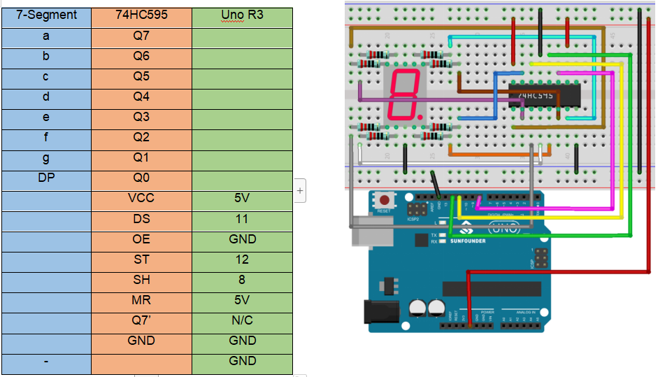
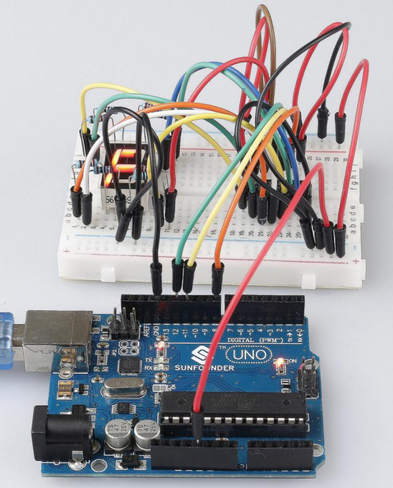

.. note::

    Hello, welcome to the SunFounder Raspberry Pi & Arduino & ESP32 Enthusiasts Community on Facebook! Dive deeper into Raspberry Pi, Arduino, and ESP32 with fellow enthusiasts.

    **Why Join?**

    - **Expert Support**: Solve post-sale issues and technical challenges with help from our community and team.
    - **Learn & Share**: Exchange tips and tutorials to enhance your skills.
    - **Exclusive Previews**: Get early access to new product announcements and sneak peeks.
    - **Special Discounts**: Enjoy exclusive discounts on our newest products.
    - **Festive Promotions and Giveaways**: Take part in giveaways and holiday promotions.

    👉 Ready to explore and create with us? Click [|link_sf_facebook|] and join today!

Lesson 20 74HC595
==========================

**Introduction**
------------------

Generally, there are two ways to drive a single 7-segment display. One
way is to connect its 8 pins directly to eight ports on the Uno board.
Or you can connect the 74HC595 to three ports of the Uno board and then
the 7- segment display to the 74HC595. In this experiment, we will use
the latter. By this way, we can save five ports – considering the Uno
board’s limited ports, this is very important. Now let's get started!

**Components**
-----------------

.. image:: media_arduino/image171.png
    :width: 800
    :align: center

.. image:: media_arduino/image202.png
    :width: 800
    :align: center

**Experimental Principle**
-----------------------------

**7-Segment Display**
^^^^^^^^^^^^^^^^^^^^^^^^

A 7-segment display is an 8-shaped component which packages 7 LEDs. Each
LED is called a segment – when energized, one segment forms part of a
numeral (both decimal and hexadecimal) to be displayed. An additional
8th LED is sometimes used within the same package thus allowing the
indication of a decimal point (DP) when two or more 7-segment displays
are connected together to display numbers greater than ten.

.. image:: media_arduino/image163.jpeg
    :width: 150
    :align: center

Each of the LEDs in the display is given a positional segment with one
of its connection pins led out from the rectangular plastic package.
These LED pins are labeled from "a" through to "g" representing each
individual LED. The other LED pins are connected together forming a
common pin. So by forward biasing the appropriate pins of the LED
segments in a particular order, some segments will brighten and others
stay dim, thus showing the corresponding character on the display.

The common pin of the display generally tells its type. There are two
types of pin connection: a pin of connected cathodes and one of
connected anodes, indicating Common Cathode (CC) and Common Anode (CA).
As the name suggests, a CC display has all the cathodes of the 7 LEDs
connected when a CA display has all the anodes of the 7 segments
connected.

**Common Cathode 7-Segment Display**
^^^^^^^^^^^^^^^^^^^^^^^^^^^^^^^^^^^^^^

In a common cathode display, the cathodes of all the LED segments are
connected to the logic "0" or ground. Then an individual segment (a-g)
is energized by a "HIGH", or logic "1" signal via a current limiting
resistor to forward bias the anode of the segment.

.. image:: media_arduino/image164.jpeg
    :width: 800
    :align: center

**Common Anode 7-Segment Display**
^^^^^^^^^^^^^^^^^^^^^^^^^^^^^^^^^^^^^

In a common anode display, the anodes of all the LED segments are
connected to the logic "1". Then an individual segment (a-g) is
energized by a ground, logic "0" or "LOW" signal via a current limiting
resistor to the cathode of the segment.

.. image:: media_arduino/image165.jpeg
    :width: 400
    :align: center

**74HC595**
^^^^^^^^^^^^^^^^^

The 74HC595 consists of an 8−bit shift register and a storage register
with three−state parallel outputs. It converts serial input into
parallel output so you can save IO ports of an MCU.

When MR (pin10) is high level and OE (pin13) is low level, data is input
in the rising edge of SHcp and goes to the memory register through the
rising edge of SHcp. If the two clocks are connected together, the shift
register is always one pulse earlier than the memory register. There is
a serial shift input pin (Ds), a serial output pin (Q) and an
asynchronous reset button (low level) in the memory register. The memory
register outputs a Bus with a parallel 8-bit and in three states. When
OE is enabled (low level), the data in memory register is output to the
bus.

.. image:: media_arduino/image166.png
    :width: 800
    :align: center

**Pins of 74HC595 and their functions**:

**Q0-Q7**: 8-bit parallel data output pins, able to control 8 LEDs or 8
pins of 7-segment display directly.

**Q7’**: Series output pin, connected to DS of another 74HC595 to
connect multiple 74HC595s in series

**MR**: Reset pin, active at low level; here it is directly connected to
5V.

**SHcp**: Time sequence input of shift register. On the rising edge, the
data in shift register moves successively one bit, i.e. data in Q1 moves
to Q2, and so forth. While on the falling edge, the data in shift
register remain unchanged.

**STcp**: Time sequence input of storage register. On the rising edge,
data in the shift register moves into memory register.

**OE**: Output enable pin, active at low level. Here connected to GND.

**DS**: Serial data input pin

**VCC**: Positive supply voltage

**GND**: Ground

**Principle:**
^^^^^^^^^^^^^^^^^

In the experiment MR (pin10) is connected to 5V (HIGH Level) and OE (pin
13) to GND (LOW Level). Therefore, the data is input into the rising
edge of SHcp and enters the memory register through the rising edge. We
use the shiftout() function to output a 8-bit data to the shift register
through DS. In the rising edge of the SHcp, the data in the shift
register moves successively one bit in one time, i.e. data in Q1 moves
to Q2, and so forth. In the rising edge of STcp, data in the shift
register moves into the memory register. All data will be moved to the
memory register after 8 times. Then the data in the memory register is
output to the bus (Q0-Q7). So the 16 characters are displayed in the
7-segment in turn.

The schematic diagram:

.. image:: media_arduino/image212.png
    :width: 800
    :align: center

**Experimental Procedures**
------------------------------

**Step 1:** Build the circuit (pay attention to the direction
of the chip by the concave on it)

**Step 2:** Open the code file.

**Step 3:** Select the **Board** and **Port.**

**Step 4:** Upload the sketch to the board.

You should now see the 7-segment display from 0 to 9 and A to F.

**Code**
--------------------

.. raw:: html

    <iframe src=https://create.arduino.cc/editor/sunfounder01/42eb9580-b03f-45ae-87e0-c447d20170a8/preview?embed style="height:510px;width:100%;margin:10px 0" frameborder=0></iframe>

**Code Analysis** **20-1** **Set the array elements**
^^^^^^^^^^^^^^^^^^^^^^^^^^^^^^^^^^^^^^^^^^^^^^^^^^^^^^^^^

.. code-block:: arduino

    int datArray[16] = {252, 96, 218, 242, 102, 182, 190, 224, 254, 246, 238, 62, 156, 122, 158, 142};

This array stores the data of the 16 characters from 0 to F. 218 stands
for 2, which you can calculate by yourself. To display 2, the segment f
and c of the 7-segment display must be low level (dim).

Since the segment f and c are connected to Q2 and Q5 of the 74HC595, set
both Q0, Q2 and Q5 (the dot) as low level and leave the rest pins as
high level. Therefore, the values of Q7 Q6 Q5 Q4 Q3 Q2 Q1 Q0 are 1 1 0 1
1 0 1 0.

Change the binary numbers into decimal ones:
1x2\ :sup:`7`\ +1x2\ :sup:`6`\ +0x2\ :sup:`5`\ +1x2\ :sup:`4`\ +1x2\ :sup:`3`\ +0x2\ :sup:`2`\ +1x2\ :sup:`1`\ +0x2\ :sup:`0`\ =218.

.. image:: media_arduino/image170.jpeg
    :width: 150
    :align: center

So that's the value for the number **2** to be displayed. You can
calculate other characters similarly.

**Code Analysis** **20-2** **Display 0-F in the 7-segment display**
^^^^^^^^^^^^^^^^^^^^^^^^^^^^^^^^^^^^^^^^^^^^^^^^^^^^^^^^^^^^^^^^^^^^

.. code-block:: arduino

    for(int num = 0; num < 16; num++)

    {

        digitalWrite(STcp,LOW); // ground ST_CP and hold low for as long as you are transmitting

        shiftOut(DS,SHcp,MSBFIRST,datArray[num]);

        // return the latch pin high to signal chip that it

        // no longer needs to listen for information

        digitalWrite(STcp,HIGH); // pull the ST_CPST_CP to save the data

        delay(1000); // wait for a second

    }

Set *STcp* as low level first and then high level. It will generate a
rising edge pulse of STcp.

**shiftOut()** is used to shift out a byte of data one bit at a time,
which means to shift a byte of data in *dataArray[num]* to the shifting
register with the DS pin. *MSBFIRST* means to move from high bits.

After *digitalWrite(STcp,HIGH)* is run, the STcp will be at the rising
edge. At this time, the data in the shift register will be moved to the
memory register.

A byte of data will be transferred into the memory register after 8
times. Then the data of memory register is output to the bus (Q0-Q7).
You will see a character is displayed on the 7-segment. Then delay for
1000ms. After that line, go back to *for()*. The loop repeats until all
the characters are displayed in the 7-segment display one by one after
16 times.
