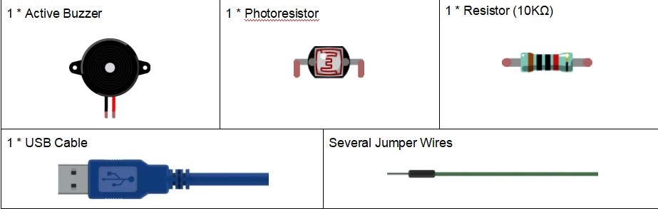
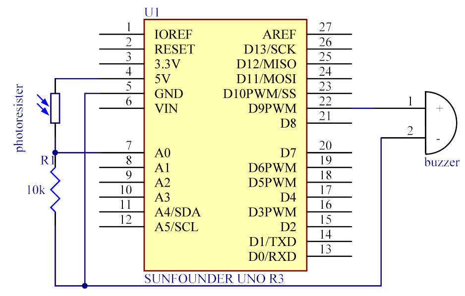
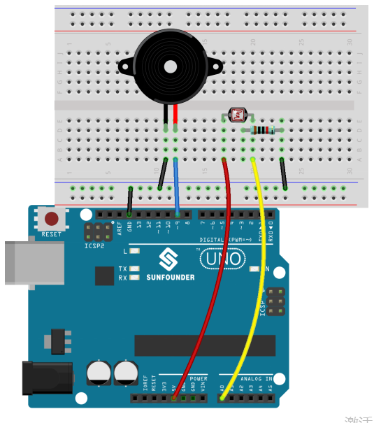
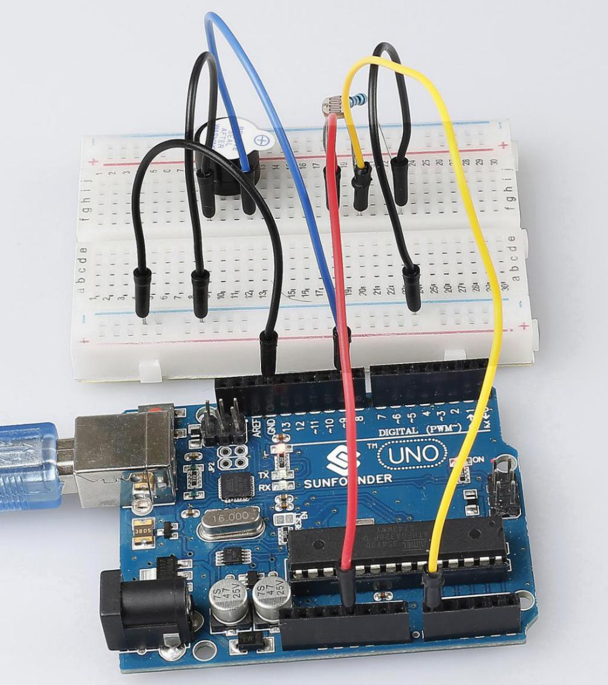

Lesson 20 Controlling Voice by Light
==============================================

**Introduction**
--------------------

Previously we have learnt how to use a photoresistor. In this lesson,
let's get further - control a buzzer to beep in different frequencies by
the photoresistor.

**Components**
-----------------

.. image:: media_arduino/image171.png
    :width: 800
    :align: center

**Experiment Principle**
-----------------------------

When you shine some light on the photoresistor, if the incident light
gets stronger, the resistance of the photoresistor will decrease; if the
incident light becomes weaker, the resistance will increase. We can
apply this principle to change the voltage distribution in the circuit.

In this experiment, the output of the photoresistor is sent to pin A0 on
the SunFounder Uno board and then processed by the ADC on the board to
output a digital signal. We use this digital signal as the parameter of
the delay() function in the sketch to make the buzzer beep.

When the incident light is strong, the output value gets greater, thus
the buzzer will beep slowly; when incident light is weak, the output
value is smaller, thus the buzzer will beep sharply.

The schematic diagram:

**Experiment Procedures**

**Step 1:** Build the circuit

**Step 2:** Open the code file.

**Step 3:** Select the **Board** and **Port.**

**Step 4:** Upload the sketch to the board.

Now, if you place the photoresistor in a dark environment, the buzzer
will beep sharply; if you shine a flashlight on the photoresistor, the
buzzer beeping will slow down.

**Code**
---------------------

.. raw:: html

    <iframe src=https://create.arduino.cc/editor/sunfounder01/914d5b15-2802-4fb5-b35f-b37943ff5451/preview?embed style="height:510px;width:100%;margin:10px 0" frameborder=0></iframe>

**Code Analysis** **20-1** **Set the array elements**
^^^^^^^^^^^^^^^^^^^^^^^^^^^^^^^^^^^^^^^^^^^^^^^^^^^^^^^^

.. code-block:: arduino

    void loop()

    {

        sensorValue = analogRead(photocellPin); //read the value of A0

        digitalWrite(buzzerPin, HIGH); 

        delay(sensorValue); //wait for a while,and the delay time depend on the sensorValue

        digitalWrite(buzzerPin, LOW);

        delay(sensorValue);

    }

The value of the photoresistor is read, and when the incident light is
strong, the output value becomes large. Then set the buzzer to high
level to make it beep, delay the **sensorvalue** ms, then turn off the
buzzer and also delay the **sensorvalue** ms. So you can see that if you
put the photoresistor in a dark environment, the buzzer will make a
sharp humming sound; if you illuminate the flashlight on the
photoresistor, the buzzer will beep.
