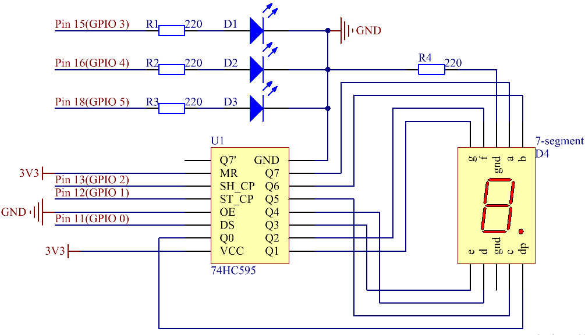

.. note::

    Hello, welcome to the SunFounder Raspberry Pi & Arduino & ESP32 Enthusiasts Community on Facebook! Dive deeper into Raspberry Pi, Arduino, and ESP32 with fellow enthusiasts.

    **Why Join?**

    - **Expert Support**: Solve post-sale issues and technical challenges with help from our community and team.
    - **Learn & Share**: Exchange tips and tutorials to enhance your skills.
    - **Exclusive Previews**: Get early access to new product announcements and sneak peeks.
    - **Special Discounts**: Enjoy exclusive discounts on our newest products.
    - **Festive Promotions and Giveaways**: Take part in giveaways and holiday promotions.

    👉 Ready to explore and create with us? Click [|link_sf_facebook|] and join today!

Lesson 20 Traffic Light
=================================

**Introduction**
-------------------

In last lesson, we learned how to use a 74HC595 chip to drive 
a 7-Segment Display. Based on that, we can apply it more widely 
now, such as making a simple traffic light. Now let's get started!

**Newly Added Components**
-----------------------------

.. image:: media_pi/image251.png
    :width: 800
    :align: center

**Schematic Diagram**
----------------------------

.. image:: media_pi/image252.png
    :width: 800
    :align: center

**Build the Circuit**
---------------------------

.. image:: media_pi/image253.png
    :width: 800
    :align: center

**For C Language Users**
----------------------------

**Command**
^^^^^^^^^^^^

**1.** Go to the folder of the code.

.. raw:: html

    <run></run>

.. code-block::

    cd /home/pi/electronic-kit/for-raspberry-pi/c/Lesson_20_TrafficLight

**2.** Compile the code.

.. raw:: html

    <run></run>

.. code-block::

    gcc 20_TrafficLight.c -lwiringPi

**3.** Run the executable file.

.. raw:: html

    <run></run>

.. code-block::

    sudo ./a.out

You can see the following phenomenon of traffic lights. The red LED
lights up for 9 seconds, green LED for 5s, and yellow LED for 3s.

.. note::

    If it does not work after running, or there is an error prompt: \"wiringPi.h: No such file or directory\", please refer to :ref:`C code is not working?`.

**Code**
^^^^^^^^^^^

.. code-block:: C

    #include <wiringPi.h>  
    #include <stdio.h>  
    #include <wiringShift.h>  
    #include <signal.h>  
    #include <unistd.h>  
    #define     SDI     0   //serial data input(DS)  
    #define     RCLK    1   //memory clock input(STCP)  
    #define     SRCLK    2    //shift register clock input(SHCP)  
    const int ledPin[]={3,4,5};   //Define 3 LED pin(Red, Green, Yellow)  
    unsigned char SegCode[17] = {0x3f,0x06,0x5b,0x4f,0x66,0x6d,0x7d,0x07,0x7f,0x6f,0x77,0x7c,0x39,0x5e,0x79,0x71,0x80};  
      
    int greentime = 5;  
    int yellowtime = 3;  
    int redtime = 9;  
    int colorState = 0;  
    char *lightColor[]={"Red","Green","Yellow"};  
    int counter = 9;  
      
    void init(void){  
        pinMode(SDI, OUTPUT);   
        pinMode(RCLK, OUTPUT);   
        pinMode(SRCLK, OUTPUT);   
      
        digitalWrite(SDI, 0);  
        digitalWrite(RCLK, 0);  
        digitalWrite(SRCLK, 0);  
      
          for(int i=0;i<3;i++){         
            pinMode(ledPin[i],OUTPUT);  
            digitalWrite(ledPin[i],LOW);  
        }  
    }  
      
    void hc595_shift(unsigned char dat){  
        int i;  
        for(i=0;i<8;i++){  
            digitalWrite(SDI, 0x80 & (dat << i));  
            digitalWrite(SRCLK, 1);  
            delay(1);  
            digitalWrite(SRCLK, 0);  
        }  
            digitalWrite(RCLK, 1);  
            delay(1);  
            digitalWrite(RCLK, 0);  
    }  
      
    void timer(int  sig){       //Timer function  
        if(sig == SIGALRM){     
            counter --;           
            alarm(1);   
            if(counter == 0){  
                if(colorState == 0) counter = greentime;  
                if(colorState == 1) counter = yellowtime;  
                if(colorState == 2) counter = redtime;  
                colorState = (colorState+1)%3;   
            }  
            printf("counter : %d \t light color: %s \n",counter,lightColor[colorState]);  
        }  
    }  
      
    void display(int num)  
    {             
        hc595_shift(SegCode[num%10]);   
        delay(1);      
    }  
      
    void lightup(int state)  
    {  
        for(int i=0;i<3;i++){  
            digitalWrite(ledPin[i],LOW);  
        }  
            digitalWrite(ledPin[state],HIGH);      
    }  
      
    int main(void)  
    {  
        int i;  
      
        if(wiringPiSetup() == -1){ //when initialize wiring failed,print message to screen  
            printf("setup wiringPi failed !");  
            return 1;   
        }  
      
        init();  
      
        signal(SIGALRM,timer);  //configure the timer  
        alarm(1);               //set the time of timer to 1s  
        while(1){ 
            display(counter);  
            lightup(colorState);         
        }  
        return 0;  
    }   

**Code Explanation**
^^^^^^^^^^^^^^^^^^^^^^^^

.. code-block:: C

    12.int greentime = 5;  
    13.int yellowtime = 3;  
    14.int redtime = 9;  

Define the duration of lighting of three LEDs. Since 
what we use is a 7-Segment Display here, we shorten 
the length of seconds of lighting of traffic lights, 
setting the green LED to light up for 5 seconds, the 
yellow LED to 3 seconds, and the red LED to 9 seconds.

.. code-block:: C

    15.int colorState = 0;  
    16.int counter = 9;

The variable **colorState** corresponds to the state of 
the traffic lights, and we only need to do a simple 
calculation of **colorState** to indicate the order change 
of the state of the traffic lights. The Variable counter 
is used to count down the time to each traffic light 
status and will be output on a 7-Segment Display.

.. code-block:: C

    19.void init(void){  
    20.    pinMode(SDI, OUTPUT);  
    21.    pinMode(RCLK, OUTPUT);  
    22.    pinMode(SRCLK, OUTPUT); 
    23.  
    24.    digitalWrite(SDI, 0);  
    25.    digitalWrite(RCLK, 0);  
    26.    digitalWrite(SRCLK, 0);  
    27.  
    28.      for(int i=0;i<3;i++){         
    29.        pinMode(ledPin[i],OUTPUT);  
    30.        digitalWrite(ledPin[i],LOW);  
    31.    }  
    32.}  

Initialize pins. Set all control pins of 74HC595 to output 
mode and initialize them to low level. At the same time, 
the LEDs are set to output mode, default low level.

.. code-block:: C

    47.void timer(int  sig){         
    48.    if(sig == SIGALRM){     
    49.        counter --;           
    50.        alarm(1);   
    51.        if(counter == 0){  
    52.            if(colorState == 0) counter = greentime;  
    53.            if(colorState == 1) counter = yellowtime;  
    54.            if(colorState == 2) counter = redtime;  
    55.            colorState = (colorState+1)%3;   
    56.        }  
    57.        printf("counter : %d \t light color: %s \n",counter,lightColor[colorState]);  
    58.    }  
    59.}  

On this timer, counter decreases gradually with every second passing, 
and when it goes to 0, the state of the traffic light changes accordingly.

.. code-block:: C

    67.void lightup(int state)  
    68.{  
    69.    for(int i=0;i<3;i++){  
    70.        digitalWrite(ledPin[i],LOW);  
    71.    }  
    72.        digitalWrite(ledPin[state],HIGH);      
    73.}  
    
The function is to turn off all the lights first, and then light 
up the corresponding LED according to the value of the traffic light state.

**For Python Language Users**
------------------------------------

**Command**
^^^^^^^^^^^^^^^^

**1.** Go to the folder of the code.

.. raw:: html

    <run></run>

.. code-block::

    cd /home/pi/electronic-kit/for-raspberry-pi/python

**2.** Run the code.

.. raw:: html

    <run></run>

.. code-block::

    sudo python3 20_TrafficLight.py

You can see the following phenomenon of traffic lights. The red LED
lights up for 9 seconds, green LED for 5s, and yellow LED for 3s.

**Code**
^^^^^^^^^^^

.. note::
    You can **Modify/Reset/Copy/Run/Stop** the code below. But before that, you need to go to  source code path like ``electronic-kit/for-raspberry-pi/python``. After modifying the code, you can run it directly to see the effect.

.. raw:: html

    <run></run>

.. code-block:: python

    import RPi.GPIO as GPIO  
    import time  
    import threading  
      
    #define the pins connect to 74HC595  
    SDI   = 17      #serial data input(DS)  
    RCLK  = 18      #memory clock input(STCP)  
    SRCLK = 27       #shift register clock input(SHCP)  
    number = (0x3f,0x06,0x5b,0x4f,0x66,0x6d,0x7d,0x07,0x7f,0x6f,0x77,0x7c,0x39,0x5e,0x79,0x71,0x80)  
       
    ledPin =(22,23,24)   
      
    greenLight = 5  
    yellowLight = 3  
    redLight = 9  
    lightColor=("Red","Green","Yellow")  
      
    colorState=0  
    counter = 9        
    t = 0           
         
    def setup():  
        GPIO.setmode(GPIO.BCM)     
        GPIO.setup(SDI, GPIO.OUT)     
        GPIO.setup(RCLK, GPIO.OUT)  
        GPIO.setup(SRCLK, GPIO.OUT)  
        for pin in ledPin:  
            GPIO.setup(pin,GPIO.OUT)  
          
                  
    def hc595_shift(dat):       
        for bit in range(0, 8):      
            GPIO.output(SDI, 0x80 & (dat << bit))  
            GPIO.output(SRCLK, GPIO.HIGH)  
            GPIO.output(SRCLK, GPIO.LOW)  
        GPIO.output(RCLK, GPIO.HIGH)  
        GPIO.output(RCLK, GPIO.LOW)  
      
    def display(num):    
        hc595_shift(0xff)     
        hc595_shift(number[num%10])   
        time.sleep(0.003)     
          
      
    def timer():        #timer function  
        global counter  
        global colorState  
        global t  
        t = threading.Timer(1.0,timer)    
        t.start()       
        counter-=1                            
        if (counter is 0):  
            if(colorState is 0):  
                counter= greenLight  
            if(colorState is 1):  
                counter=yellowLight  
            if (colorState is 2):  
                counter=redLight  
            colorState=(colorState+1)%3  
        print ("counter : %d    color: %s "%(counter,lightColor[colorState]))  
      
    def lightup(state):  
        for i in range(0,3):  
            GPIO.output(ledPin[i], GPIO.LOW)  
        GPIO.output(ledPin[state], GPIO.HIGH)  
      
    def loop():  
        global t  
        global counter  
        global colorState  
        t = threading.Timer(1.0,timer)     
        t.start()                            
        while True:  
            display(counter)  
            lightup(colorState)  
              
    def destroy():   # When "Ctrl+C" is pressed, the function is executed.   
        global t  
        GPIO.cleanup()        
        t.cancel()      #cancel the timer  
      
    if __name__ == '__main__': # Program starting from here   
        setup()   
        try:  
            loop()    
        except KeyboardInterrupt:    
            destroy()      

**Code Explanation**
^^^^^^^^^^^^^^^^^^^^^^^^

.. code-block::

    13.greenLight = 5  
    14.yellowLight = 3  
    15.redLight = 9  

Define the duration of lighting of three LEDs. 
Since what we use is a 7-Segment Display here, 
we shorten the length of seconds of lighting of 
traffic LEDs, setting the green LED to light up for 
5 seconds, the yellow LED to 3 seconds, and the red 
LED to 9 seconds.

.. code-block::

    18.colorState=0  
    19.counter = 9        

The variable **colorState** corresponds to the state of the traffic LEDs, 
and we only need to do a simple calculation of **colorState** to indicate 
the order change of the state of the traffic LEDs.

**counter** is used to count down the time to each traffic LED status 
and will be output on a 7-Segment Display.

.. code-block::

    45.def timer():        #timer function  
    46.    global counter  
    47.    global colorState  
    48.    global t  
    49.    t = threading.Timer(1.0,timer)    
    50.    t.start()       
    51.    counter-=1                            
    52.    if (counter is 0):  
    53.        if(colorState is 0):  
    54.            counter= greenLight  
    55.        if(colorState is 1):  
    56.            counter=yellowLight  
    57.        if (colorState is 2):  
    58.            counter=redLight  
    59.        colorState=(colorState+1)%3  
    60.    print ("counter : %d    color: %s "%(counter,lightColor[colorState]))  

On this timer, counter decreases gradually with every second passing, 
and when it goes to 0, the state of the traffic LED changes accordingly.

.. code-block::

    62.def lightup(state):  
    63.    for i in range(0,3):  
    64.        GPIO.output(ledPin[i], GPIO.LOW)  
    65.    GPIO.output(ledPin[state], GPIO.HIGH)  

The function is to turn off all the LEDs first, and then 
light up the corresponding LED according to the value of the 
traffic LED state.

**Phenomenon Picture**
-----------------------------

.. image:: media_pi/image192.jpeg
    :width: 600
    :align: center
