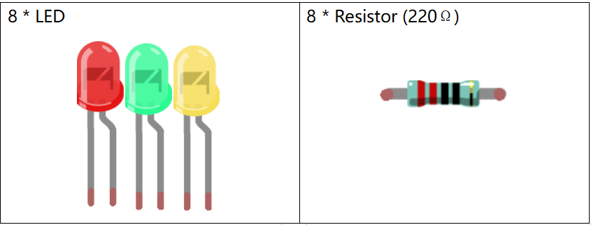
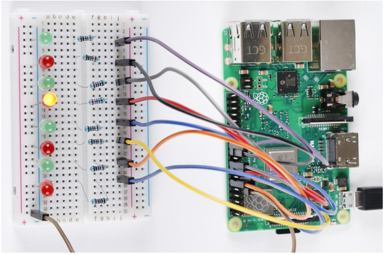

.. note::

    Hello, welcome to the SunFounder Raspberry Pi & Arduino & ESP32 Enthusiasts Community on Facebook! Dive deeper into Raspberry Pi, Arduino, and ESP32 with fellow enthusiasts.

    **Why Join?**

    - **Expert Support**: Solve post-sale issues and technical challenges with help from our community and team.
    - **Learn & Share**: Exchange tips and tutorials to enhance your skills.
    - **Exclusive Previews**: Get early access to new product announcements and sneak peeks.
    - **Special Discounts**: Enjoy exclusive discounts on our newest products.
    - **Festive Promotions and Giveaways**: Take part in giveaways and holiday promotions.

    👉 Ready to explore and create with us? Click [|link_sf_facebook|] and join today!

Lesson 2 Flowing LED Lights
=================================

**Introduction**
------------------

In this lesson, we will learn how to make eight LEDs blink as flowing
water based on Raspberry Pi.

**Newly Added Components**
-----------------------------

**Schematic Diagram**
-------------------------

In this experiment, connect **220Ω**\ resistors to the anode (the longer
pin of the LED) respectively, then the resistors to Pin **11, 12, 13,
15, 16, 18, 22** and **24** of Raspberry Pi, and connect the cathode
(the short pin) of the LEDs to **GND**. We can see from the schematic
diagram that the anode of LED connect to a current-limiting resistor and
then to Raspberry Pi. Therefore, to turn on an LED, we need to make pins
high level. This process can be realized by programming.

.. image:: media_pi/image201.png
    :width: 800
    :align: center

**Build the Circuit**
-----------------------

.. image:: media_pi/image202.png
    :width: 800
    :align: center

**For C Language Users:**
--------------------------

**Command**
^^^^^^^^^^^^^

**1.** Go to the folder of the code.

.. raw:: html

    <run></run>

.. code-block::

    cd /home/pi/electronic-kit/for-raspberry-pi/c/Lesson_2_FlowingLedLights

**2.** Compile the code.

.. raw:: html

    <run></run>

.. code-block::

    gcc 2_FlowingLedLights.c -lwiringPi

.. note::

    When using the gcc command, if you do not use -o,
    it will automatically output as a.out.

**3.** Run the executable file.

.. raw:: html

    <run></run>

.. code-block::

    sudo ./a.out

Now, you will see these 8 LEDs are lit one by one from left
to right, and then one by one from right to left.

.. note::

    If it does not work after running, or there is an error prompt: \"wiringPi.h: No such file or directory\", please refer to :ref:`C code is not working?`.

**Code**
^^^^^^^^^^^^

.. code-block:: C

    #include <wiringPi.h>   
    #include <stdio.h>  
      
    const int LedPin[]={0,1,2,3,4,5,6,10};   //Define 8 LED pin   
      
    int main(void)  
    {  
        // When initialize wiring failed, print message to screen  
        if(wiringPiSetup() == -1){  
            printf("setup wiringPi failed !");  
            return 1;   
        }  
          
        for(int j=0;j<8;j++)  
        {  
            pinMode(LedPin[j], OUTPUT);// Set LedPin as output to write value to it.  
            digitalWrite(LedPin[j], LOW);  
        }  
          
        while(1){  
            for(int i=0;i<8;i++)  
            {  
                // LED on  
                digitalWrite(LedPin[i], HIGH);                    
                delay(100);            
            }  
            for(int i=7;i>-1;i--)  
            {         
                // LED off  
                digitalWrite(LedPin[i], LOW);  
                delay(100);  
            }  
        }  
      
        return 0;  
    }  

**Code Explanation**
^^^^^^^^^^^^^^^^^^^^^^^^^^^^

.. code-block:: C

    4.const int LedPin[]={0,1,2,3,4,5,6,10}; 

Create an array, **LedPin** to define the eight LEDs then 
connect them to **GPIO0** ~ **GPIO6**, **GPIO10** respectively.

.. code-block:: C

    14.    for(int j=0;j<8;j++)  
    15.    {  
    16.        pinMode(LedPin[j], OUTPUT); 
    17.        digitalWrite(LedPin[j], LOW);  
    18.    }  

Use a **for** loop to set all 8 pins connected 
to LEDs to **OUTPUT** mode and **LOW** level.

.. code-block:: c

    21.        for(int i=0;i<8;i++)  
    22.        {  
    23.            // LED on  
    24.            digitalWrite(LedPin[i], HIGH);                    
    25.            delay(100);           
    26.        }  

Light up the LEDs in GPIO0~6 and GPIO10 successively. 
i increases progressively from **0** to **7**, LED0 to LED7 
changes accordingly, making it like a flowing LED light 
from left to right. 

.. code-block:: c

    27.        for(int i=7;i>-1;i--)  
    28.        {         
    29.            // LED off  
    30.            digitalWrite(LedPin[i], LOW);  
    31.            delay(100);  
    32.        }  

Close the LEDs in GPIO0~6 and GPIO10 successively. i 
increases progressively from **7** 
to **0**, LED0 to LED7 changes accordingly, 
making it like a flowing LED light from right to left. 

**For Python Language Users**
---------------------------------

**Command**
^^^^^^^^^^^^^

**1.** Go to the folder of the code

.. raw:: html

    <run></run>

.. code-block::

    cd /home/pi/electronic-kit/for-raspberry-pi/python

**2.** Run the code.

.. raw:: html

    <run></run>

.. code-block::

    sudo python3 2_FlowingLed.py

Now, you will see these 8 LEDs are lit one by one from left to right,
and then one by one from right to left.

**Code**
^^^^^^^^^^

.. note::
    You can **Modify/Reset/Copy/Run/Stop** the code below. But before that, you need to go to  source code path like ``electronic-kit/for-raspberry-pi/python``. After modifying the code, you can run it directly to see the effect.

.. raw:: html

    <run></run>

.. code-block:: python

    import RPi.GPIO as GPIO    
    import time     
      
    pins = [17,18,27,22,23,24,25,8]  
      
    # Define a setup function for some setup  
    def setup():  
        GPIO.setmode(GPIO.BCM)     
        for i in range(0, 8, 1):  
            GPIO.setup(pins[i], GPIO.OUT, initial=GPIO.LOW)  
      
    # Define a main function for main process  
    def main():  
        while True:  
            # print ('...LED ON')  
            # Turn on LED  
            for i in range(0, 8, 1):  
                GPIO.output(pins[i], GPIO.HIGH)  
                time.sleep(0.1)  
                 
            # print ('LED OFF...')  
            # Turn off LED  
            for i in range(7, -1, -1):  
                GPIO.output(pins[i], GPIO.LOW)  
                time.sleep(0.1)  
      
    # Define a destroy function for clean up everything after the script finished   
    def destroy():  
        # Turn off LED     
        for i in range(0, 8, 1):  
                GPIO.output(pins[i], GPIO.LOW)  
        # Release resource  
        GPIO.cleanup()                      
      
    # If run this script directly, do:  
    if __name__ == '__main__':  
        setup()  
        try:  
            main()  
        # When 'Ctrl+C' is pressed, the child program   
        # destroy() will be  executed.  
        except KeyboardInterrupt:  
            destroy()  

**Code Explanation**
^^^^^^^^^^^^^^^^^^^^^^

.. code-block:: 

    9.    for i in range(0, 8, 1):  
    10.        GPIO.setup(pins[i], GPIO.OUT, initial=GPIO.LOW)

Use a **for** loop to set all 8 pins connected to LEDs to output mode 
and LOW level.

.. code-block:: 

    17.        for i in range(0, 8, 1):  
    18.            GPIO.output(pins[i], GPIO.HIGH) 
    19. 			time.sleep(0.1)

Variable **i** increases progressively from **0** to **8**,
increasing by 1 every time. Accordingly, set the pins in the array
**pins[i]** to **HIGH** respectively to light up the LEDs and the
lighting time is **0.1**\ s. Then, you will see 8 LEDs light up one
by one.

.. code-block:: 

    23.        for i in range(7, -1, -1):  
    24.            GPIO.output(pins[i], GPIO.LOW)  
    25.            time.sleep(0.1)  

Variable **i** decreases progressively from **7** to **-1**,
decreasing by 1 every time. Then LED0~LED7 change accordingly, making
it like a flowing LED light from right to left.

**Phenomenon Picture**
-----------------------------

