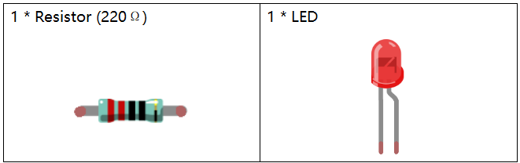

Lesson 3 Breathing LED
================================

**Introduction**
----------------

In this lesson, we will try something interesting - gradually increase
or decrease the luminance of an LED with PWM, just like breathing. So we
give it a magical name - Breathing LED.

**Newly Added Components**
----------------------------------

**Principle**
---------------

**PWM**

Pulse Width Modulation, or PWM, is a technique for getting analog
results with digital means. Digital control is used to create a square
wave, a signal switched between on and off. This on-off pattern can
simulate voltages in between full on (5 Volts) and off (0 Volts) by
changing the portion of the time the signal spends on versus the time
that the signal spends off. The duration of "on time" is called pulse
width. To get varying analog values, you can change or modulate this
width. If you repeat this on-off pattern fast enough with some device,
an LED for example, the result would be like this: the signal is a
steady voltage between 0 and 5v controlling the brightness of the LED.

**Duty Cycle**

A duty cycle is the percentage of one period in which a signal is
active. A period is the time it takes for a signal to complete an
on-and-off cycle. As a formula, a duty cycle may be expressed as:

D=T/Px100%

Where is the duty cycle, is the time the signal is active, and is the
total period of the signal. Thus, a 60% duty cycle means the signal is
on 60% of the time but off 40% of the time. The "on time" for a 60% duty
cycle could be a fraction of a second, a day, or even a week, depending
on the length of the period.

.. image:: media_pi/image90.jpeg
    :width: 600
    :align: center

**Schematic Diagram**
----------------------

.. image:: media_pi/image262.png
    :width: 400
    :align: center

.. image:: media_pi/image263.png
    :width: 600
    :align: center

**Build the Circuit**
----------------------

.. image:: media_pi/image92.png
    :width: 600
    :align: center

**For C Language Users:**
-----------------------------

**Command**
^^^^^^^^^^^^

**1.** Go to the folder of the code.

.. raw:: html

    <run></run>

.. code-block::

    cd /home/pi/electronic-kit/for-raspberry-pi/c/Lesson_3_BreathingLed

**2.** Compile the code.

.. raw:: html

    <run></run>

.. code-block::

    gcc 3_BreathingLed.c -lwiringPi

**3.** Run the executable file.

.. raw:: html

    <run></run>

.. code-block::

    sudo ./a.out

As the code runs, you can see that the brightness of the LED becomes
stronger or weaker.

.. note::

    If it does not work after running, or there is an error prompt: \"wiringPi.h: No such file or directory\", please refer to :ref:`C code is not working?`.

**Code**
^^^^^^^^^

.. code-block:: C

    #include <stdio.h>  
    #include <wiringPi.h>  
    #include <softPwm.h>  
      
    #define LedPin 1   
      
    int main (void)  
    {  
    // When initialize wiring failed, print message to screen  
        if(wiringPiSetup() == -1){  
            printf("setup wiringPi failed !");  
            return 1;   
        }  
          
        softPwmCreate(LedPin,  0, 100);  
      
        int i;  
      
        while(1) // loop forever  
        {  
            for(i=0;i<100;i++){  // i,as the value of pwm, increases progressively during 0-1024.    
                softPwmWrite(LedPin, i);   
                delay(10);     
            }   
      
            for(i=100;i>=0;i--){  
                softPwmWrite(LedPin, i);  
                delay(10);  
            }   
        }  
        return 0 ;  
    }   

**Code Explanation**
^^^^^^^^^^^^^^^^^^^^^^^^^

.. code-block:: C

    #include <softPwm.h> 

WiringPi includes a software-driven **PWM** library of 
outputting a PWM signal on any of the Raspberry Pi's 
GPIO pins. To maintain a low CPU usage, the minimum 
pulse width is 100μS. That combined with the default suggested range of 
100 gives a PWM frequency of 100Hz. Within these 
limitations, control of a light/LED or a motor is very achievable.

.. code-block:: C

  15.    softPwmCreate(LedPin,  0, 100);  

The function is to use software library to create a PWM pin, set its period between 0x100us-100x100us. 
The prototype of the function softPwmCreate(LedPinRed,  0, 100) is as follows：

.. code-block:: C

    int softPwmCreate(int pin,int initialValue,int pwmRange);

**pin:** Any GPIO pin of Raspberry Pi can be set as a PWM pin. 

**initialValue:** The initial pulse width is that initialValue times100us.

**pwmRange:** The period of PWM is that pwmRange times100us.

.. code-block:: C

      22.            softPwmWrite(LedPin, i); 

The function is used to write the PWM value **i** to the **LedPin**. 

The prototype of the function softPwmWrite(LedPinBlue,  b_val) is as follows：

.. code-block:: C

    void softPwmWrite (int pin, int value) ;

**pin:** Any GPIO pin of Raspberry Pi can be set as a PWM pin. 

**Value:** The pulse width of PWM is value times 100us. Note that value can only be less than pwmRange 
defined previously, if it is larger than pwmRange, the value will be given a fixed value, pwmRange.

.. code-block:: C

       23.            delay(10);

Wait for 10ms, interval time between the changes indicates the speed of breathing.

**For Python Language Users**
-------------------------------

**Command**
^^^^^^^^^^^^^

**1.** Go to the folder of the code.

.. raw:: html

    <run></run>

.. code-block::

    cd /home/pi/electronic-kit/for-raspberry-pi/python

**2.** Run the code.

.. raw:: html

    <run></run>

.. code-block::

    sudo python3 3_BreathingLed.py

As the code runs, you can see that the brightness of the LED becomes
stronger or weaker.

**Code**
^^^^^^^^^^^^

.. note::
    You can **Modify/Reset/Copy/Run/Stop** the code below. But before that, you need to go to  source code path like ``electronic-kit/for-raspberry-pi/python``. After modifying the code, you can run it directly to see the effect.

.. raw:: html

    <run></run>

.. code-block:: python

    import RPi.GPIO as GPIO  
    import time  
      
    LedPin = 18  
      
    def setup():  
        global pLed  
        GPIO.setmode(GPIO.BCM)  
        GPIO.setup(LedPin, GPIO.OUT, initial=GPIO.LOW)  
        pLed = GPIO.PWM(LedPin, 1000)  
        pLed.start(0)  
      
    def main():  
        # Set increase/decrease step  
        step =2   
        delay = 0.05  
        while True:  
            # Increase duty cycle from 0 to 100  
            for dc in range(0, 101, step):  
                pLed.ChangeDutyCycle(dc)  
                print (' ++ Duty cycle: %s'%dc)  
                time.sleep(delay)  
            time.sleep(1)  
      
            # decrease duty cycle from 100 to 0  
            for dc in range(100, -1, -step):  
                # Change duty cycle to dc  
                pLed.ChangeDutyCycle(dc)  
                print ('  -- Duty cycle: %s'%dc)  
                time.sleep(delay)  
            time.sleep(1)  
      
    def destroy():  
        # Stop pLed  
        pLed.stop()  
        # Turn off LED  
        GPIO.output(LedPin, GPIO.LOW)  
        # Release resource  
        GPIO.cleanup()  
      
    # If run this script directly, do:  
    if __name__ == '__main__':  
        setup()  
        try:  
            main()  
        # When 'Ctrl+C' is pressed, the child program   
        # destroy() will be  executed.  
        except KeyboardInterrupt:  
            destroy()  

**Code Explanation**
^^^^^^^^^^^^^^^^^^^^^^

.. code-block:: 

    10.    pLed = GPIO.PWM(LedPin, 1000)

To create a PWM instance. Set **pLed** as pwm output and frequence to **1K** Hz.

.. code-block:: 

   11.    pLed.start(0) 

Set pLed begin with value **0**.

.. code-block:: 

    19.        for dc in range(0, 101, step):  
    20.            # Change duty cycle to dc  
    21.            pLed.ChangeDutyCycle(dc)  
    22.            print (' ++ Duty cycle: %s'%dc)  
    23.            time.sleep(delay)  

Increase the duty cycle by 2 at a time, from **0** to 
**101**, and you'll see the LED getting brighter and brighter.

.. code-block:: 

    26. for dc in range(100, -1, -step):  
    27.            pLed.ChangeDutyCycle(dc)  
    28.            print ('  -- Duty cycle: %s'%dc)  
    29.            time.sleep(delay)  

Similarly, when the duty cycle is reduced by 2 from 
**100** to **-1**, the LED brightness will be dimmer and dimmer.

**Phenomenon Picture**
-----------------------

.. image:: media_pi/image84.jpeg
    :width: 400
    :align: center