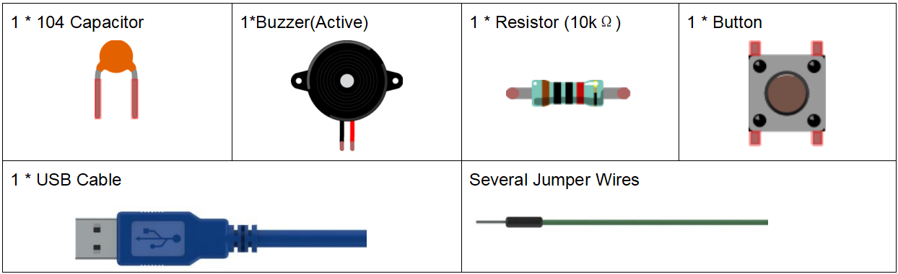

.. note::

    Hello, welcome to the SunFounder Raspberry Pi & Arduino & ESP32 Enthusiasts Community on Facebook! Dive deeper into Raspberry Pi, Arduino, and ESP32 with fellow enthusiasts.

    **Why Join?**

    - **Expert Support**: Solve post-sale issues and technical challenges with help from our community and team.
    - **Learn & Share**: Exchange tips and tutorials to enhance your skills.
    - **Exclusive Previews**: Get early access to new product announcements and sneak peeks.
    - **Special Discounts**: Enjoy exclusive discounts on our newest products.
    - **Festive Promotions and Giveaways**: Take part in giveaways and holiday promotions.

    👉 Ready to explore and create with us? Click [|link_sf_facebook|] and join today!

Lesson 4 Doorbell
======================

**Introduction**
---------------------

A buzzer is a great tool in your experiments whenever you want to make
some sounds. In this lesson, we will learn how to drive an active buzzer
to build a simple doorbell.

**Components**
-----------------

.. image:: media_arduino/image171.png
    :width: 800
    :align: center

**Experimental Principle**
------------------------------

As a type of electronic buzzer with an integrated structure, buzzers,
which are supplied by DC power, are widely used in computers, printers,
photocopiers, alarms, electronic toys, automotive electronic devices,
telephones, timers and other electronic products for voice devices.
Buzzers can be categorized as active and passive ones (see the following
picture). Turn the pins of two buzzers face up, and the one with a green
circuit board is a passive buzzer, while the other enclosed with a black
tape is an active one.

The difference between an active buzzer and a passive buzzer:

.. image:: media_arduino/image70.png
    :width: 400
    :align: center

An active buzzer has a built-in oscillating source, so it will make
sounds when electrified. But a passive buzzer does not have such source,
so it will not tweet if DC signals are used; instead, you need to use
square waves whose frequency is between 2K and 5K to drive it. The
active buzzer is often more expensive than the passive one because of
multiple built-in oscillating circuits.

In this experiment, we use an active buzzer.

The schematic diagram：

.. image:: media_arduino/image206.png
    :width: 800
    :align: center

**Experimental Procedures**
-------------------------------

**Step 1:** Build the circuit (Long pins of buzzer is the Anode and the
short pin is Cathode).

**Step 2:** Open the code file.

**Step 3:** Select the **Board** and **Port.**

**Step 4:** Upload the sketch to the board.

.. image:: media_arduino/image215.png
    :align: center

Now, you should hear the buzzer beep.

.. image:: media_arduino/image73.jpeg
    :width: 800
    :align: center

**Code**
-----------------------

.. raw:: html

    <iframe src=https://create.arduino.cc/editor/sunfounder01/0129cc3d-8759-4c29-add0-7fca61da8d22/preview?embed style="height:510px;width:100%;margin:10px 0" frameborder=0></iframe>

**Code Analysis 4-1 Define variables**
^^^^^^^^^^^^^^^^^^^^^^^^^^^^^^^^^^^^^^^^^

.. code-block:: arduino

    const int buttonPin = 2; //the button connect to pin2

    const int buzzerPin = 8; //the led connect to pin8

    /**********************************/

    int buttonState = 0; //variable for reading the pushbutton status

Connect the button to pin 2 and buzzer to pin 8. Define a variable
*buttonState* to restore the state of the button.

**Code Analysis 4-2 Set the input and output status of the pins**
^^^^^^^^^^^^^^^^^^^^^^^^^^^^^^^^^^^^^^^^^^^^^^^^^^^^^^^^^^^^^^^^^^^

.. code-block:: arduino

    void setup()

    {

        pinMode(buttonPin, INPUT); //initialize the buttonPin as input

        pinMode(buzzerPin, OUTPUT); //initialize the buzzerpin as output

    }

We need to know the status of the button in this experiment, so here set
the *buttonPin* as INPUT; to set HIGH/LOW of the buzzer, we set
*buzzerPin* as OUTPUT.

**Code Analysis 4-3** **Read the status of the button**
^^^^^^^^^^^^^^^^^^^^^^^^^^^^^^^^^^^^^^^^^^^^^^^^^^^^^^^^^^^

.. code-block:: arduino

    buttonState = digitalRead(buttonPin);

buttonPin(Pin2) is a digital pin; here is to read the value of the
button and store it in *buttonState*.

**digitalRead (Pin)**: Reads the value from a specified digital pin,
either HIGH or LOW.

**Code Analysis 4-4 Turn on the LED when the button is pressed**
^^^^^^^^^^^^^^^^^^^^^^^^^^^^^^^^^^^^^^^^^^^^^^^^^^^^^^^^^^^^^^^^^^^

.. code-block:: arduino

    if (buttonState == HIGH ) //When press the button, run the following code.
    
    {
        
        for (i = 0; i < 50; i++) /*When i=o, which accords with the condition
        i<=50, i++ equals to 1 (here in i = i + 1, the two "i"s are not the
        same, but i_now = i_before + 1). Run the code in the curly braces: 
        let the buzzer beep for 3ms and stop for 3ms. Then repeat 50 times.*/

        { 
            digitalWrite(buzzerPin, HIGH); //Let the buzzer beep.

            delay(3);//wait for 3ms

            digitalWrite(buzzerPin, LOW); //Stop the buzzer.

            delay(3);//wait for 3ms 
        }

        for (i = 0; i < 80; i++) //Let the buzzer beep for 5ms and stop for 5ms, repeat 80 times.
        
        { 
            digitalWrite(buzzerPin, HIGH);

            delay(5);//wait for 5ms

            digitalWrite(buzzerPin, LOW);

            delay(5);//wait for 5ms
        }
    }

In this part, when the **buttonState** is High level, then let the
buzzer beeping in different frequency which can simulate the doorbell.
