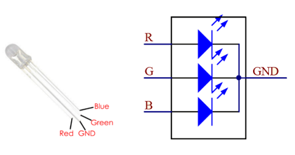
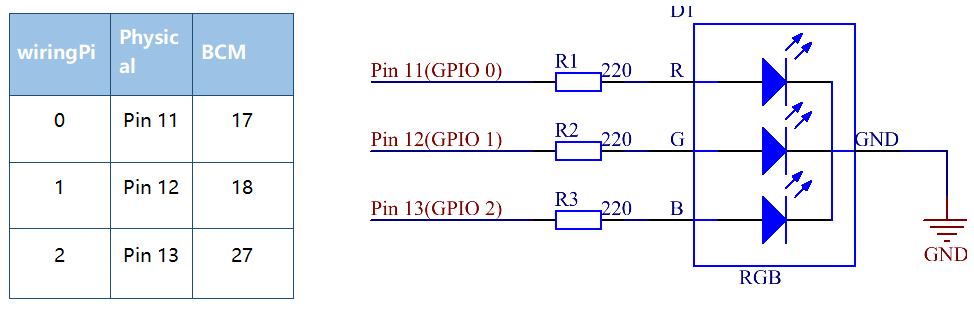

Lesson 4 RGB LED
=====================

**Introduction**
---------------------------

Previously we've used the PWM technology to control an LED’s brightness.
In this lesson, we will use it to control an RGB LED to flash various
kinds of colors.

**Newly Added Components**
----------------------------------

.. image:: media_pi/image206.png
    :width: 600
    :align: center

**Principle**
--------------------

**RGB LED**

The three primary colors of the RGB LED can be mixed into various colors
by brightness. The brightness of LED can be adjusted with PWM. Raspberry
Pi has only one channel for hardware PWM output, but it needs three
channels to control the RGB LED, which means it is difficult to control
the RGB LED with the hardware PWM of Raspberry Pi. Fortunately, the
**softPwm** library simulates PWM (softPwm) by programming. You only
need to include the header file **softPwm.h** (for C language users),
and then call the API it provides to easily control the RGB LED by
multi-channel PWM output, so as to display all kinds of color.

**Schematic Diagram**
-----------------------

After connecting the pins of R, G, and B to a current
limiting resistor, connect them to the pin 11, pin 12, and pin 13
respectively. The longest pin (GND) of the LED connects to the GND of
the Raspberry Pi. When the three pins are given different PWM values,
the RGB LED will display different colors.

**Build the Circuit**
-----------------------

.. image:: media_pi/image98.png
    :width: 800
    :align: center

**For C Language Users**
----------------------------

**Command**
^^^^^^^^^^^^^^^^^

**1.** Go to the folder of the code.

.. raw:: html

    <run></run>

.. code-block::

    cd /home/pi/electronic-kit/for-raspberry-pi/c/Lesson_4_RGBLed

**2.** Compile the code.

.. raw:: html

    <run></run>

.. code-block::

    gcc 4_rgbLed.c -lwiringPi

**3.** Run the executable file.

.. raw:: html

    <run></run>

.. code-block::

    sudo ./a.out

After the code runs, you will see that RGB displays red, green, blue,
yellow, pink, and cyan.

.. note::

    If it does not work after running, or there is an error prompt: \"wiringPi.h: No such file or directory\", please refer to :ref:`C code is not working?`.

**Code**
^^^^^^^^^^^

.. code-block:: C

    #include <wiringPi.h>  
    #include <softPwm.h>  
    #include <stdio.h>  
      
    #define uchar unsigned char  
      
    #define LedPinRed    0  
    #define LedPinGreen  1  
    #define LedPinBlue   2  
      
    // define function used for initializing I/O port to output for pwm.   
    void ledInit(void){  
        softPwmCreate(LedPinRed,  0, 100);  
        softPwmCreate(LedPinGreen,0, 100);  
        softPwmCreate(LedPinBlue, 0, 100);  
    }  
      
    void ledColorSet(uchar r_val, uchar g_val, uchar b_val){  
        softPwmWrite(LedPinRed,   r_val);  
        softPwmWrite(LedPinGreen, g_val);  
        softPwmWrite(LedPinBlue,  b_val);  
    }  
      
    int main(void){  
        if(wiringPiSetup() == -1){ //when initialize wiring failed, printf message to screen  
            printf("setup wiringPi failed !");  
            return 1;   
        }  
      
        ledInit();  
      
        while(1){  
            printf("Red\n");  
            ledColorSet(0xff,0x00,0x00);   //red          
            delay(500);  
            printf("Green\n");  
            ledColorSet(0x00,0xff,0x00);   //green  
            delay(500);  
            printf("Blue\n");  
            ledColorSet(0x00,0x00,0xff);   //blue  
            delay(500);  
            printf("Yellow\n");  
            ledColorSet(0xff,0xff,0x00);   //yellow  
            delay(500);  
            printf("Purple\n");  
            ledColorSet(0xff,0x00,0xff);   //purple  
            delay(500);  
            printf("Cyan\n");  
            ledColorSet(0xc0,0xff,0x3e);   //cyan  
            delay(500);  
        }  
      
        return 0;  
    }   

**Code Explanation**
^^^^^^^^^^^^^^^^^^^^^^^^

.. code-block:: C

    12.void ledInit(void){  
    13.    softPwmCreate(LedPinRed,  0, 100);  
    14.    softPwmCreate(LedPinGreen,0, 100);  
    15.    softPwmCreate(LedPinBlue, 0, 100);  
    16.}  

Create a function to set the **LedPinRed**，**LedPinGreen** and **LedPinBlue** as PWM pins, 
then set their period between 0x100us-100x100us.

The prototype of the function softPwmCreate(LedPinRed,  0, 100) is as follows：

.. code-block:: C

    int softPwmCreate(int pin,int initialValue,int pwmRange);

**pin:** Any GPIO pin of Raspberry Pi can be set as a PWM pin. 

**initialValue:** The initial pulse width is that initialValue times100us.

**pwmRange:** the period of PWM is that pwmRange times100us.

.. code-block:: C

    18.void ledColorSet(uchar r_val, uchar g_val, uchar b_val){  
    19.    softPwmWrite(LedPinRed,   r_val);  
    20.    softPwmWrite(LedPinGreen, g_val);  
    21.    softPwmWrite(LedPinBlue,  b_val);  
    22.}  

This function is to set the colors of the LED. Using RGB, 
the formal parameter **r_val** represents 
the luminance of the red one, **g_val** of the green one, **b_val** of the blue one. 

The prototype of the function softPwmWrite(LedPinBlue,  b_val) is as follows：

.. code-block:: C

    void softPwmWrite (int pin, int value) ;

**pin:** Any GPIO pin of Raspberry Pi can be set as a PWM pin. 

**Value:** The pulse width of PWM is value times 100us. Note that **value** can only be less than 
**pwmRange** defined previously, if it is larger than pwmRange, 
the **value** will be given a fixed value, pwmRange.

.. code-block:: C

    30.    ledInit(); 
     
Call the **ledInit()** function in the **main** function to initialize the LED.  

.. code-block:: C

    34.    ledColorSet(0xff,0x00,0x00);   //red

Call the function defined before. Write **0xff** into LedPinRed and **0x00** into 
LedPinGreen and LedPinBlue. 

Only the Red LED lights up after running this code. If you want to light up 
LEDs in other colors, just modify the parameters.

**For Python Language Users**
-------------------------------

**Command**
^^^^^^^^^^^^^^^^^^

**1.** Go to the folder of the code.

.. raw:: html

    <run></run>

.. code-block::

    cd /home/pi/electronic-kit/for-raspberry-pi/python

**2.** Run the code.

.. raw:: html

    <run></run>

.. code-block::

    sudo python3 4_rgbLed.py

After the code runs, you will see that RGB displays red, 
green, blue, yellow, pink, and cyan.

**Code**
^^^^^^^^^^^^

.. note::
    You can **Modify/Reset/Copy/Run/Stop** the code below. But before that, you need to go to  source code path like ``electronic-kit/for-raspberry-pi/python``. After modifying the code, you can run it directly to see the effect.

.. raw:: html

    <run></run>

.. code-block:: python

    import RPi.GPIO as GPIO  
    import time  
      
    COLOR = [0xFF0000, 0x00FF00, 0x0000FF, 0xFFFF00, 0xFF00FF, 0x00FFFF]  
    pins = {'Red':17, 'Green':18, 'Blue':27}  
      
    def setup():  
        global p_R, p_G, p_B  
        GPIO.setmode(GPIO.BCM)  
        for i in pins:  
            GPIO.setup(pins[i], GPIO.OUT, initial=GPIO.LOW)  
      
        # Set all led as pwm channel and frequece to 2KHz  
        p_R = GPIO.PWM(pins['Red'], 2000)  
        p_G = GPIO.PWM(pins['Green'], 2000)  
        p_B = GPIO.PWM(pins['Blue'], 2000)  
      
        # Set all begin with value 0  
        p_R.start(0)  
        p_G.start(0)  
        p_B.start(0)  
      
    def MAP(x, in_min, in_max, out_min, out_max):  
        return (x - in_min) * (out_max - out_min) / (in_max - in_min) + out_min  
      
    def setColor(color):  
        # Devide colors from 'color' veriable  
        R_val = (color & 0xFF0000) >> 16  
        G_val = (color & 0x00FF00) >> 8  
        B_val = (color & 0x0000FF) >> 0  
      
        # Map color value from 0~255 to 0~100  
        R_val = MAP(R_val, 0, 255, 0, 100)  
        G_val = MAP(G_val, 0, 255, 0, 100)  
        B_val = MAP(B_val, 0, 255, 0, 100)  
          
        # Change the colors  
        p_R.ChangeDutyCycle(R_val)   
        p_G.ChangeDutyCycle(G_val)  
        p_B.ChangeDutyCycle(B_val)  
      
        print ("color_msg: R_val = %s,  G_val = %s, B_val = %s"%(R_val, G_val, B_val))     
      
    def main():  
        while True:  
            for color in COLOR:  
                setColor(color)  
                time.sleep(0.5)     
      
    def destroy():  
        # Stop all pwm channel  
        p_R.stop()  
        p_G.stop()  
        p_B.stop()  
        # Turn off all LEDs  
        GPIO.output(pins, GPIO.LOW)  
        # Release resource  
        GPIO.cleanup()  
      
    # If run this script directly, do:  
    if __name__ == '__main__':  
        setup()  
        try:  
            main()  
        # When 'Ctrl+C' is pressed, the child program   
        # destroy() will be  executed.  
        except KeyboardInterrupt:  
            destroy()  

**Code Explanation**
^^^^^^^^^^^^^^^^^^^^^

.. code-block:: 

     14.    p_R = GPIO.PWM(pins['Red'], 2000)  

This statement is used to set the pin to a specific PWM 
frequency, in this case **2000** Hz.

.. code-block:: 

    23.def MAP(x, in_min, in_max, out_min, out_max):  
    24.    return (x - in_min) * (out_max - out_min) / (in_max - in_min) + out_min  

Define a **map** function for mapping values. For instance, x=50, in_min=0, 
in_max=255, out_min=0, out_max=100. After the map 
function mapping, it returns (50-0) * (100-0)/(255-0) +0=19.6, meaning that 50 
in 0-255 equals 19.6 in 0-100.

.. code-block:: 

    26.def setColor(color):
    27.    R_val = (color & 0xFF0000) >> 16  
    28.    G_val = (color & 0x00FF00) >> 8  
    29.    B_val = (color & 0x0000FF) >> 0  

Create a **setColor()** function to assign different value to the 
three variables: R_val, G_val, B_val. Input color should be hexadecimal 
with red value, blue value, green value. Assign the first two values of the 
hexadecimal to R_val, the middle two to G_val, assign the last two values to 
B_val, please refer to the shift operation of the hexadecimal for 
details. For example, color=0xFF00FF, then R_val=(0xFF00FF & 0xFF0000)>>16 = 0xFF, 
G_val = 0x00, B_val=0xFF.

.. code-block:: 

    32.# Map color value from 0~255 to 0~100  
    33.    R_val = MAP(R_val, 0, 255, 0, 100)  
    34.    G_val = MAP(G_val, 0, 255, 0, 100)  
    35.    B_val = MAP(B_val, 0, 255, 0, 100)  
    36.      
    37.    # Change the colors  
    38.    p_R.ChangeDutyCycle(R_val)   
    39.    p_G.ChangeDutyCycle(G_val)  
    40.    p_B.ChangeDutyCycle(B_val) 

Map the RGB value from **0** - **255** to **0** - **100**. After that, get a value. 
Then set it to be the duty cycle of R_val, 
G_val and B_val, and the RGB LED displays corresponding colors.

.. code-block:: 

    46.            for color in COLOR:  
    47.            setColor(color)  
    48.            time.sleep(0.5)

Assign every item in the **COLOR** list to 
the color respectively and change the color 
of the RGB LED via the **setColor()** function. 

**Phenomenon Picture**
-----------------------

.. image:: media_pi/image99.jpeg
    :width: 800
    :align: center

