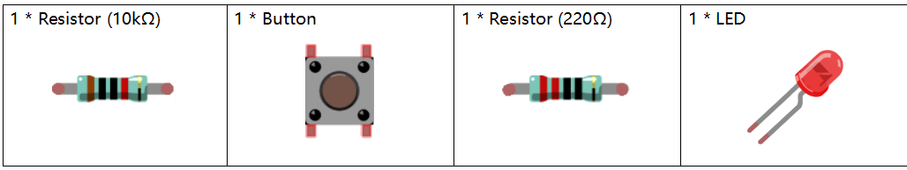
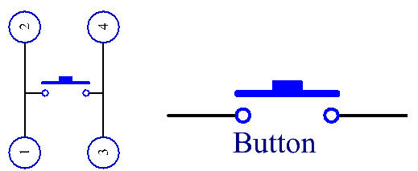
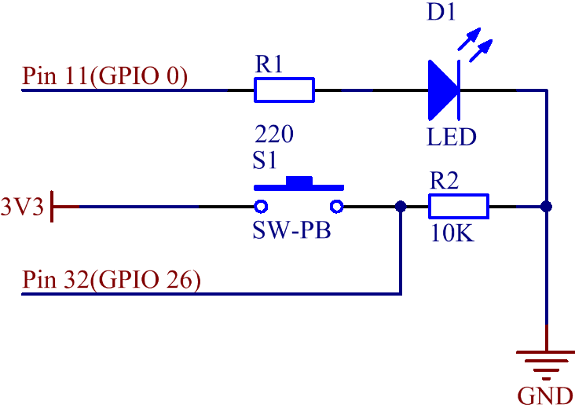
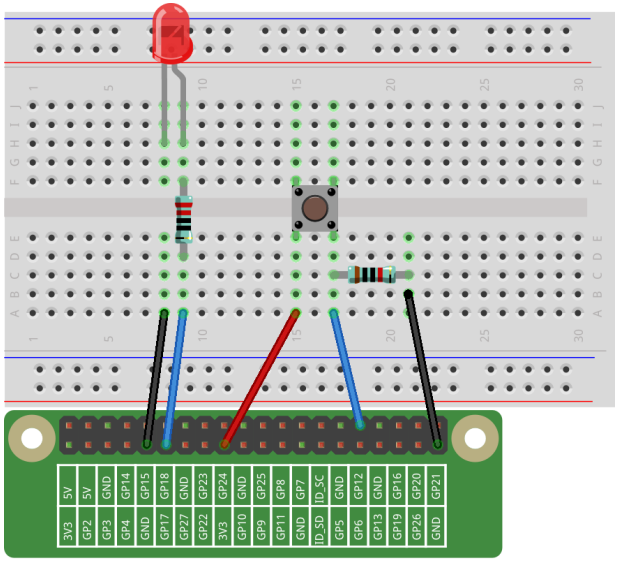

Lesson 5 Controlling LED by Button
==========================================

**Introduction**
---------------------

In this lesson, we will learn how to turn an LED on or off by a button.

**Newly Added Components**
-----------------------------------

**Principle**
---------------------

Button

Button is a common component used to control electronic devices. It is
usually used as switch to connect or break circuits. Although buttons
come in a variety of sizes and shapes, the one used here is a 6mm
mini-button as shown in the following pictures.

Two pins on the same side are connected, which is shown below:

.. image:: media_pi/image102.png
    :width: 150
    :align: center

The symbol shown as below is usually used to represent a button in
circuits.

When the button is pressed, the 4 pins are connected, thus closing the
circuit.

**Schematic Diagram**
--------------------------

When the button is pressed once, pin 32 is 3.3V (HIGH). Set the pin
11(integrated with an LED) as high level by programming at the same
time. Then press the button again and set pin 11 to Low. So we will see
the LED light on and off alternately as the button is pressed many
times.

.. image:: media_pi/image211.png
    :width: 800
    :align: center

**Build the Circuit**
-----------------------------

**For C Language Users**
----------------------------

**Command**
^^^^^^^^^^^^

**1.** Go to the folder of the code.

.. raw:: html

    <run></run>

.. code-block::

    cd /home/pi/electronic-kit/for-raspberry-pi/c/Lesson_5_Controlling_Led_by_Button

**2.** Compile the code.

.. raw:: html

    <run></run>

.. code-block::

    gcc 5_Button.c -lwiringPi

**3.** Run the executable file.

.. raw:: html

    <run></run>

.. code-block::

    sudo ./a.out

When you press the button for the first time, the LED lights up. When
the button is pressed again, the LED lights off.

.. note::

    If it does not work after running, or there is an error prompt: \"wiringPi.h: No such file or directory\", please refer to :ref:`C code is not working?`.

**Code** 
^^^^^^^^^^^^^^^

.. code-block:: C

    #include <wiringPi.h>  
    #include <stdio.h>  
      
    #define LedPin      0  
    #define ButtonPin   26  
    int state = 0;  
      
    int main(void){  
        // When initialize wiring failed, print message to screen  
        if(wiringPiSetup() == -1){  
            printf("setup wiringPi failed !");  
            return 1;   
        }  
          
        pinMode(LedPin, OUTPUT);   
        pinMode(ButtonPin, INPUT);  
        pullUpDnControl(ButtonPin, PUD_DOWN);  
      
        while(1){  
            // Indicate that button has pressed down  
            if(digitalRead(ButtonPin) == 1)  
            {  
                delay(10);  
                if(digitalRead(ButtonPin) == 1)  
                {  
                    state ++;  
                    if(state%2 == 1)  
                    {  
                        digitalWrite(LedPin,HIGH);  
                        delay(100);  
                    }  
                    if(state%2 == 0)  
                    {  
                        digitalWrite(LedPin,LOW);  
                        delay(100);  
                    }  
                }  
            }         
        }  
        return 0;  
    }      

**Code Explanation**
^^^^^^^^^^^^^^^^^^^^^^

.. code-block:: C

    6. int state = 0; 

Define a variable **state** to record the number of times 
it is pressed and the initial number of times is **0**.

.. code-block:: C

    15.  pinMode(LedPin, OUTPUT);   
    16.  pinMode(ButtonPin, INPUT);

Set the LedPin to **OUTPUT** mode, ButtonPin to **INPUT** mode.

.. code-block:: C

    17.    pullUpDnControl(ButtonPin, PUD_DOWN); 

When the button is not pressed, ButtonPin is in suspension at which time 
the read value is changing. To enable ButtonPin to output a stable low level, 
**PUD_DOWN** is added to the code, keeping ButtonPin at the forced 
pull-down state till the button is pressed.

.. code-block:: C

    21.        if(digitalRead(ButtonPin) == 1)  
    22.        {  
    23.            delay(10);  
    24.            if(digitalRead(ButtonPin) == 1)  
    25.            {  

Usually the buttons we use are mechanical buttons, 
so in the process of pressing down and releasing, there 
will be no direct change from 0 to 1, but will be more 
than 10ms of level jitter. In order to ensure that the 
program only responds to the button once when it is closed 
or broken, the jitter elimination of the button must be 
carried out. An **if** function is used to detect whether the 
button is pressed. When the signal of the button is pressed is 
detected, a delay of 10ms is used to eliminate the possibility of 
false judgment, and another **if** function 
is used to detect again. If both **if** conditions are met, confirm 
that it is a button press, and then execute the program in the **if**.

.. code-block:: C

    26.                state ++; 

If the button is pressed, the number of times 
it is pressed is increased by one. (state ++ 
is the same as state = state+1).

.. code-block:: C

    27.                if(state%2 == 1)  
    28.                {  
    29.                    digitalWrite(LedPin,HIGH);  
    30.                    delay(100);  
    31.                }  

% is a modulo operator in C language; state%2 is that state is 
divided by 2 to return the remainder. If state=17, then state%2 =1. 
Here, determine whether state%2 is equal to 1. If it is, 
it means that the number of times of pressing the button 
is a singular number, and then turn on the LED.

.. code-block:: C

    32.                if(state%2 == 0)  
    33.                {  
    34.                    digitalWrite(LedPin,LOW);  
    35.                    delay(100);  
    36.                }  

Here, judge whether state%2 is equal to 0. 
If so, it means that the number of times the button is 
pressed is an even number, and then turn off the LED.

**For Python Language Users**
---------------------------------

**Command**
^^^^^^^^^^^^^^^^

**1.** Go to the folder of the code.

.. raw:: html

    <run></run>

.. code-block::

    cd /home/pi/electronic-kit/for-raspberry-pi/python

**2.** Run the code.

.. raw:: html

    <run></run>

.. code-block::

    sudo python3 5_Button.py

When you press the button for the first time, the LED lights up. When
the button is pressed again, the LED lights off.

**Code**
^^^^^^^^^^^^^^^^

.. note::
    You can **Modify/Reset/Copy/Run/Stop** the code below. But before that, you need to go to  source code path like ``electronic-kit/for-raspberry-pi/python``. After modifying the code, you can run it directly to see the effect.

.. raw:: html

    <run></run>

.. code-block:: python

    import RPi.GPIO as GPIO  
    import time  
      
    LedPin = 17  
    BtnPin = 12  
    Led_status = False  
      
    # Define a setup function for some setup  
    def setup():  
        GPIO.setmode(GPIO.BCM)  
        GPIO.setup(BtnPin, GPIO.IN)  
        GPIO.setup(LedPin, GPIO.OUT, initial=GPIO.LOW)  
        GPIO.add_event_detect(BtnPin, GPIO.FALLING, callback=swLed)  
      
    # Define a callback function for button callback  
    def swLed(ev=None):  
        global Led_status  
        Led_status = not Led_status  
        GPIO.output(LedPin, Led_status)  
      
    # Define a main function for main process  
    def main():  
        while True:  
            # Don't do anything.  
            time.sleep(1)  
      
    # Define a destroy function for clean up everything after  
    # the script finished   
    def destroy():  
        # Turn off LED  
        GPIO.output(LedPin, GPIO.LOW)  
        # Release resource  
        GPIO.cleanup()  
      
    # If run this script directly, do:  
    if __name__ == '__main__':  
        setup()  
        try:  
            main()  
        # When 'Ctrl+C' is pressed, the child program   
        # destroy() will be  executed.  
        except KeyboardInterrupt:  
            destroy()      

**Code Explanation**
^^^^^^^^^^^^^^^^^^^^^^^

.. code-block:: 

    6. Led_status = False

Set a variable **Led_status** to record the 
current status of the LED; when Led_status is 
**True**, it indicates that the current lamp is in 
bright state; when Led_status is **False**, it means that the light is off. 

.. code-block:: 

    11.    GPIO.setup(BtnPin, GPIO.IN)  

Set **BtnPin** as input mode to read the state of 
the button to determine whether to execute 
the corresponding program. Note that when **GPIO.setup** sets 
the pin to input mode, then there is no need to set the initial value.

.. code-block:: 

    12.    GPIO.setup(LedPin, GPIO.OUT, initial=GPIO.LOW)

Specify an initial value for your output channel. Here the 
LED is the output component, 
so we set **LedPin** to **GPIO.OUT** mode. Then initialize the state of 
LED to **GPIO.LOW** which means that the light is off. 

.. code-block:: 

    13.    GPIO.add_event_detect(BtnPin, GPIO.FALLING, callback=swLed)

The **event_detected()** function is designed to be used in a 
loop with other things, but unlike polling it is not going 
to miss the change in state of an input while the CPU is busy 
working on other things. Set up a 
falling detect on BtnPin, when the BtnPin pin is detected to 
change from high level to low level, **swLed** function is called.

.. code-block:: 

    13.def swLed(ev=None):  
    14.    global Led_status  
    15.    Led_status = not Led_status  
    16.    GPIO.output(LedPin, Led_status)  

RPi.GPIO runs a second thread for callback functions. This means 
that callback functions can be run at the same time as your main 
program, in immediate response to an edge. Define a callback 
function for button callback, execute the function after the 
callback of the interrupt. When this function is executed, 
the state of the LED is firstly reversed(If **True**, make it **False**, 
and vice versa). Then input the function to LedPin. 
And "**ev** = **None**" means that if no parameter is passed when calling 
**swLed**, take **None** as the default value of **ev**.

**Phenomenon Picture**
----------------------------

.. image:: media_pi/image107.jpeg
    :width: 800
    :align: center

