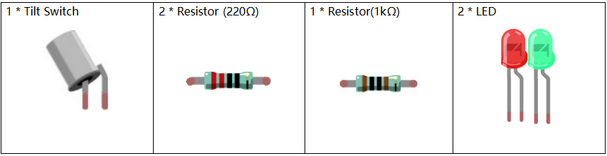

Lesson 6 Tilt Switch
============================

**Introduction**
---------------------

In this lesson, we'll learn a new switch component, tilt switch. Here we
apply two LEDs to indicate the current state of tilt switch. You can
also use this kind of switch to make a sense light with the clamshell
box.

**Newly Added Components**
--------------------------

**Principle**
----------------

The principle is very simple. When the switch is tilted in a certain
angle, the ball inside rolls down and touches the two contacts connected
to the pins outside, thus triggering circuits. Otherwise the ball will
stay away from the contacts, thus breaking the circuits.

.. image:: media_pi/image110.jpeg
    :width: 800
    :align: center

**Schematic Diagram**
-----------------------------

.. image:: media_pi/image214.png
    :width: 800
    :align: center

**Build the Circuit**
-------------------------

.. image:: media_pi/image112.png
    :width: 800
    :align: center

**For C Language Users**
----------------------------

**Command**
^^^^^^^^^^^^^

**1.** Go to the folder of the code.

.. raw:: html

    <run></run>

.. code-block::

    cd /home/pi/electronic-kit/for-raspberry-pi/c/Lesson_6_TiltSwitch

**2.** Compile the code.

.. raw:: html

    <run></run>

.. code-block::

    gcc 6_Tilt.c -lwiringPi

**3.** Run the executable file.

.. raw:: html

    <run></run>

.. code-block::

    sudo ./a.out

When the tilt switch is level, the green LED turns on. 
If you tilt the switch, the red LED will turn on.

.. note::

    If it does not work after running, please refer to :ref:`C code is not working?`

**Code**
^^^^^^^^^^^^^

.. code-block:: C

    #include <wiringPi.h>  
    #include <stdio.h>  
      
    #define TiltPin     0  
    #define Gpin        2  
    #define Rpin        3  
      
    int main(void)  
    {     
        if(wiringPiSetup() == -1){ //when initialize wiring failed,print message to screen  
            printf("setup wiringPi failed !");  
            return 1;   
        }  
      
        pinMode(TiltPin, INPUT);  
        pinMode(Gpin, OUTPUT);  
        pinMode(Rpin, OUTPUT);  
      
        while(1){  
              
            if(1 == digitalRead(TiltPin)){  
                delay(10);  
                if(1 == digitalRead(TiltPin)){  
                    digitalWrite(Rpin, HIGH);  
                    digitalWrite(Gpin, LOW);  
                    printf("RED\n");  
                }  
            }  
            else if(0 == digitalRead(TiltPin)){  
                delay(10);  
                if(0 == digitalRead(TiltPin)){  
                    while(!digitalRead(TiltPin));                 
                    digitalWrite(Rpin, LOW);  
                    digitalWrite(Gpin, HIGH);  
                    printf("GREEN\n");  
                }  
            }  
        }  
        return 0;  
    }  

**Code Explanation**
^^^^^^^^^^^^^^^^^^^^^

.. code-block:: c

    15.    pinMode(TiltPin, INPUT);  
    16.    pinMode(Gpin, OUTPUT);  
    17.    pinMode(Rpin, OUTPUT);  

Initialize pins, then set the 
pin of tilt switch to **INPUT** mode, 
and LEDs to **OUTPUT** mode.

.. code-block:: c

    21.        if(1 == digitalRead(TiltPin)){

It is used to judge whether the tilt switch is tilted 
or not. The value of **TiltPin** is firstly read, if it is 
equal to **1**, the codes inside the **if()** statement run; 
otherwise, the codes of **if** are skipped.

.. code-block:: c

    21.    if(1 == digitalRead(TiltPin)){  
    22.            delay(10);  
    23.            if(1 == digitalRead(TiltPin)){  
    24.                digitalWrite(Rpin, HIGH);  
    25.                digitalWrite(Gpin, LOW);  
    26.                printf("RED\n");  
    27.            }  
    28.        }  

When the tilt is tilted, the tilt switch 
is on; the Raspberry Pi reads a high level at the tilt 
pin, so the red LED is on and green LED off.

.. code-block:: c

    29.        else if(0 == digitalRead(TiltPin)){  
    30.            delay(10);  
    31.            if(0 == digitalRead(TiltPin)){  
    32.                while(!digitalRead(TiltPin));                 
    33.                digitalWrite(Rpin, LOW);  
    34.                digitalWrite(Gpin, HIGH);  
    35.                printf("GREEN\n");  
    36.            }  
    37.        }  

When the tilt is level, the tilt switch is off; 
the Raspberry Pi reads a low level at the tilt pin, 
so the red LED is off and green LED on.

**For Python Language Users**
--------------------------------

**Command**
^^^^^^^^^^^^^^^^^^^^

**1.** Go to the folder of the code.

.. raw:: html

    <run></run>

.. code-block::

    cd /home/pi/electronic-kit/for-raspberry-pi/python

**2.** Run the code.

.. raw:: html

    <run></run>

.. code-block::

    sudo python3 6_Tilt.py

When the tilt switch is level, the green LED turns on. If you tilt the
switch, the red LED will turn on.

**code**
^^^^^^^^^^^^

.. note::
    You can **Modify/Reset/Copy/Run/Stop** the code below. But before that, you need to go to  source code path like ``electronic-kit/for-raspberry-pi/python``. After modifying the code, you can run it directly to see the effect.

.. raw:: html

    <run></run>

.. code-block:: python

    import RPi.GPIO as GPIO  
      
    TiltPin = 17  
    Gpin   = 27  
    Rpin   = 22  
      
    def setup():  
        GPIO.setmode(GPIO.BCM)       
        GPIO.setup(Gpin, GPIO.OUT,initial=GPIO.HIGH)      
        GPIO.setup(Rpin, GPIO.OUT,initial=GPIO.LOW)      
        GPIO.setup(TiltPin, GPIO.IN)     
        GPIO.add_event_detect(TiltPin, GPIO.BOTH, callback=detect, bouncetime=200)  
      
    def Led(x):  
        if x == 0:  
            GPIO.output(Rpin, 1)  
            GPIO.output(Gpin, 0)  
        if x == 1:  
            GPIO.output(Rpin, 0)  
            GPIO.output(Gpin, 1)  
      
    def Print(x):  
        if x == 0:  
            print ('    *************')  
            print ('    *   Tilt!   *')  
            print ('    *************')  
      
    def detect(chn):  
        Led(GPIO.input(TiltPin))  
        Print(GPIO.input(TiltPin))  
      
    def loop():  
        while True:  
            pass  
      
    def destroy():  
        GPIO.output(Gpin, GPIO.LOW)       # Green LED off  
        GPIO.output(Rpin, GPIO.LOW)       # Red LED off  
        GPIO.cleanup()                     # Release resource  
      
    if __name__ == '__main__':     # Program start from here  
        setup()  
        try:  
            loop()  
            # When 'Ctrl+C' is pressed, the child program destroy() will be  executed.  
        except KeyboardInterrupt:    
            destroy()  

**Code Explanation**
^^^^^^^^^^^^^^^^^^^^^^

.. code-block:: 

    12.    GPIO.add_event_detect(TiltPin, GPIO.BOTH, callback=detect, bouncetime=200)

Set up a falling detect on **TiltPin**, and callback function to detect. 
Here **bouncetime** is to add rise threshold detection on the channel and 
ignore edge operations less than 200ms caused by switch jitter.

.. code-block:: 

    13.def Led(x):  
    14.    if x == 0:  
    15.        GPIO.output(Rpin, 1)  
    16.        GPIO.output(Gpin, 0)  
    17.    if x == 1:  
    18.        GPIO.output(Rpin, 0)  
    19.        GPIO.output(Gpin, 1)  

Define a **Led()** function to set the mode of the two LEDs. 
When x = 0, the red LED goes on and the green light goes off; 
when x = 1, the red LED goes off, the green LED goes on. 
When the function is called, the mode of the LED can be set 
directly with the statement **Led(1)** or **Led(0)**.

.. code-block:: 

    28.def detect(chn):  
    29.    Led(GPIO.input(TiltPin))  
    30.    Print(GPIO.input(TiltPin))  

This is a callback function that executes when a 
trigger is detected. Assign the current **TiltPin** state (0 or 1) 
to the Led function, that is, pass parameters to the 
**Led** function. The **Led** function then performs the 
corresponding operation on the LEDs.

**Phenomenon Picture**
------------------------

.. image:: media_pi/image113.jpeg
    :width: 800
    :align: center

