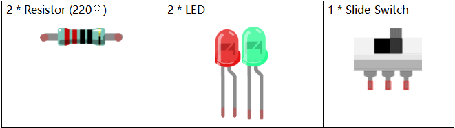
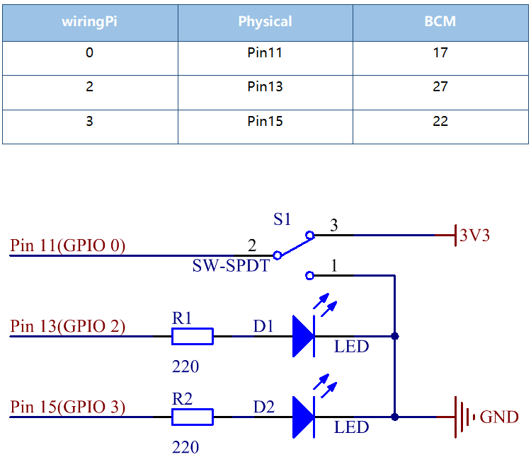
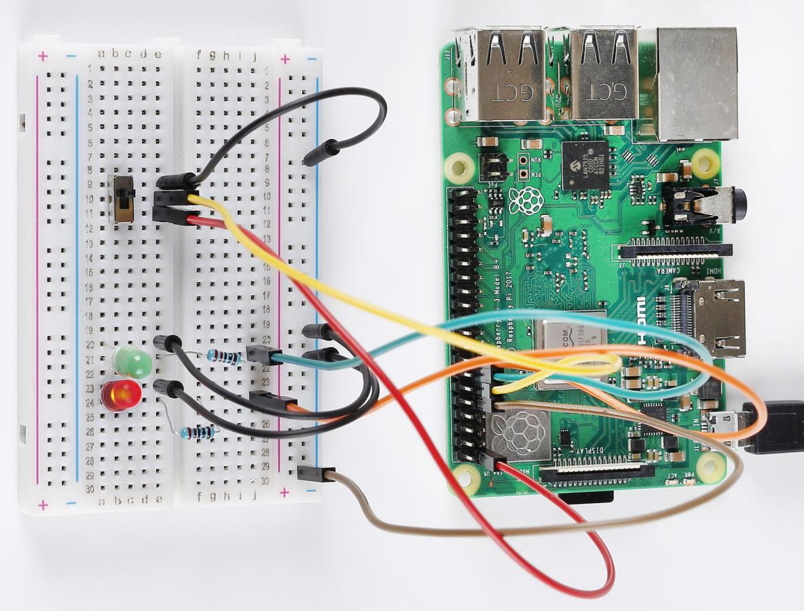

Lesson 7 Slide Switch
===============================

**Introduction**
-------------------

In this lesson, we are going to use a slide switch to turn on the 2
LEDs. The slide switch is a device to connect or disconnect the circuit
by sliding its handle. They are quite common in our surroundings. Now
let's see how it works.

**Newly Added Components**
---------------------------------

**Principle**
------------------

Slide Switch

.. image:: media_pi/image115.jpeg
    :width: 150
    :align: center

Just as its name suggests, slide switch is to connect or disconnect the
circuit by sliding its switch handle so as to switch the circuit. The
common types of slide switch include single pole double throw, single
pole triple throw, double pole double throw, and double pole triple
throw and so on. Generally, it is used in circuits with a low voltage
and features flexibility and stabilization. Slide switches are commonly
used in all kinds of instruments/meters equipment, electronic toys and
other fields related.

How it works: The middle pin is fixed. When the handle is pushed to the
left, the left two pins are connected; when push it to the right, the
two pins on the right connect, thus switching circuits.

Just as its name suggests, slide switch is to connect or disconnect the
circuit by sliding its switch handle so as to switch the circuit. The
common types of slide switch include single pole double throw, single
pole triple throw, double pole double throw, and double pole triple
throw and so on. Generally, it is used in circuits with a low voltage
and features flexibility and stabilization. Slide switches are commonly
used in all kinds of instruments/meters equipment, electronic toys and
other fields related.

How it works: The middle pin is fixed. When the handle is pushed to the
left, the left two pins are connected; when push it to the right, the
two pins on the right connect, thus switching circuits.

.. image:: media_pi/image216.png
    :width: 600
    :align: center

See the circuit symbol of slide switch and 2 is the middle pin.

.. image:: media_pi/image254.png
    :width: 400
    :align: center

**Schematic Diagram**
-----------------------------

Here we use a slide switch to turn the LED on/off, which is simple.
Connect the middle pin of the switch to pin 11. Connect the left pin of
the switch to **GND**, the right to **3.3V**. Attach the anode pins (the
longer pins) of the two LEDs to pin **13** and pin **15** respectively
after getting them connected with two **220Ω** resistors. In addition,
insert the cathodes of the two LEDs into **GND**. Get the slide switch
connected to the left, the signal read on pin 11 is 0 (a low level), so
the LED 1 lights up; to the right, the signal read on pin 11 is 1 (a
high level), then the LED 2 turns on.

**Build the Circuit**
-----------------------------

.. image:: media_pi/image120.png
    :width: 800
    :align: center

**For C Language Users**
----------------------------

**Command**
^^^^^^^^^^^^

**1.** Go to the folder of the code.

.. raw:: html

    <run></run>

.. code-block::

    cd /home/pi/electronic-kit/for-raspberry-pi/c/Lesson_7_SlideSwitch

**2.** Compile the code.

.. raw:: html

    <run></run>

.. code-block::

    gcc 7_Slider.c -lwiringPi

**3.** Run the executable file.

.. raw:: html

    <run></run>

.. code-block::

    sudo ./a.out

When the slide is pulled to the right, the LED2 is on and LED1 off. If
the slide is pulled to the left, the LED1 is on and LED2 off.

.. note::

    If it does not work after running, or there is an error prompt: \"wiringPi.h: No such file or directory\", please refer to :ref:`C code is not working?`.

**Code**
^^^^^^^^^^^^^^^

.. code-block:: c

    #include <wiringPi.h>  
    #include <stdio.h>  
      
    #define slidePin        0  
    #define led1            2  
    #define led2            3  
      
    int main(void)  
    {  
        // When initialize wiring failed, print message to screen  
        if(wiringPiSetup() == -1){  
            printf("setup wiringPi failed !");  
            return 1;   
        }  
          
        pinMode(slidePin, INPUT);  
        pinMode(led1, OUTPUT);  
        pinMode(led2, OUTPUT);  
          
        while(1){  
            // slide switch high, led1 on  
            if(digitalRead(slidePin) == 1){  
                digitalWrite(led1, HIGH);  
                digitalWrite(led2, LOW);  
                printf("LED1 on\n");  
                delay(100);  
            }  
            // slide switch low, led2 on  
            if(digitalRead(slidePin) == 0){  
                digitalWrite(led2, HIGH);  
                digitalWrite(led1, LOW);  
                printf(".....LED2 on\n");  
                delay(100);  
            }  
        }  
        return 0;  
    }  

**Code Explanation**
^^^^^^^^^^^^^^^^^^^^^^

.. code-block:: c

    16.    pinMode(slidePin, INPUT);  
    17.    pinMode(led1, OUTPUT);  
    18.    pinMode(led2, OUTPUT);  

Initialize the pins connected to slide switch to the 
**INPUT** mode, and initialize the LED lights to the **OUTPUT** mode.

.. code-block:: c

    22.        if(digitalRead(slidePin) == 1){  
    23.            digitalWrite(led1, HIGH);  
    24.            digitalWrite(led2, LOW);  
    25.            printf("LED1 on\n");  
    26.            delay(100);  
    27.        }  

When the slide is pulled to the left, the middle pin and 
left one are connected; the Raspberry Pi reads a high level at 
the middle pin, so the LED1 is on and LED2 off.

.. code-block:: c

    28.        if(digitalRead(slidePin) == 0){  
    29.            digitalWrite(led2, HIGH);  
    30.            digitalWrite(led1, LOW);  
    31.            printf(".....LED2 on\n");  
    32.            delay(100);  
    33.        }  

When the slide is pulled to the right, the middle pin 
and right one are connected; the Raspberry Pi reads a 
low, so the LED2 is on and LED1 off.

**For Python Language Users**
-------------------------------

**Command**
^^^^^^^^^^^^^^^

1. Go to the folder of the code

.. raw:: html

    <run></run>

.. code-block::

    cd /home/pi/electronic-kit/for-raspberry-pi/python

2. Run the code

.. raw:: html

    <run></run>

.. code-block::

    sudo python3 7_Slider.py

When the slide is pulled to the right, the LED2 is on and LED1 off. If
the slide is pulled to the left, the LED1 is on and LED2 off.

**Code**
^^^^^^^^^^^^^^^

.. note::
    You can **Modify/Reset/Copy/Run/Stop** the code below. But before that, you need to go to  source code path like ``electronic-kit/for-raspberry-pi/python``. After modifying the code, you can run it directly to see the effect.

.. raw:: html

    <run></run>

.. code-block:: python

    import RPi.GPIO as GPIO  
    import time  
      
    slidePin = 17  
    led1Pin = 27  
    led2Pin = 22  
      
    # Define a setup function for some setup  
    def setup():  
        GPIO.setmode(GPIO.BCM)  
        GPIO.setup(slidePin, GPIO.IN)  
        GPIO.setup(led1Pin, GPIO.OUT, initial=GPIO.LOW)  
        GPIO.setup(led2Pin, GPIO.OUT, initial=GPIO.LOW)  
      
    def main():  
        while True:  
            # slide switch high, led1 on  
            if GPIO.input(slidePin) == 1:  
                print ('LED1 ON ')  
                GPIO.output(led2Pin, GPIO.LOW)  
                GPIO.output(led1Pin, GPIO.HIGH)  
      
            # slide switch low, led2 on  
            if GPIO.input(slidePin) == 0:  
                print ('    LED2 ON ')  
                GPIO.output(led1Pin, GPIO.LOW)  
                GPIO.output(led2Pin, GPIO.HIGH)  
            time.sleep(0.5)  
      
    def destroy():  
        # Turn off LED  
        GPIO.output(led1Pin, GPIO.LOW)  
        GPIO.output(led2Pin, GPIO.LOW)  
        # Release resource  
        GPIO.cleanup()                       
      
    # If run this script directly, do:  
    if __name__ == '__main__':  
        setup()  
        try:  
            main()  
        # When 'Ctrl+C' is pressed, the child program   
        # destroy() will be  executed.  
        except KeyboardInterrupt:  
            destroy()          

**Code Explanation**
^^^^^^^^^^^^^^^^^^^^^^^^^

.. code-block:: 

    11.    GPIO.setup(slidePin, GPIO.IN)  
    12.    GPIO.setup(led1Pin, GPIO.OUT, initial=GPIO.LOW)  
    13.    GPIO.setup(led2Pin, GPIO.OUT, initial=GPIO.LOW)  

Initialize the pin, then set the pin connected to 
slide switch to the input mode and LEDs to the output mode.

.. code-block:: 

    18.    if GPIO.input(slidePin) == 1:  
    19.            GPIO.output(led2Pin, GPIO.LOW)  
    20.            GPIO.output(led1Pin, GPIO.HIGH)  

When the slide is pulled to the left, the middle 
pin and left one are connected; 
the Raspberry Pi reads a high level at the middle pin, 
so the LED1 is on and LED2 off.

.. code-block:: 

    24.       if GPIO.input(slidePin) == 0:  
    25.            GPIO.output(led1Pin, GPIO.LOW)  
    26.            GPIO.output(led2Pin, GPIO.HIGH)  

When the slide is pulled to the right, the 
middle pin and right one are connected; the 
Raspberry Pi reads a low, so the LED2 is 
on and LED1 off.

**Phenomenon Picture**
-------------------------

