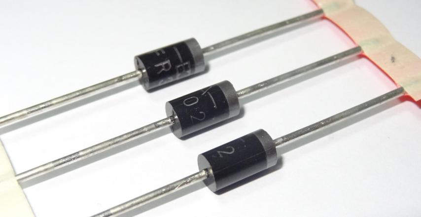
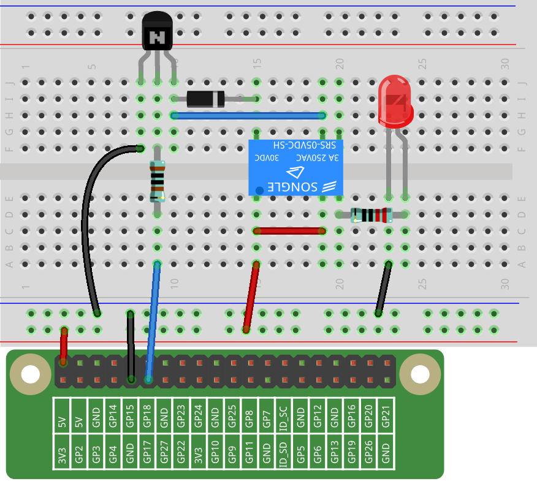

.. note::

    Hello, welcome to the SunFounder Raspberry Pi & Arduino & ESP32 Enthusiasts Community on Facebook! Dive deeper into Raspberry Pi, Arduino, and ESP32 with fellow enthusiasts.

    **Why Join?**

    - **Expert Support**: Solve post-sale issues and technical challenges with help from our community and team.
    - **Learn & Share**: Exchange tips and tutorials to enhance your skills.
    - **Exclusive Previews**: Get early access to new product announcements and sneak peeks.
    - **Special Discounts**: Enjoy exclusive discounts on our newest products.
    - **Festive Promotions and Giveaways**: Take part in giveaways and holiday promotions.

    👉 Ready to explore and create with us? Click [|link_sf_facebook|] and join today!

Lesson 8 Relay
====================

**Introduction**
--------------------

In this lesson, we will learn to use a relay. It is one of the commonly
used components in automatic control system. When the voltage, current,
temperature, pressure, etc., reaches, exceeds or is lower than the
predetermined value, the relay will connect or interrupt the circuit, to
control and protect the equipment.

**Newly Added Components**
-------------------------------

.. image:: media_pi/image218.png
    :width: 800
    :align: center

**Principle**
-----------------

**Relay**

As we may know, relay is a device which is used to provide connection
between two or more points or devices in response to the input signal
applied. In other words, relays provide isolation between the controller
and the device as devices may work on AC as well as on DC. However, they
receive signals from a microcontroller which works on DC hence requiring
a relay to bridge the gap. Relay is extremely useful when you need to
control a large amount of current or voltage with small electrical
signal.

There are 5 parts in every relay:

1. **Electromagnet -** It consists of an iron core wounded by coil of
wires. When electricity is passed through, it becomes magnetic.
Therefore, it is called electromagnet.

2. **Armature -** The movable magnetic strip is known as armature. When
current flows through them, the coil is energized thus producing a
magnetic field which is used to make or break the normally open (N/O) or
normally close (N/C) points. And the armature can be moved with direct
current (DC) as well as alternating current (AC).

3. **Spring** - When no currents flow through the coil on the
electromagnet, the spring pulls the armature away so the circuit cannot
be completed.

4. Set of electrical **contacts** - There are two contact points:

* **Normally open** - connected when the relay is activated, and disconnected when it is inactive.

* **Normally close** - not connected when the relay is activated, and connected when it is inactive.

5. Molded frame - Relays are covered with plastic for protection.

**Working of Relay**

The working principle of relay is simple. When power is supplied to the
relay, currents start flowing through the control coil; as a result, the
electromagnet starts energizing. Then the armature is attracted to the
coil, pulling down the moving contact together thus connecting with the
normally open contacts. So the circuit with the load is energized. Then
breaking the circuit would a similar case, as the moving contact will be
pulled up to the normally closed contacts under the force of the spring.
In this way, the switching on and off of the relay can control the state
of a load circuit. 

.. image:: media_pi/image125.jpeg
    :width: 800
    :align: center

**Transistor**

.. image:: media_pi/image126.jpeg
    :width: 150
    :align: center

Transistor is a semiconductor device that controls current by current.
It functions by amplifying weak signal to larger amplitude signal and is
also used for non-contact switch. A transistor is a three-layer
structure composed of P-type and N-type semiconductors. They form the
three regions internally. The thinner in the middle is the base region;
the other two are both N-type or P-type ones – the smaller region with
intense majority carriers is the emitter region, while the other one is
the collector region. This composition enables the transistor to be an
amplifier.

From these three regions, three poles are generated respectively, which
are base (b), emitter (e), and collector (c). They form two P-N
junctions, namely, the emitter junction and collection junction. The
direction of the arrow in the transistor circuit symbol indicates that
of the emitter junction. Based on the semiconductor type, transistors
can be divided into two groups, the NPN and PNP ones. From the
abbreviation, we can tell that the former is made of two N-type
semiconductors and one P-type and that the latter is the opposite. See
the figure below. 

.. image:: media_pi/image127.png
    :width: 800
    :align: center

When a High level signal goes through an NPN transistor, it is
energized. But a PNP one needs a Low level signal to manage it. Both
types of transistor are frequently used for contactless switches, just
like in this experiment.

**Diode1N4007**

1N4007 is a semiconductor device for converting alternating current into
direct current. By using the one-way conductivity of the diode,
alternating current with alternating directions can be converted into a
single-direction pulse direct current.

With a positive large current, 1N4007 has a low voltage drop
(representative value 0.7 V ) called as forward conduction state. If the
opposite voltage is applied, the potential barrier is increased to
withstand a high reverse voltage or to flow through a very small reverse
current (called reverse leakage current) called as a reverse blocking
state. Thus, the rectifier diode has a significant one-way conductivity.
In this lesson, we apply this characteristic of diode.

**Schematic Diagram**
-------------------------

When a high level signal is given to Pin 11, the transistor is
energized, thus making the coil of the relay conductive. Then its
normally open contact is closed, and the LED will light up. When Pin 11
is given a Low level, the LED will stay dim. In this experiment, we
apply Freewheeling Diode that connects to both ends of the relay coil in
parallel to prevent relay from breakdown or burnout caused by induced
voltage.

.. image:: media_pi/image268.png
    :width: 800
    :align: center

**Build the Circuit**
-------------------------

**For C Language Users**
--------------------------

**Command**
^^^^^^^^^^^^^^^^^

**1.** Go to the folder of the code.

.. raw:: html

    <run></run>

.. code-block::

    cd /home/pi/electronic-kit/for-raspberry-pi/c/Lesson_8_Relay

**2.** Compile the code.

.. raw:: html

    <run></run>

.. code-block::

    gcc 8_Relay.c -lwiringPi

**3.** Run the executable file.

.. raw:: html

    <run></run>

.. code-block::

    sudo ./a.out

Now, the LED will blink, you can hear a tick-tock caused by breaking the
normally close contact and closing the normally open one.

.. note::

    If it does not work after running, or there is an error prompt: \"wiringPi.h: No such file or directory\", please refer to :ref:`C code is not working?`.

**Code**
^^^^^^^^^^^

.. code-block:: C

    #include <wiringPi.h>  
    #include <stdio.h>  
      
    #define RelayPin 0  
      
    int main(void){  
        if(wiringPiSetup() == -1){ //when initialize wiring failed, print message to screen  
            printf("setup wiringPi failed !");  
            return 1;   
        }  
          
        pinMode(RelayPin, OUTPUT);     
      
        while(1){  
            // Tick   
            printf("......Relay Open \n");  
            digitalWrite(RelayPin, LOW);  
            delay(1000);  
            // Tock  
            printf("Relay Close......\n");  
            digitalWrite(RelayPin, HIGH);  
            delay(1000);  
        }  
        return 0;  
    }  

**Code Explanation**
^^^^^^^^^^^^^^^^^^^^^^^^^^

.. code-block:: C

    17.        digitalWrite(RelayPin, LOW); 

Set the I/O port **RelayPin** as **LOW** (0V), so the 
transistor is not energized and the coil is not 
powered. There is no electromagnetic force, so the 
relay opens and the LED remains off.

.. code-block:: C

    21.        digitalWrite(RelayPin, HIGH); 

Set the I/O port as **HIGH** (5V) to energize the transistor. 
The coil of the relay is powered and generate electromagnetic 
force, and the relay closes. Then you can see the LED is lit.

**For Python Language Users**
-------------------------------

**Command**
^^^^^^^^^^^^

**1.** Go to the folder of the code.

.. raw:: html

    <run></run>

.. code-block::

    cd /home/pi/electronic-kit/for-raspberry-pi/python

**2.** Run the code.

.. raw:: html

    <run></run>

.. code-block::

    sudo python3 8_Relay.py

Now, the LED is blinking, you can hear a tick-tock caused by breaking
the normally closed contact and closing the normally open one.

**Code**
^^^^^^^^^^

.. note::
    You can **Modify/Reset/Copy/Run/Stop** the code below. But before that, you need to go to  source code path like ``electronic-kit/for-raspberry-pi/python``. After modifying the code, you can run it directly to see the effect.

.. raw:: html

    <run></run>

.. code-block:: python

    import RPi.GPIO as GPIO  
    import time  
      
    relayPin = 17  
      
    # Define a setup function for some setup  
    def setup():  
        GPIO.setmode(GPIO.BCM)  
        GPIO.setup(relayPin, GPIO.OUT, initial=GPIO.LOW)  
      
    # Define a main function for main process  
    def main():  
        while True:  
            print ('...Relay open')  
            # Tick  
            GPIO.output(relayPin, GPIO.LOW)  
            time.sleep(1)  
            print ('Relay close...')  
            # Tock  
            GPIO.output(relayPin, GPIO.HIGH)   
            time.sleep(1)  
      
    def destroy():  
        # Turn off LED  
        GPIO.output(relayPin, GPIO.LOW)  
        # Release resource  
        GPIO.cleanup()                       
      
    # If run this script directly, do:  
    if __name__ == '__main__':  
        setup()  
        try:  
            main()  
        # When 'Ctrl+C' is pressed, the child program   
        # destroy() will be  executed.  
        except KeyboardInterrupt:  
            destroy()  

**Code Explanation**
^^^^^^^^^^^^^^^^^^^^^

.. code-block:: 

    9.    GPIO.setup(relayPin, GPIO.OUT, initial=GPIO.LOW) 

Initialize pins. And the output pin of relay is set to 
output mode and default low level.

.. code-block:: 

    17.        time.sleep(1)

Wait for 1 second. Change the switching frequency of 
the relay by changing this parameter. 
Note: Relay is a kind of metal dome formed in mechanical structure. 
So its lifespan will be shortened under high-frequency using.

.. code-block:: 

    16.        GPIO.output(relayPin, GPIO.LOW)

Set the I/O port as low level (0V), thus the 
transistor is not energized and the 
coil is not powered. There is no electromagnetic 
force, so the relay opens and the LED remains off.

.. code-block:: 

    20.        GPIO.output(relayPin, GPIO.HIGH) 

Set the I/O port as high level (5V) to 
energize the transistor. The coil of the relay is 
powered and generate electromagnetic force, 
and the relay closes. Then you can see the LED is lit.

**Phenomenon Picture**
-----------------------------

.. image:: media_pi/image131.jpeg
    :width: 800
    :align: center

