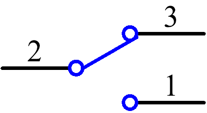
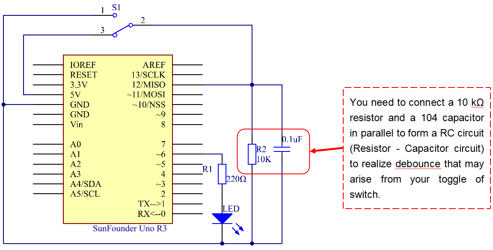
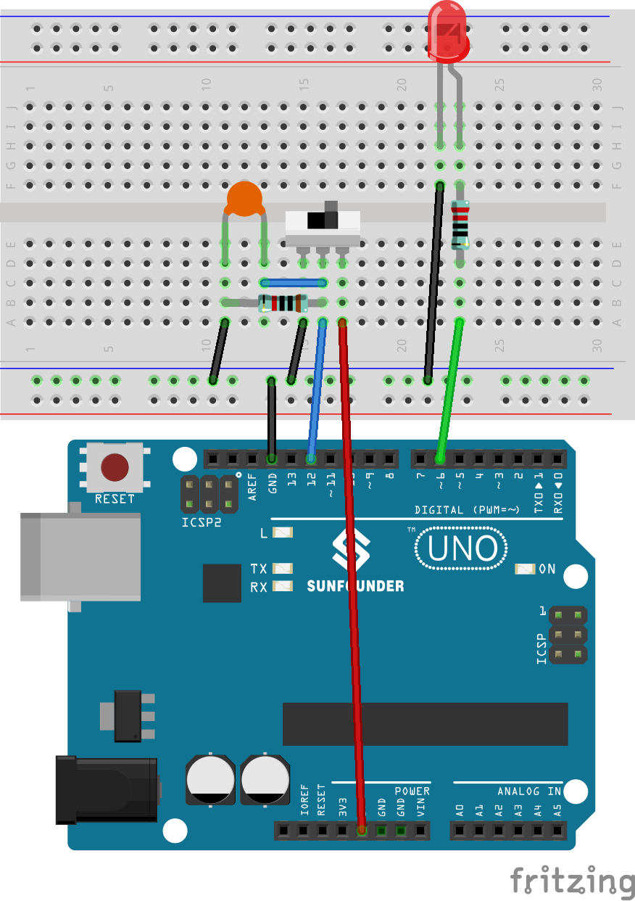
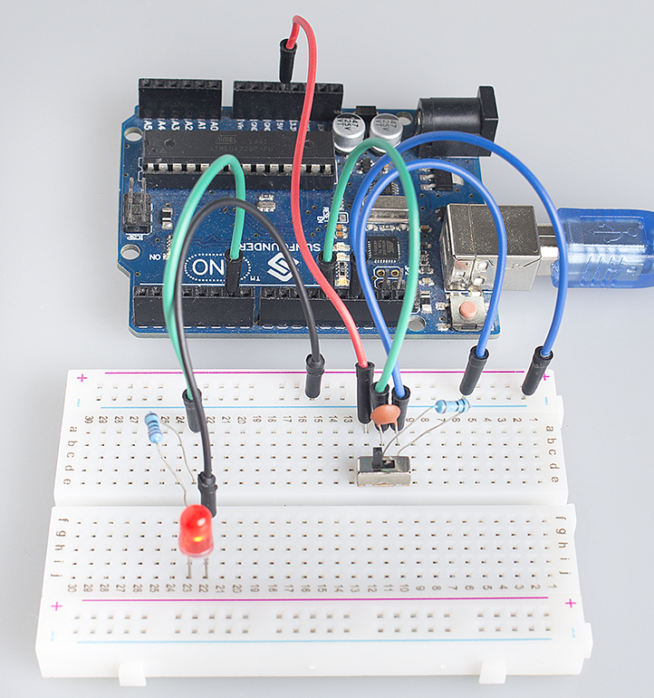

Lesson 8 Slide Switch
==========================

**Introduction**
----------------------

In this lesson, we are going to use a slide switch to turn on/off an
external LED. The slide switch is a device to connect or disconnect the
circuit by sliding its handle. They are quite common in our
surroundings. Now let's see how it works.

**Components**
------------------

.. image:: media_arduino/image171.png
    :width: 800
    :align: center

.. image:: media_arduino/image185.png
    :width: 800
    :align: center

**Experimental Principle**
----------------------------

**Slide Switch**
--------------------

.. image:: media_arduino/image97.jpeg
    :width: 150
    :align: center

Just as its name suggests, slide switch is to connect or disconnect the
circuit by sliding its switch handle so as to switch the circuit. The
common types of slide switch include single pole double throw, single
pole triple throw, double pole double throw, and double pole triple
throw and so on. Generally, it is used in circuits with a low voltage
and features flexibility and stabilization. Slide switches are commonly
used in all kinds of instruments/meters equipment, electronic toys and
other fields related.

How it works: The middle pin is fixed. When the handle is pushed to the
left, the left two pins are connected; push it to the right, the two
pins on the right connect, thus switching circuits.

.. image:: media_arduino/image186.png
    :width: 400
    :align: center

See the circuit symbol for slide switch and 2 is the middle pin.

**Principle:**
^^^^^^^^^^^^^^^^^^^

Here we use a slide switch to control the on/off of an LED which is
simple. Connect the middle pin of the switch to pin 12. Connect one pin
at one end to VCC. After connecting a 10K resistor and a 104 capacitor,
connect the last one pin to GND (to let the switch output stable level
signal). Connect an LED to pin 6. Push the handle of the slide switch to
the pin connected with pin 12 which is High level, we can light up the
LED at pin 6 by programming.

**Experimental Procedures**
--------------------------------

**Step 1:** Build the circuit

**Step 2**: Open the code file

**Step 3:** Select correct Board and Port

**Step 4:** Upload the sketch to the SunFounder Uno board

When you toggle the switch to pin12, the LED lights.

**Code**
------------------

.. raw:: html

    <iframe src=https://create.arduino.cc/editor/sunfounder01/070a7e98-b057-42ae-9bfd-6b3357a9f9c1/preview?embed style="height:510px;width:100%;margin:10px 0" frameborder=0></iframe>

**Code Analysis 8-1 Read the switch state to turn on/off the LED**
^^^^^^^^^^^^^^^^^^^^^^^^^^^^^^^^^^^^^^^^^^^^^^^^^^^^^^^^^^^^^^^^^^^^^^^

.. code-block:: arduino

    void loop()

    {

        //read the state of the switch value

        switchState = digitalRead(switchPin);

        if (switchState == HIGH )       //if it is,the state is HIGH

        {

            digitalWrite(ledPin, HIGH); //turn the led on

        }

        else

        {

            digitalWrite(ledPin, LOW);  //turn the led off

        }

    }

First, read the state of the *switchPin* and see whether you have moved
the switch handle. If it has been pushed to pin 12, then the
*switchState* is High level, so set *ledPin* as High level, which means
to light up the LED; otherwise, to turn it off.
