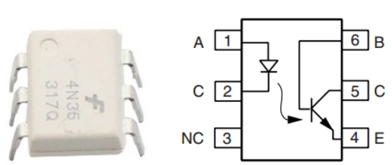
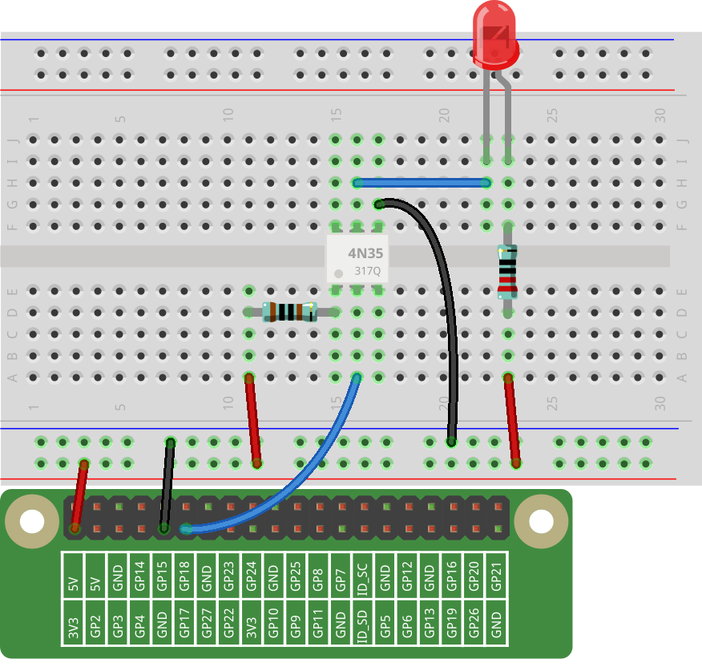
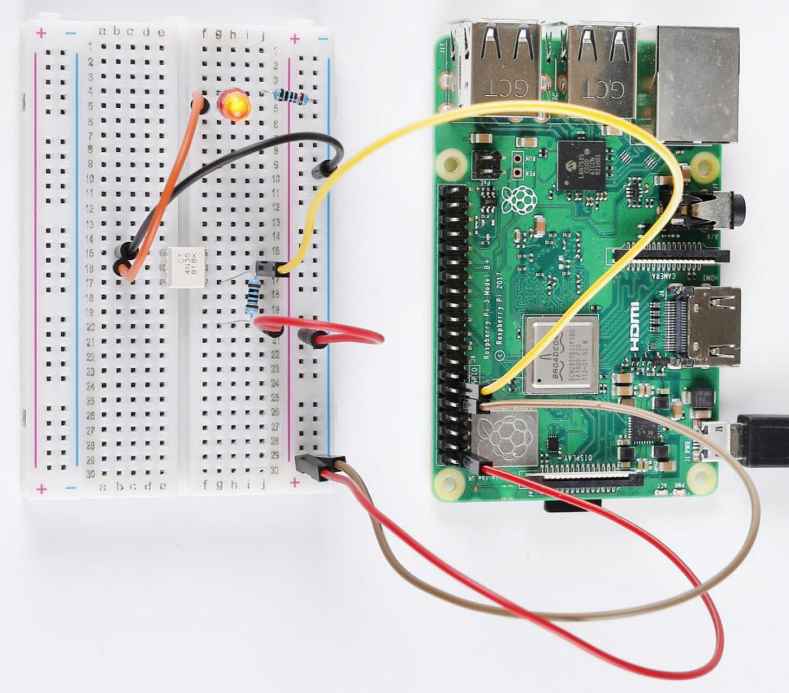

Lesson 9 4N35
=====================

**Introduction**
--------------------

In this lesson, let's learn the operational principle of 4N35 chip. We
analyze the principle in this way: using 4N35 chip to drive a LED, and
then explaining the phenomenon of LED and the internal structure of the
chip.

**Newly Added Components**
-------------------------------

.. image:: media_pi/image220.png
    :width: 800
    :align: center

**Principle**
-----------------

**4N35**

4N35 is a general-purpose optocoupler. It consists of gallium arsenide
infrared LED and a silicon NPN phototransistor. What an optocoupler does
is to break the connection between signal source and signal receiver, so
as to stop electrical interference. 4N35 can be used in AV conversion
audio circuits that is widely used in electrical isolation of a general
optocoupler.

See the internal structure of the 4N35 above. Pin 1 and 2 are connected
to an infrared LED. When the LED is electrified, it'll emit infrared
rays. To protect the LED from burning, usually a resistor (about 1K) is
connected to pin 1. Then the NPN phototransistor is power on when
receiving the rays, and then it can control the load connected to the
phototransistor. Even when the load short circuit occurs, it won't
affect the control board, thus realizing good electrical isolation.

**Schematic Diagram**
---------------------------

In this experiment, use an LED as the load connected to the NPN
phototransistor. In program, a LOW level is given to **Pin 11**, then
the infrared LED will emit infrared rays. After that, the
phototransistor receives infrared rays and gets electrified, and the LED
cathode is LOW, thus turning on the LED.

.. image:: media_pi/image222.png
    :width: 800
    :align: center

**Build the Circuit**
-------------------------

.. note:: 
    pay attention to the direction of the chip by the concave on it.

**For C Language Users**
-------------------------

**Command**

**1.** Go to the folder of the code.

.. raw:: html

    <run></run>

.. code-block::

    cd /home/pi/electronic-kit/for-raspberry-pi/c/Lesson_9_4N35

**2.** Compile the code.

.. raw:: html

    <run></run>

.. code-block::

    gcc 9_4N35.c -lwiringPi

**3.** Run the executable file.

.. raw:: html

    <run></run>

.. code-block::

    sudo ./a.out

You will see the LED blinking.

.. note::

    If it does not work after running, or there is an error prompt: \"wiringPi.h: No such file or directory\", please refer to :ref:`C code is not working?`.

**Code**
^^^^^^^^^^^

.. code-block:: c

    #include <wiringPi.h>     
    #include <stdio.h>  
      
    #define OptoPin  0  
      
    int main(void)  
    {  
        // When initialize wiring failed, print message to screen  
        if(wiringPiSetup() == -1){  
            printf("setup wiringPi failed !");  
            return 1;   
        }  
          
        pinMode(OptoPin,OUTPUT);  
          
        while(1){  
            // Turn LED off  
            digitalWrite(OptoPin, HIGH);  
            delay(500);  
            // Turn LED on  
            digitalWrite(OptoPin, LOW);  
            delay(500);  
        }  
        return 0;  
    }  

**Code Explanation**
^^^^^^^^^^^^^^^^^^^^^^^

.. code-block:: c

    14.    pinMode(OptoPin,OUTPUT);

Initialize pins. Set the output pin of 4N35, 
Optopin to **OUTPUT** mode.

.. code-block:: c

    18.        digitalWrite(OptoPin, HIGH);

Set **OptoPin** as **LOW** (0V), thus the optocoupler is energized, 
and the pin connected to LED conduct to low level. 
Then the LED will light up. 

.. code-block:: c

    21.        digitalWrite(OptoPin, LOW); 

Set **OptoPin** as **HIGH** (3.3V), thus the optocoupler is not 
energized, and the pin connected to LED cannot conduct to 
low level. Then the LED goes out. 

**For Python Language Users**
------------------------------

**Command**
^^^^^^^^^^^^^^^

**1.** Go to the folder of the code.

.. raw:: html

    <run></run>

.. code-block::

    cd /home/pi/electronic-kit/for-raspberry-pi/python

**2.** Run the code.

.. raw:: html

    <run></run>

.. code-block::

    sudo python3 9_4N35.py

You will see the LED blinking.

**Code**
^^^^^^^^^^

.. note::
    You can **Modify/Reset/Copy/Run/Stop** the code below. But before that, you need to go to  source code path like ``electronic-kit/for-raspberry-pi/python``. After modifying the code, you can run it directly to see the effect.

.. raw:: html

    <run></run>

.. code-block:: python

    import RPi.GPIO as GPIO  
    import time  
      
    Pin_4N35 = 17  
      
    # Define a setup function for some setup  
    def setup():  
        GPIO.setmode(GPIO.BCM)  
        GPIO.setup(Pin_4N35, GPIO.OUT, initial=GPIO.LOW)  
      
    # Define a main function for main process  
    def main():  
        while True:  
            # Turn off LED  
            GPIO.output(Pin_4N35, GPIO.HIGH)  
            time.sleep(0.5)  
            # Turn on LED  
            GPIO.output(Pin_4N35, GPIO.LOW)   
            time.sleep(0.5)  
      
    def destroy():  
        # Turn off LED  
        GPIO.output(Pin_4N35, GPIO.HIGH)  
        # Release resource  
        GPIO.cleanup()                       
      
    # If run this script directly, do:  
    if __name__ == '__main__':  
        setup()  
        try:  
            main()  
        # When 'Ctrl+C' is pressed, the child program   
        # destroy() will be  executed.  
        except KeyboardInterrupt:  
            destroy()   

**Code Explanation**
^^^^^^^^^^^^^^^^^^^^^^^^^^

.. code-block:: 

    1.         GPIO.output(Pin_4N35, GPIO.HIGH)

Set **OptoPin** as **high** level (3.3V), 
thus the optocoupler is not energized, 
and the pin connected to LED cannot conduct 
to low level. Then the LED goes out.

.. code-block:: 

    1.         time.sleep(0.5)

Wait for **0.5** second. The on-off frequency of the optocoupler 
can be changed by modifying this parameter.

.. code-block:: 

    1.         GPIO.output(Pin_4N35, GPIO.LOW)

Set **OptoPin** as low level (0V), thus the optocoupler is energized, 
and the pin connected to LED conduct to low level. 
Then the LED will light up.

**Phenomenon Picture**
--------------------------

